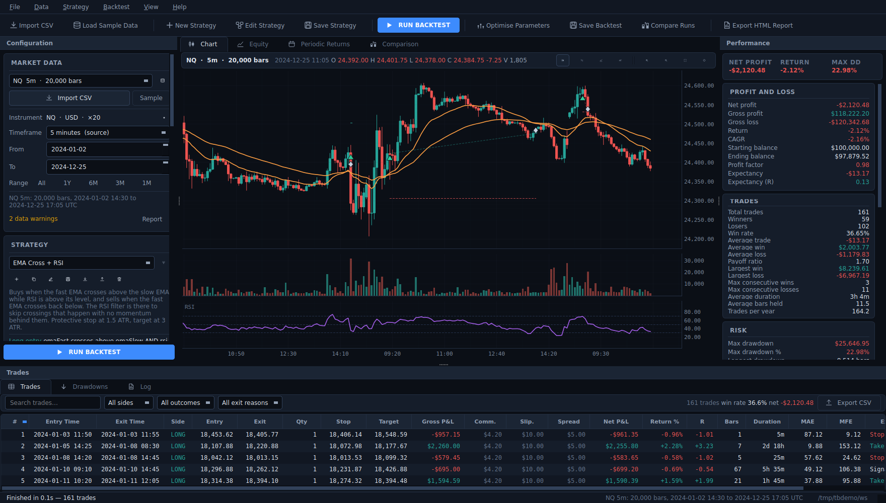
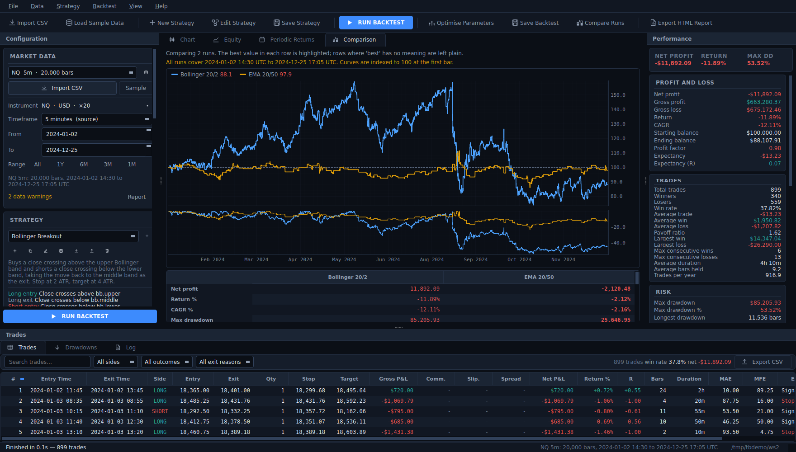
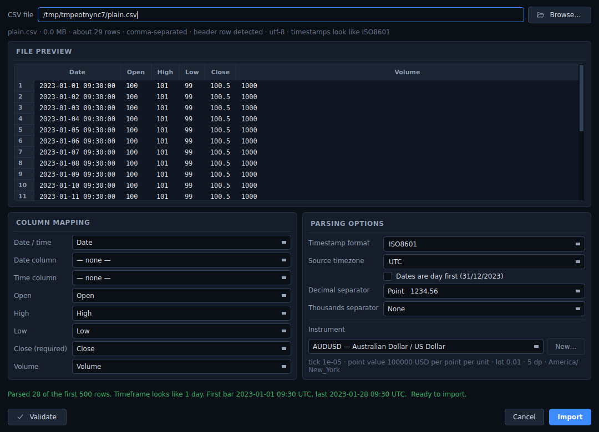
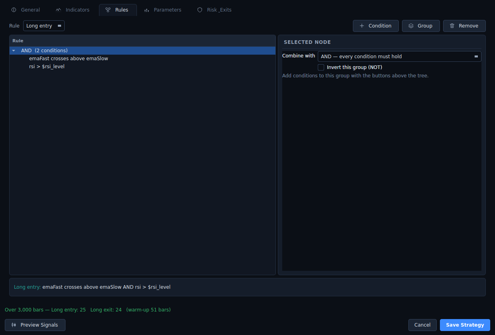
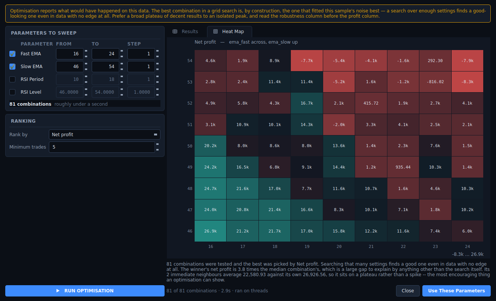
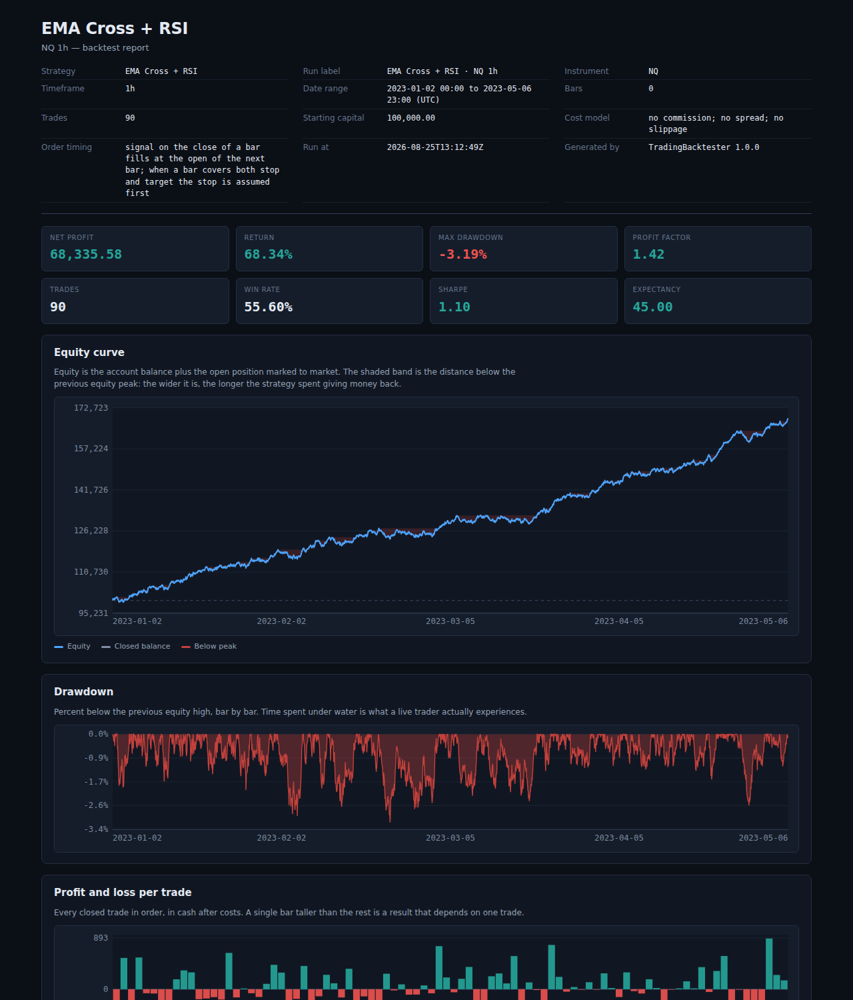

# Trading Backtester

A desktop backtesting platform for trading strategies. Import your own OHLCV
data, build a strategy out of indicators and rules without writing code, run it
against history, and read what happened on an interactive chart, a trade
blotter and a full set of performance statistics.

Everything runs locally. The application makes **no network requests of any
kind**, collects no telemetry, and stores your data, strategies and results only
in a workspace folder on your own machine.



<details>
<summary>More screenshots</summary>

**Comparing two saved runs** — equity curves indexed to 100 at the first common
bar, drawdowns beneath, and a metric matrix with the best value in each row
highlighted.



**Importing a CSV** — the raw rows the parser sees, a column mapping guessed
from the file, and a Validate button that names the row and column when
something is wrong.



**Building a strategy** — a rule tree of nested AND/OR groups, an editor for the
selected node, and the rule rendered back into English underneath.



**Optimising** — a heat map over two parameters, with a robustness column and a
note that says plainly whether the winner sits on a plateau or a spike.



**The exported HTML report** — one self-contained file, charts drawn as inline
SVG, no external assets and no network requests.



</details>

---

## Contents

- [Install and run](#install-and-run)
- [Simple mode](#simple-mode)
- [A five-minute tour](#a-five-minute-tour)
- [Importing data](#importing-data)
- [Instruments](#instruments)
- [Timeframes](#timeframes)
- [Building a strategy](#building-a-strategy)
- [Running a backtest](#running-a-backtest)
- [Reading the metrics](#reading-the-metrics)
- [Finding strategies automatically](#finding-strategies-automatically)
- [Importing a strategy you already have](#importing-a-strategy-you-already-have)
- [The research loop](#the-research-loop)
- [The research dashboard](#the-research-dashboard)
- [Which indicators actually predict anything](#which-indicators-actually-predict-anything)
- [Finding anomalies](#finding-anomalies)
- [Optimisation](#optimisation)
- [Out of sample: what are *these* parameters worth?](#out-of-sample-what-are-these-parameters-worth)
- [Walk-forward: is the optimisation real?](#walk-forward-is-the-optimisation-real)
- [Monte Carlo: what else could have happened?](#monte-carlo-what-else-could-have-happened)
- [The mirror market: was it the rule or the rally?](#the-mirror-market-was-it-the-rule-or-the-rally)
- [Is it an edge, or is it exposure?](#is-it-an-edge-or-is-it-exposure)
- [Comparing runs](#comparing-runs)
- [Saving and exporting](#saving-and-exporting)
- [Where your files live](#where-your-files-live)
- [Large datasets](#large-datasets)
- [How orders are simulated](#how-orders-are-simulated)
- [Using it without the window](#using-it-without-the-window)
- [Building from source](#building-from-source)
- [Architecture](#architecture)
- [Troubleshooting](#troubleshooting)
- [Limitations, stated plainly](#limitations-stated-plainly)

---

## Install and run

### Windows (the normal way)

1. Download `TradingBacktesterSetup.exe`.
2. Run it. It installs per-user by default, so it does **not** ask for
   administrator rights and works on a locked-down machine.
3. Launch **Trading Backtester** from the Start menu.

You do not need Python, Node.js or any development tools. The installer bundles
its own interpreter and every dependency.

The application is not code-signed. Windows SmartScreen will show a
"Windows protected your PC" banner the first time you run it; choose
**More info → Run anyway**. Signing requires a certificate from a commercial
authority, which this project does not have.

### Uninstalling

Use *Add or remove programs*. Your workspace folder — datasets, strategies and
saved backtests — is deliberately **left in place**. Delete it yourself if you
want it gone.

### Running from source (any platform)

```bash
git clone <this repository>
cd desktop
python -m venv .venv
.venv/bin/pip install -r requirements.txt      # Windows: .venv\Scripts\pip
.venv/bin/python run.py                        # Windows: .venv\Scripts\python run.py
```

Python 3.10 or newer. On Linux you may need the Qt runtime libraries:

```bash
sudo apt install libegl1 libgl1 libxkbcommon-x11-0 libxcb-cursor0 \
                 libxcb-icccm4 libxcb-image0 libxcb-keysyms1 \
                 libxcb-randr0 libxcb-render-util0 libxcb-shape0
```

---

## Simple mode

The application opens in **Simple mode**: the optimiser, the comparison view,
the risk-settings panel and the drawdown and log tabs are hidden, and a
three-step guide in the configuration panel says what to do first. Nothing is
disabled — a greyed-out control still has to be read, understood and dismissed,
so Simple mode hides rather than disables.

**View ▸ Simple Mode** turns it off and everything comes back. The choice is
remembered.

The guide ticks its steps off as you do them and hides itself once all three
are done; **View ▸ Show Start Here** brings it back.

---

## A five-minute tour

1. Press **Sample** in the Market Data panel. This loads a bundled synthetic
   dataset. It is generated by a random process — it is there so you can see
   the application work, not so you can learn anything about markets from it.
2. Pick **EMA Cross + RSI** in the Strategy panel. Its rules appear underneath
   in plain English.
3. Press **RUN BACKTEST**.
4. The chart fills with candles, indicator lines, entry arrows and exit
   markers. The right panel fills with statistics. The bottom panel fills with
   trades.
5. Click any trade in the table — the chart scrolls to it and highlights it.
   Click a marker on the chart — the table selects that trade.
6. Change **EMA Fast** from 20 to 10 in the parameter list and run again.

---

## Importing data

**File → Import CSV**, or the **Import CSV** button.

The import dialog inspects your file and works out everything it can: the
delimiter, whether there is a header, which column holds which field, the
timestamp format, and whether dates are day-first. You correct anything it got
wrong, press **Validate** to parse the first few hundred rows, and see either
the parsed date range and inferred timeframe or the exact row and column that
failed.

### Working out the column order

Header names are a claim about a file, not a proof, so the importer checks them
against the values before it trusts them. Two facts make that possible without
guessing:

* a timestamp column parses as timestamps, and moves in one direction;
* an OHLC quartet satisfies `high >= max(open, close)` and
  `low <= min(open, close)` on essentially every bar.

The second is the whole test. It is a falsifiable statement about four columns:
a wrong assignment fails it on the first few bars, and the right one cannot
fail it. So the importer reads a sample of the rows and:

* keeps the mapping the names imply when it satisfies that relation — names are
  usually right, and second-guessing them would be its own bug;
* replaces it when it does not, matching the columns to the values instead.
  This is what reads a file whose columns are in an unusual order, whose
  headers are in another language, or whose headers are simply wrong;
* tells the open from the close by continuity — the close of one bar and the
  open of the next are the same trade — which is the only thing that
  distinguishes them in a file with no usable header;
* notices that the rows are newest first, and sorts them oldest first on
  import;
* moves the volume off a column that is zero on every row when a real one
  exists. An MT5 export writes zeros in `Volume` and the true figure in
  `TickVolume`; importing the zeros is silently wrong, because every
  volume-based indicator then goes flat.

Everything it changes is stated in plain language in the dialog, and the
preview above the mapping labels each column with the field it is mapped to, so
the mapping can be checked against the values without cross-referencing eight
drop-downs.

**Auto-detect columns** re-runs all of this on demand. And if **Validate**
fails, the mapping is checked against the data and, when the two disagree,
corrected and tried once more — a wrong mapping is the most common reason an
import fails, and the file itself holds the evidence for what the right one is.

Nothing here overrides you: change a drop-down and the dialog uses your choice.
Mapping drop-downs also ignore the mouse wheel unless they are focused, so
scrolling the dialog cannot silently rewrite the mapping.

### What it accepts

| Aspect | Supported |
|---|---|
| Delimiters | comma, semicolon, tab, pipe |
| Header | present or absent |
| Timestamps | ISO 8601 (with or without offset or `Z`), `YYYY-MM-DD HH:MM:SS`, `DD/MM/YYYY`, `MM/DD/YYYY`, `YYYYMMDD HHMMSS`, epoch seconds / milliseconds / microseconds / nanoseconds |
| Date + time | one combined column, or separate `Date` and `Time` columns |
| Timezone | tz-aware input converted to UTC; tz-naive input localised to a timezone you choose |
| Numbers | `1234.56`, `1,234.56`, `1.234,56` |
| Encoding | UTF-8, UTF-8 with BOM, Latin-1 fallback |
| Volume | optional — missing volume is filled with zero and flagged; an all-zero column loses to a real one |
| Column order | any — matched to the values when the header names do not fit |
| Row order | oldest first or newest first; newest-first files are sorted on import |
| Extras | unknown columns ignored, `#` comment lines skipped, blank lines skipped |

A minimal file looks like this:

```csv
Date,Open,High,Low,Close,Volume
2023-01-02 09:30:00,15012.25,15040.50,15008.00,15033.75,4821
2023-01-02 09:35:00,15033.75,15061.25,15029.50,15055.00,3907
```

### Data quality

Every import is checked for duplicate timestamps, out-of-order timestamps,
`high < low`, bodies outside the bar's range, non-positive prices, missing
values, gaps inside the trading week, and implausible single-bar moves. Problems
appear in the Market Data panel and in full under **Data → Data Quality Report**.

The application warns rather than silently repairing, because silently repairing
data is how a backtest ends up describing something that never happened.

---

## Instruments

An instrument tells the engine what a price *means*. The setting that matters
most is **point value**: the cash change in your account per 1.0 of price
movement, per unit held.

| Instrument | Tick size | Point value | Note |
|---|---|---|---|
| A share (AAPL) | 0.01 | 1.0 | one unit is one share |
| E-mini Nasdaq (NQ) | 0.25 | 20.0 | one unit is one contract |
| Micro Nasdaq (MNQ) | 0.25 | 2.0 | one tenth of NQ |
| E-mini S&P (ES) | 0.25 | 50.0 | |
| EURUSD standard lot | 0.00001 | 100000.0 | lot size 0.01 allows micro lots |

Sixteen instruments are pre-configured. **Data → Instruments** lets you edit
them or add your own; changes are saved in your workspace and survive upgrades.

---

## Timeframes

1m, 5m, 15m, 30m, 1h, 4h, Daily and Weekly.

Bars are **built up** from the timeframe you imported. 1-minute data can produce
any of them; hourly data can produce 4h, daily and weekly but not 5m. Timeframes
your data cannot support are simply not offered — the application will not
fabricate bars it does not have.

Aggregation takes the first open, the highest high, the lowest low, the last
close and the sum of volume, and labels the bar at the start of its period.
Periods containing no bars are dropped, not filled.

---

## Building a strategy

**Strategy → Edit Strategy**, or the strategy icon in the left panel.

A strategy is data, not code: a list of indicators, four rule trees (long entry,
long exit, short entry, short exit), a set of parameters, and its risk and exit
settings. Nothing about it is compiled into the application, which is why you
can build one without programming and why the optimiser can sweep it.

### Indicators

48 are built in, across moving averages, oscillators, trend, volatility and
volume: SMA, EMA, WMA, HMA, DEMA, TEMA, RMA, VWMA, RSI, MACD, Bollinger Bands,
ATR, Stochastic, ADX, VWAP, OBV, CCI, MFI, ROC, Momentum, standard deviation,
Keltner, Donchian, SuperTrend, Parabolic SAR, Williams %R, CMF, Aroon, true
range, z-score, linear regression, pivots, Choppiness, Ultimate Oscillator, TSI,
Elder Ray, highest/lowest and more.

Each one is a registered function of the bars. Adding another is a single
decorated function in `tradingbacktester/indicators/library.py` — no other file
changes.

### Rules

A rule tree is built from conditions combined with AND, OR and NOT, nested as
deeply as you like:

| Condition | Meaning |
|---|---|
| **Compare** | `left > right`, `>=`, `<`, `<=`, `==`, `!=` |
| **Cross** | `left` crosses above / below / either way through `right` |
| **State** | a series is rising, falling, positive, negative, or has risen for *N* bars |
| **Session** | the bar falls inside a time window on an allowed weekday |
| **Always** | a constant, useful as a placeholder |

Either side of a condition can be a price series (open/high/low/close/volume/
hlc3/hl2/ohlc4), an indicator output, a constant, a **strategy parameter**, or
an arithmetic combination of those (`EMA20 * 1.01`, `close - ATR`). Any operand
can be offset backwards by *N* bars.

A cross fires on the bar where the relationship changes, not on every bar the
inequality happens to hold.

### The worked example

```
LONG ENTRY:  EMA 20 crosses above EMA 50  AND  RSI > 50
LONG EXIT:   EMA 20 crosses below EMA 50
STOP LOSS:   1.5 × ATR
TAKE PROFIT: 3.0 × ATR
```

ships as the built-in strategy **EMA Cross + RSI**, with `ema_fast`, `ema_slow`,
`rsi_period` and `rsi_level` exposed as parameters. Six more are included:
RSI Mean Reversion, Bollinger Breakout, MACD Trend, Donchian Breakout,
Opening Range Momentum and SuperTrend Follower.

### Parameters

Anything numeric in a strategy can be a named parameter with a label, a default,
a range and a step. Parameters appear as controls in the left panel, are saved
with the strategy, and are what the optimiser sweeps. You never edit source code
to change a strategy.

---

## Running a backtest

Set the run's economics in the left panel:

- **Capital and sizing** — starting capital; sizing by fixed units, fixed cash,
  percent of equity, risk percent (size from the distance to the stop) or a
  volatility target; caps on position size and concurrent positions; long/short
  permissions; margin; a daily loss limit.
- **Trading costs** — commission per unit, per trade or as a percent of
  notional, with a minimum; spread in price points; slippage as points, a
  percent, or a fraction of ATR.
- **Stops and targets** — stop loss, take profit and trailing stop, each as an
  ATR multiple, a percentage or price points; break-even at *N* R; a time stop
  in bars.
- **Session and execution** — trading hours and weekdays in a chosen timezone,
  flat-at-close, order timing, and the intrabar barrier rule.

Then press **RUN BACKTEST** (or F5). The run happens on a background thread:
the window stays responsive and **Cancel** works.

---

## Reading the metrics

The right-hand panel groups every statistic and — this matters — **labels the
ones your sample cannot support**. A metric marked `LOW n` is computed from too
few trades to be meaningful; one marked `N/A` has a degenerate denominator, for
example a profit factor with no losing trades.

A short guide to the ones people misread:

- **Profit factor** — gross profit ÷ gross loss. Above 1 is profitable. Below
  about 30 trades it is mostly noise.
- **Sharpe ratio** — annualised excess return ÷ return volatility, computed from
  per-bar equity returns. Sensitive to the annualisation factor, which is
  derived from your timeframe and the observed trading calendar.
- **Sortino ratio** — the same idea penalising only downside deviation.
- **Max drawdown** — the largest peak-to-trough fall in *equity*, including open
  positions, not just closed-trade balance.
- **Expectancy** — average net profit per trade. The number that actually
  compounds.
- **R-multiple** — result ÷ cash risked at entry. Undefined when a trade had no
  stop.
- **MAE / MFE** — how far a trade went against you and in your favour while it
  was open. Large MFE with small net profit means your exits are leaving money
  behind.

The full formula for every metric is in **Help → Metric Definitions**
(`docs/METRICS.md`).

---

## Finding strategies automatically

**Backtest → Find Strategies…**, `Ctrl+F`, or the button on the toolbar. The
window has three tabs — *Strategies*, *Indicators*, *Anomalies* — asking three
questions of the same data with the same machinery underneath. This section is
the first; the next two sections are the others.

Pick the data and the kind of trading you want. That is the whole form, and the
style fixes the rest — bar size, stop and target geometry, session window, how
the result is judged — because those are exactly the settings that, left for the
search to pick, turn it into a machine for finding coincidences.

| Style | Bars | Session | Stop | Target | Max hold |
|---|---|---|---|---|---|
| Scalping | 1m, 5m | 09:30–11:30 NY | 0.5–1× ATR | 1–2R | 12 bars |
| Day trading | 5m, 15m, 30m | 09:30–16:00 NY | 1–2× ATR | 1–3R | 48 bars |
| Swing trading | 1h, 4h | all hours | 1.5–3× ATR | 1.5–3R | 60 bars |
| Position trading | Daily | all hours | 2–4× ATR | 2–4R | 40 bars |

Ten families of entry rule are tried across a small parameter grid and every
geometry the style allows:

| Family | Fires when |
|---|---|
| Trend pullback | Price pulls back to the fast average while it is above the slow one |
| Channel breakout | Close beyond the highest high of the previous *N* bars |
| RSI reversion | RSI turns back up through an oversold level |
| Bollinger reversion | Close crosses back inside the lower band |
| MACD cross | The MACD line crosses above its signal line |
| Stochastic with the trend | %K crosses %D, taken only above a long moving average |
| **Break of structure** | Close takes out the last *confirmed swing point*, with the trend |
| **Momentum** | Rate of change crosses a threshold — the one family with no average in it |
| **Volatility squeeze** | Bands were narrow, and price closes out through one |
| **Range expansion** | A bar far larger than the recent average, closing in its direction |

Break of structure is not the channel breakout with extra steps: a Donchian
break fires on any drift to a new extreme, while this one needs a close through
a level the market actually turned at — and the pivot is published several bars
after it happened, so the level was knowable before the close that breaks it.

**Statistical arbitrage is not here, and cannot be.** A pairs or spread trade
needs two instruments priced against each other; this application backtests one
series at a time. Nothing in the search will pretend otherwise.

### Setting your own constraints

The defaults are the point — but "day trading" means different hours on
different instruments, and a trader with a reason to trade 07:00–11:00 should
not have to edit the source to say so. From the terminal:

```bash
python -m tradingbacktester.cli find --data "US30 30m" --style intraday \
    --session 07:00-11:00 --stop 1.5 --target 2.0 \
    --template structure_break,squeeze --min-trades 40
```

`--session`, `--weekdays`, `--stop`, `--target`, `--max-bars`, `--min-trades`
and `--template` each narrow the search. Every one is applied **once, before the
search runs**, and printed with the result. None of them is searched over:
handing a list of sessions to a search and keeping the best would put the
session inside the selection, which is how a calendar condition becomes a free
lottery ticket. `--template list` shows the families and `--style list` the
styles.

### What makes the answer worth reading

The searching is the easy part. Everything below exists to stop the search
producing a confident answer that means nothing, which is what a search does by
default.

1. **The data is split in time.** The first 65% is the research block. Every
   decision — which rule, which parameters, which geometry — is made there. The
   last 35% is locked.
2. **Every candidate is scored against a matched control.** Random entries with
   the same side, the same geometry, the same distribution of time-of-day, and
   the same costs. That prices in drift, costs, barrier width and session
   timing together, so the question stops being "did it make money" and becomes
   "did it beat entering at random at the same times". A rule that only trades
   the hours that happened to pay scores as what it is: nothing.
3. **Multiplicity is stated and corrected.** The number of combinations tried is
   the number of chances the search had to be lucky. It is printed with every
   result, and a Benjamini–Hochberg correction is applied to the p-values.
4. **The neighbourhood is tested.** A real edge decays smoothly as its settings
   move. One that vanishes a rung away was a coincidence at one setting, and
   that is the most reliable tell there is.
5. **The locked block is revealed once**, for the shortlist only, as a check —
   never as a score to select on.
6. **A result better on the locked block than on research is flagged as the
   wrong shape**, not celebrated. An edge decays out of sample; it does not
   appear there.

7. **Every shortlisted candidate is re-run through the real engine.** The
   search itself uses a cached fast path — 840 combinations over half a million
   bars is affordable no other way — so a search result is a claim, not
   evidence. Anything that reaches a shortlist is backtested again through the
   same engine a hand-built strategy uses, on the research block and the locked
   block separately, and every figure shown against it comes from the trades
   that came out. The fast path is also compared against the engine **for that
   candidate**: if the two disagree, the search ranked on a number the engine
   cannot reproduce, and that is reported rather than hidden.
8. **Nothing is ranked on profit.** See below.

Anything shortlisted becomes a real strategy: **Save selected as a strategy**
puts it in the library, where it can be charted, edited, re-run through the
engine and exported to Pine like any other.

### Robustness, and why the ranking ignores return

A search always produces a winner, so ranking winners by profit ranks them by
how lucky they got — on a single sample, profit measures how well a rule fitted
that sample better than it measures anything else. So the shortlist is ordered
by a robustness score instead, built from two mechanisms that behave
differently on purpose.

**Blockers disqualify.** A rule that took no trades out of sample, or lost money
out of sample, or had too few out-of-sample trades for its style, or never
survived its own multiplicity correction, or whose figures the engine could not
reproduce, is not scored at all. It gets a reason. No weighting can rescue it,
because there is nothing to weigh: the evidence for it does not exist. This is
what stops anything being called "proven" on the strength of one block.

**Dimensions are scored and weighted**, and only run on what got past the
blockers:

| dimension | weight | what it asks |
|---|---|---|
| Out-of-sample retention | 3.0 | how much of the in-sample edge survived into the locked block |
| Statistical significance | 2.0 | how unlikely it is against a time-of-day matched control |
| Parameter sensitivity | 2.0 | does the edge survive a change of settings, or live at exactly one |
| Direction independence | 2.0 | is it a rule, or a long position wearing one (the mirror market) |
| Walk-forward | 2.0 | did it hold up in rolling windows |
| Drawdown quality | 1.5 | return measured against the worst the curve got, out of sample |
| Cost sensitivity | 1.5 | how much of the gross result the spread and commission took |
| Consistency | 1.5 | was the profit spread through the sample or earned in one fifth |
| Monte Carlo | 1.5 | how much of the equity curve was the order the trades fell in |
| Sample size | 1.0 | enough trades that the ratios describe a process |

Retention is weighted heaviest because it is the only dimension measured on
data the search never saw. It is **capped at 1.0**: a rule that does markedly
better out of sample than in sample scores no bonus for it and is flagged as
the wrong shape instead.

A dimension that could not be measured is marked *not applicable* and drops out
of the weighted mean rather than counting as a failure — scoring an unrun test
as zero would punish a candidate for the depth you chose. The score is always
shown with the number of dimensions behind it, so a thin score reads as thin,
and fewer than four dimensions grades as "too little evidence to grade" rather
than as a number.

The deeper validations run automatically at `--validate standard` (the
default): the concentration gate, a block-bootstrap Monte Carlo, and the mirror
market. `--validate full` adds walk-forward, which is much slower. `--validate
quick` runs the engine confirmation only.

### It will usually find nothing

That is the point. Run it on the shipped US30 data and it reports, honestly,
that 840 combinations produced nothing that survives its own multiplicity. A
search that always finds something is worse than useless, so both halves are
tested: `tests/test_finder.py` plants a real edge in a synthetic series and
requires the finder to detect it, then hands it a random walk and requires it
to recommend nothing.

**Everything it produces is historical analysis, not a prediction.** The report
says so in those words, on every path, including when nothing was found.

---

## Importing a strategy you already have

**Strategy → Paste a Strategy…**, `Ctrl+Shift+V`. Paste Pine Script or a
strategy this application exported, and it is read, translated and run.

The rule the whole feature is built on: **a strategy that cannot be fully
interpreted is reported, never approximated.** An import that quietly drops a
condition produces a backtest that runs, looks fine, and describes a strategy
you did not write — and there is nothing on screen to tell you. So every line
of what you paste lands in exactly one of three buckets, all of them listed:

| outcome | meaning |
|---|---|
| converted | it became part of the strategy |
| ignored | it changes nothing about what is traded — `plot`, `bgcolor`, a label |
| unsupported | it affects behaviour and could not be represented, with the reason |

If anything is unsupported, the conversion is labelled **partial** and the
dialog will not backtest it at all. A backtest of a partial conversion is a
backtest of a strategy nobody wrote.

### Why it parses rather than pattern-matches

A regular expression that matches `ta.ema(close, 20)` also matches it inside a
comment, inside a string, and inside `ta.ema(ta.ema(close, 20), 5)` — and it
silently gets the last one wrong. So the source is tokenised and parsed
properly, and the tests fix exactly those cases.

The case that matters most is Pine's commonest shape:

```pine
if longCondition
    strategy.entry("Long", strategy.long)
```

An importer that reports the `if` as unsupported and then reads the indented
`strategy.entry` as a top-level line has just built a strategy that enters on
**every bar**. It would run, it would backtest, and it would be wrong. So the
`if` condition travels with the statements inside it — through `else`,
`else if` chains, and nesting, which AND together — and any statement whose
condition could not be determined is refused rather than treated as
unconditional. An entry with no condition at all is refused for the same
reason.

### What comes across

`ta.` moving averages (SMA/EMA/WMA/HMA/VWMA/RMA/DEMA/TEMA), RSI, ATR, CCI,
MFI, ROC, MOM, stdev, highest, lowest, Williams %R, linreg, OBV, TR, VWAP;
comparisons, `and`/`or`/`not`, `ta.crossover`/`crossunder`/`cross`,
`ta.rising`/`falling`, `ta.change`, bar offsets like `close[1]`, arithmetic,
and `strategy.entry` / `strategy.close` / `strategy.exit` with point-based
`loss=` and `profit=`.

### What does not, and is listed instead

`for`/`while` loops, user-defined functions, `var` declarations that carry a
value between bars, `request.security`, arrays and matrices, indicators with no
equivalent here, variable-length lookbacks, and stops or targets at an absolute
price — this application places those as a multiple of ATR, a percentage or a
point distance, not at a price computed on the entry bar.

Position sizing, `pyramiding` and costs are **not** imported even when present
in `strategy()`. They are set in this application's own Risk and Costs panels,
and the report says so explicitly rather than letting you assume they came
across.

One more caveat it raises on sight: Pine's `==` compares floating-point values
exactly, and this engine compares them within a tolerance. On continuous series
the two rarely agree, so any `==` in a rule is flagged.

---

## The research loop

`cli research --data "US30 30m" --style intraday`. One command that runs the
whole cycle:

```
research → hypothesis → generate → backtest → analyse →
reject/improve → validate → walk-forward → rank → report
```

Each round asks a **proposer** what is worth testing next given everything
learned so far, runs each hypothesis as a real search over its family, confirms
survivors through the engine, validates and scores them, and records what
happened — including the experiments that found nothing, and why.

### The proposer proposes; the engine disposes

This is the structural rule the module is built around, and it is the reason a
language-model proposer can be plugged in safely.

A proposer emits a `Hypothesis`: a family to try, a direction, a bar size, and
a sentence saying why. **It has no field for a result.** No expected return, no
Sharpe ratio, no win rate — and that is not an oversight. A proposer that could
state a number could state a false one. Every figure that reaches a report
comes from the engine by way of the confirmation stage, and every verdict comes
from the robustness score. A model that hallucinates a Sharpe ratio hallucinates
it into a field that does not exist. A test asserts that field stays absent.

The default proposer is **systematic**: no network, no model, no API key. It
tries each entry-rule family alone first, because a family that beats its
matched control by itself is the only evidence worth building on; then it moves
one variable at a time on whatever survived — the other direction, then a
coarser bar size. Dull on purpose: every hypothesis it emits can be justified
in one sentence from what came before.

### Failures are the output too

A hypothesis that fails is not discarded — it is the input to the next round.
"Trend-following on this instrument beats nothing at 15m" is a finding, and a
loop that only remembers its successes keeps re-proposing its failures. The
text report prints the empty experiments beside the productive ones.

The loop does **not** stop when it finds something, because the first thing
found is not evidence that it is the best thing.

### The multiplicity it creates

The report states the loop's own total: every combination across every
experiment. That number is much larger than any single search's, and it is the
honest price of automating this. Each experiment corrects for its own
multiplicity; **none of them corrects for the others**, and the report says so
in those words rather than leaving you to work it out.

On the shipped US30 30m data the loop runs three experiments over 504
combinations and reports that nothing survived. That is the expected outcome.

`--save` keeps the run under `research/` in the workspace, as plain JSON — one
file per run, readable without this application, because a research record that
needs its own software to open is a research record that will not be read.

---

## The research dashboard

**Backtest → Research Dashboard…**, `Ctrl+Shift+R`. Every research run this
workspace has kept, the experiments inside each one, and what survived them.
Runs can be started from here too.

Three panes in the order the questions arrive: which run, which experiment,
which candidate.

A dashboard makes things look authoritative — rows read as facts whether or not
they are, and a big number in a large font reads as a conclusion. Three choices
push against that, and each has a test:

- **The first column of the candidate table is the robustness grade, not the
  profit.** What a rule made is three columns to the right of how much of it
  held up.
- **Experiments that found nothing are listed beside the ones that did.** They
  are what tell you the ground has been covered, and a dashboard that hides
  them is a dashboard that will re-search the same ground next week.
- **A disqualified candidate shows its blockers where its score would be**, and
  no score at all. A number printed beside a disqualifying reason is a number
  someone will quote without the reason.

Selecting a candidate gives its whole research report: every robustness
dimension with the sentence that justifies it, the engine's own backtest with
research and locked as two columns, any disagreement between the search's fast
path and the engine, and the caveats. There is no view here that shows a return
without showing what it survived.

---

## Which indicators actually predict anything

The **Indicators** tab of the same window. "Best indicator" is not a question
until you say what it is being asked to predict, so the study is always tied to
a style, and the thing being predicted is what a trade with that style's
geometry, costs included, would actually have paid.

Fifty-four engineered features across seven families — trend, momentum,
volatility, bar shape, volume, mean reversion and session — each of them
scale-free (distances in ATRs, sizes against their own rolling average, levels
as trailing z-scores or percentiles) and causal, which is checked by truncating
the series and asserting nothing earlier moves.

Each feature is scored by its rank correlation with that outcome, and then held
to four standards:

1. **Standard errors corrected for overlap.** Consecutive bars share most of
   their future and most indicators barely change from bar to bar. Both
   together are ruinous: on a persistent feature against an overlapping return
   *with no relationship at all*, a 5% test rejects **62% of the time**
   uncorrected. With Newey–West errors at the trade's own horizon it rejects
   10%. `tests/test_research.py` measures exactly that.
2. **Corrected for multiplicity**, with the number of *independent* features
   reported beside the number of significant ones. Fifty-four features are
   about thirty ideas on this data, and the report names the groups that say
   the same thing.
3. **Converted to money.** A rank correlation of 0.03 can be overwhelmingly
   significant and worth a fifth of a tick against a six-tick round turn. The
   spread between the top and bottom tenth is reported in account currency,
   beside the cost of trading and beside the baseline — what a trade opened on
   *every* bar pays, which on most instruments is negative.
4. **Checked on the locked block**, once, for sign and size.

Anything that is significant but not monotone across the deciles, or whose rank
correlation and average disagree in sign, or that is really a time-of-day
effect, says so on its own row.

---

## Finding anomalies

The **Anomalies** tab. Two different things get called an anomaly and they are
reported separately:

**Data anomalies** — bad prints, frozen quotes, holiday gaps, impossible bars.
These make a backtest describe something that never happened, so they come
first.

**Market anomalies** — fifteen detectors: volatility spikes and collapses,
range shocks, gaps, volume surges and droughts, price shocks, wide outside
bars, inside bars in a squeeze, new 200-bar extremes, three-bar thrusts. Each
is causal, and each is not merely counted but **traded**: its bars are run
through the same simulation and the same matched control as the strategy
search, on both sides, with the multiplicity corrected and the locked block
kept back.

The usual answer is "nothing follows it", which is exactly what you want to
know before building a strategy on a gap.

---

## Optimisation

**Backtest → Optimise Parameters**. Choose which parameters to sweep, their
start, stop and step, and a metric to rank by.

The dialog shows the combination count before you start and estimates the
runtime from one timed trial. Runs are spread across CPU cores. Cancel works.

**Read the robustness column.** It is the mean of your ranking metric over the
neighbouring parameter combinations. A top result whose neighbours are also good
sits on a plateau and may be describing something real. A top result surrounded
by poor ones is a spike, and a spike is what overfitting looks like.

Optimisation reports what would have happened on the data you gave it. The
best combination on a historical sample is, by construction, the one that fitted
that sample's noise best. Expect it to be worse out of sample.

The **Out of Sample** and **Walk-Forward** tabs in the same dialog are how you
find out how much worse.

---

## Out of sample: what are *these* parameters worth?

The Results tab ranks every combination over the whole series. That number is
the best fit to the data it was chosen on, and a sweep produces a winner even on
data with no edge in it — so on its own it is not evidence of anything.

**Backtest → Optimise Parameters → Out of Sample** runs the same grid over the
first 65% of the series only, fixes the ranking, and *then* measures the top few
on the part that was held back. The two blocks are never merged into one figure:
a blended number is how a combination chosen on one block gets described as
profitable.

The locked block is scored **once**, after the choice is made, and only for the
top few. That is the whole design. Scoring every combination on it and reporting
the best would not be a holdout at all — the search would simply have had more
data to overfit. The `Reveal` box exists so you can raise it, and its tooltip
says what raising it costs.

The report gives you the two columns side by side and a retention figure —
locked over research — with four things it refuses to do:

- It reports **no retention at all** when the research block lost money. "Kept
  −80% of a loss" is not a sentence, and a ratio of two negatives is worse than
  useless. Instead it says plainly that nothing in the grid worked on the block
  that chose it, and that the locked column is what the least-bad combination
  happened to do next.
- It reports no retention for a metric where **smaller is better**. A winner
  that "kept 150%" of its drawdown kept a worse one.
- It **flags** a winner that did markedly better out of sample rather than
  celebrating it. An edge decays on a block it was not chosen from; it does not
  appear there. The usual causes are an easier period in the locked block or a
  leak between the two.
- It states the **multiplicity** beside the result every time. A thousand
  combinations ranked on the research block had a thousand chances to fit it,
  and the locked figure is one sample of what happened next — not a p-value and
  not a correction for that.

The locked block is handed the bars immediately before it so indicators start
settled, and is then only allowed to trade from its own first bar. Those bars
are strictly in the past.

```bash
python -m tradingbacktester.cli optimize "Bollinger Breakout" --data "US30 30m" \
    --param bb_period=14:24:1 --param bb_dev=1.6:2.5:0.3
```

`--research` sets the split, `--reveal` how many combinations are measured on the
locked block, `--metric` what the research block is ranked by.

The Walk-Forward tab next door answers a harder question and re-optimises in
every window. This one answers the simpler question the Results tab implies but
cannot support.

---

## Walk-forward: is the optimisation real?

An optimisation tells you the best parameters *for the data it saw*, which is a
statement about history. Walk-forward turns it into a question worth asking:
choose the parameters on one block, trade the **next** block with them without
looking, move both windows along, and stitch the untouched blocks into a single
equity curve. Everything the optimiser earned in-sample is excluded from that
curve by construction, so it cannot contain a parameter chosen with hindsight.

**Backtest → Optimise Parameters → Walk-Forward.** It sweeps the same grid you
ticked on the left, on purpose: a different grid would answer a question about a
different strategy. Choose the number of folds, how much of the series the first
training block covers, and whether the training window **rolls** (fixed length,
slides forward, adapts to a changing market) or is **anchored** (grows from the
start, more data, assumes the distant past still applies).

Two numbers make the report worth reading, and both are usually bad:

- **Walk-forward efficiency** — what the chosen parameters earned out of sample
  divided by what they earned in sample. One means the optimisation found
  something that persisted. A half or less means most of what it found was the
  noise of that particular window. It is reported as undefined when the winning
  combination lost money in training too: *"kept −76% of its in-sample profit"*
  is not a sentence, and the ratio would flip sign for reasons that have nothing
  to do with robustness.
- **Parameter stability** — how often the winner changed between windows. A
  strategy whose best settings jump every window has no optimum to find; the
  optimiser is reporting the shape of the last three months.

Each block is handed the bars immediately before it so its indicators start
settled, and is then only allowed to trade from its own first bar. Without that,
every test block is blind for as long as its slowest indicator needs, the blocks
stop tiling, and the trades in the gaps are counted nowhere. The prepended bars
are strictly in the past — nothing here can see forward.

From the terminal:

```bash
python -m tradingbacktester.cli walkforward "EMA Cross + RSI" --data "US30 30m" \
    --param ema_fast=8:20:4 --param ema_slow=40:80:20 --folds 5
```

Omit `--param` and every numeric parameter is swept around its default, thinned
to three values each if the grid would otherwise be too large to run once per
fold. `--anchored` grows the training window instead of rolling it.

A walk-forward that held up is evidence, not a guarantee: it is still one
instrument over one period.

---

## Monte Carlo: what else could have happened?

A backtest draws one path. **Backtest → Monte Carlo…** (`Ctrl+M`) resamples
the trades that run took and shows the distribution that path came from —
because the drawdown you saw is one sample of a distribution, and it is usually
not the worst one in it.

Three resamplers, answering three different questions:

| Method | What it changes | What it answers |
|---|---|---|
| **Shuffle** | the order of the trades | how much of the drawdown was the order the trades happened to arrive in? Every draw ends at the same equity, so read the drawdown, not the balance. |
| **Bootstrap** | the sample of trades, drawn with replacement | how much of the result was the particular trades you got? Assumes your trades are a fair sample of the ones the strategy would take. |
| **Block bootstrap** | the same, in contiguous runs | the same question, with the losing streaks left intact. Trades cluster by regime; a plain bootstrap breaks the streaks up and reports a gentler drawdown than the strategy will actually produce. |

**Compound** contributes each trade's return as a fraction of the equity it was
opened against, so an early loss costs more than a late one — what a
percent-of-equity size actually does. Unticked, each trade contributes its cash
result, which is what a fixed size produces.

The report gives the 5th, 25th, 50th, 75th and 95th percentile of final equity,
worst drawdown in cash and percent, and how many trades the account spent under
water; where the backtest itself sits in that distribution; how often a draw
lost money; and how often one closed below a ruin level you set. **The 95th
percentile drawdown is the number to size the account against, not the one the
backtest happened to produce.**

What none of this can do is tell you whether the strategy has an edge. It
resamples the trades the strategy took; if those came from a rule fitted to this
data, every draw is fitted to it too. It answers *"given these trades, what
range of paths?"* — never *"will this work?"*.

Ruin is measured at trade closes: an open position that went far against you and
came back does not appear, so the ruin figure is a floor on how often it
happened.

---

## The mirror market: was it the rule or the rally?

Every dataset here is an instrument that went up. A long-biased rule inherits
that: hold anything through a rising market and the equity curve slopes the
right way whether or not the rule is doing anything. A research/holdout split
does not catch it — both blocks are in the same bull market — and a random
control only catches it if the control is allowed to take the same side.

The control that does catch it is a market that fell. **Backtest → Mirror-Market
Test…** builds one out of the data you already have by negating every log
return. The mirror has, exactly:

- the same timestamps — the same session structure, weekday pattern, holidays
  and gaps;
- the same bar-to-bar volatility, and therefore the same volatility clustering:
  a turbulent fortnight in the original is a turbulent fortnight in the mirror;
- the same bar ranges and the same intrabar shape, reflected — an up-bar that
  opened on its low and closed on its high becomes a down-bar that opened on its
  high and closed on its low;
- the opposite drift.

Run the same rule on both and you are asking one question: how much of this was
the rule, and how much was the market going up? The report splits the real
result into a direction-independent half — the mean of the two runs — and a
direction-dependent half, and says which one it mostly is.

On the shipped US30 15m data, `MACD Trend` makes +5,994 on the real series and
+4,206 on the mirror — it keeps 70% of its profit with the drift reversed, and
the decomposition puts only 15% of the result down to direction.
`SuperTrend Follower` makes +10,669 and +889: it keeps 8%, and 46% of its real
result is direction. Those two percentages measure different things and it is
worth knowing which is which — the mirror's own net is what the same rule
earned on a market that fell, while the decomposition estimates the
direction-independent component of the *real* result. A rule can score poorly
on the first and respectably on the second, because it fires on different bars
in the mirror.

The indicator study is starker still: the long baseline flips from +3.93 to
−3.92 per trade, and `return60_atr` — the momentum feature that ranks first on
the real series — drops out of the top three on the mirror, while the
volatility features (`atr_rank200`, `atr14_over_atr100`) stay there with the
same sign.

Every command that reads data takes `--mirror`, because that question is worth
asking of a search, an indicator ranking and an anomaly scan too — not only of
one backtest:

```bash
python -m tradingbacktester.cli mirror "MACD Trend" --data "US30 30m"
python -m tradingbacktester.cli find --data "US30 15m" --style swing --mirror
python -m tradingbacktester.cli indicators --data "US30 30m" --style swing --mirror
```

**The mirror is a control, not a second sample.** It contains no information the
original did not, so a rule that survives it has survived one control — not a
second market and not a second period. And real markets do not fall the way they
rise: falls are faster and more volatile, so a mirrored bull market is not a bear
market anyone traded. Read it as a control on direction, never as a simulation
of a downturn.

---

## Is it an edge, or is it exposure?

A Sharpe ratio computed on raw account currency cannot tell an edge from
leverage. A rule that happens to be long the index during a rising hour earns
money whether or not its entry condition means anything, and the Sharpe rewards
it either way. So every Sharpe in the statistics panel and both reports now sits
beside the regression of the strategy's **per-session** P&L on the market's own
move across **the strategy's own entry window** — not the whole session, because
a rule that only trades 09:30 to 11:00 is exposed to that hour and a half and to
nothing else.

| | |
|---|---|
| **Residual Sharpe** | the Sharpe of what is left once the market's contribution is regressed out |
| **Market share of P&L** | the fraction of the result the market factor explains — above about a half, the Sharpe beside it is measuring exposure |
| **Beta** | the regression slope against one long unit held across the same window |
| **Alpha** | the mean per-session result left after the market's contribution |

On the shipped US30 15m data, `EMA Cross + RSI` reads a Sharpe of 0.186 and a
respectable-looking profit. **87% of that result is the market's own move.**
Stripped of it the residual Sharpe is 0.025. `MACD Trend` goes the other way —
its beta is slightly negative, so its residual Sharpe (0.305) is *higher* than
its raw one (0.225).

**The denominator is every session in the range, the flat ones included.**
Dropping the sessions a strategy did not trade is the most common way an
intraday Sharpe gets inflated two or three times.

### Sub-period concentration

Beside it: split the range into five equal parts by session and ask what share
of the profit the best part carried. Above **60%** the result is one good
stretch rather than an edge — a spike in time, and as disqualifying as a spike
in parameter space, which the optimiser's robustness column has always said
plainly.

Run it on the block you are **selecting** on. Pointed out-of-sample it catches
nothing, because the candidate has already been chosen by then.

Both are available as ranking objectives in the optimiser. Neither is a thing to
maximise hard: ranking a 901,120-cell sweep on residual Sharpe did move the beta
(0.490 down to 0.166), but among the survivors the correlation between the
selection block's residual Sharpe and an untouched validation block's was
**−0.057**. Report them, rank on them if it helps, and do not optimise against
them and call the result robust.

---

## Comparing runs

Save a run with **Backtest → Save Backtest**, then **Compare Runs** to put two
to eight of them side by side: equity curves overlaid and indexed to 100 at
their first common timestamp, drawdowns together, and a metric matrix with the
best value in each row highlighted. Runs over different date ranges are aligned
on their overlap and the mismatch is stated rather than hidden.

---

## Saving and exporting

| What | Where | Format |
|---|---|---|
| Strategy | Strategy → Export | JSON, portable between installations |
| Trade list | File → Export Trades, or the button on the blotter | CSV |
| Equity curve | File → Export Equity Curve | CSV |
| Full report | File → Export HTML Report | one self-contained HTML file |
| Printable report | File → Export PDF Report | A4 PDF |

The HTML and PDF reports carry a **What else could have happened** section: 4,000
block-bootstrap resamples of that run's trades, with the 5th to 95th percentile
of final equity, worst drawdown and time under water beside what the backtest
itself did. The report is the artifact that gets shared, and a single equity
curve shared on its own reads as the outcome rather than as one draw from a
distribution. Neither report makes a network request of any kind.
| Backtest run | Backtest → Save Backtest | in the workspace, reloadable |

The HTML report is a single file with the charts drawn as inline SVG. It has no
external assets and makes no network requests, so it opens correctly on a
machine with no internet connection and can be emailed as one attachment.

---

## Where your files live

```
Documents\TradingBacktester\        (Windows default)
├── data/          imported datasets, stored as Parquet with a JSON index
├── strategies/    one .json per strategy
├── backtests/     saved runs (trades, curves, metrics, config)
├── reports/       exported CSV, HTML and PDF
├── settings/      instruments.json and window state
├── logs/          rotating log files
└── samples/       the bundled synthetic CSVs
```

Move it, back it up or sync it as a whole. **File → Change Workspace Folder**
points the application somewhere else without touching the old one.

---

## Large datasets

The chart draws what is on the screen, not what is in the file. Candles, volume,
indicator bands and histograms all clip to the visible x range, and everything
that survives that is reduced to one column per pixel when it is zoomed out — so
panning a million-bar dataset costs the same as panning a thousand-bar one, and
zooming in still shows every bar.

Reducing keeps the extremes of each column rather than sampling, so nothing is
lost that you could have seen: a price line keeps each column's high and low, a
volume or indicator histogram keeps its tallest bar, and a band keeps its widest
point. A one-bar spike stays visible at every zoom level. This is not a
refinement — drawing every bar as a thin rectangle at 500 bars per pixel loses
spikes to sub-pixel rounding, so the reduced chart is the more truthful one.

Opening a dataset shows the most recent 300 bars, and nothing after that moves
your view. Choosing a strategy, adding an indicator panel or changing a
parameter all redraw in place.

This is not a detail. A previous build built the shaded area of a Bollinger band
as a single path over every point in the file. On the shipped 581,195-bar US30
5-minute dataset that took about two seconds per band, three bands per redraw,
on the thread that paints the window — so opening the application on a large
dataset produced a white rectangle that Windows titled "Not Responding". The
application now opens on that dataset in under two seconds, and the packaged
build refuses to ship if drawing a band or a histogram over half a million bars
takes longer than two seconds (`--self-test`).

Datasets are read once and kept: reopening the same one does not re-parse the
file. Re-importing over it invalidates that automatically, since the cache is
keyed on the file's size and modification time.

Two things still cost what the data costs, because they have to: importing a
CSV, and running a backtest. Both report progress and both run off the GUI
thread.

---

## How orders are simulated

The short version; the full document is **Help → Backtesting Assumptions**
(`docs/BACKTEST_ASSUMPTIONS.md`).

1. **Rules are evaluated on a bar's close**, using only bars up to and including
   that one.
2. **The resulting order fills at the next bar's open.** This is the default and
   the only setting free of look-ahead. A rule that fires on a close could not
   have transacted at that close, because the close was not known until the bar
   was over. The alternative — *same bar close* — is offered because some
   vendors report results that way, and is labelled optimistic wherever it
   appears.
3. **A gap through a stop fills at the open**, not at the stop price. This is
   the difference between an honest backtest and a flattering one.
4. **When one bar's range covers both the stop and the target**, bar data cannot
   say which came first. The default assumes the stop was hit. You can switch to
   optimistic, or to inferring the path from the bar's shape, but the
   pessimistic setting is the only one that will not overstate results. The
   exception is a bar that *opened* beyond one of them: that barrier was reached
   at the bar's first price, which is a fact rather than a guess, and it settles
   the order whatever the setting says.
5. **Trailing stops are tested before they are updated.** Updating first would
   let a bar that stopped you out also move the stop, which is look-ahead.
6. **Costs are always adverse.** Spread, slippage and commission are charged
   against you on both sides. No configuration can pay your account for trading.
7. **Every open position is closed at the last bar's close**, marked
   `End of Data`, so nothing is silently left running.

---

## Using it without the window

Everything below the user interface is ordinary Python, so the platform can be
driven from a terminal, a script or a scheduled job. The CLI reads and writes
the same workspace as the app: a dataset imported here appears in the window,
and a strategy the finder saves here opens in the editor.

```bash
python -m tradingbacktester.cli data                    # what is available
python -m tradingbacktester.cli import ~/data/5m.csv --symbol US30
python -m tradingbacktester.cli find --data "US30 15m" --style intraday
python -m tradingbacktester.cli find --data "US30 15m" --style swing --save
python -m tradingbacktester.cli indicators --data "US30 15m" --style intraday
python -m tradingbacktester.cli anomalies --data "US30 15m"
python -m tradingbacktester.cli run "EMA Cross + RSI" --data "US30 30m"
python -m tradingbacktester.cli walkforward "EMA Cross + RSI" --data "US30 30m" \
    --param ema_fast=8:20:4 --folds 5
python -m tradingbacktester.cli montecarlo "EMA Cross + RSI" --data "US30 30m" \
    --method block --draws 5000
python -m tradingbacktester.cli mirror "MACD Trend" --data "US30 30m"
python -m tradingbacktester.cli report "MACD Trend" --data "US30 30m" \
    --out report.html --trades
```

`report` writes the same self-contained HTML or PDF the window's File → Export
menu produces; the suffix chooses the format and the PDF renders with no display
attached. `--mirror` on any command that reads data reflects the series first. `--json`
prints machine-readable output on `find`, `indicators`, `anomalies`,
`run`, `optimize`, `walkforward`, `montecarlo` and `mirror`; everything else then goes to stderr so the output can
be piped straight into a tool that expects one document. `--workspace` points at
a different folder. Nothing here reaches the network.

The engine is also importable directly:

```python
from tradingbacktester.data.bundled import find
from tradingbacktester.data.csv_loader import load_csv, sniff_csv
from tradingbacktester.data.instruments import default_instrument_for
from tradingbacktester.finder import find_strategies, format_report, style

dataset = find("US30 15m")
bars = load_csv(str(dataset.path()), sniff_csv(str(dataset.path())).mapping,
                default_instrument_for("US30"))
print(format_report(find_strategies(bars, style("intraday"))))
```

---

## Building from source

### Windows installer

```powershell
cd desktop
.\packaging\build_windows.ps1
```

This creates an isolated build environment, generates the icon, runs the test
suite, freezes the application with PyInstaller, runs the frozen build's
self-test, and — if Inno Setup 6 is installed — produces
`dist\TradingBacktesterSetup.exe`. Without Inno Setup you still get a working
`dist\TradingBacktester\TradingBacktester.exe`.

`-SkipTests` and `-SkipInstaller` are available but the default refuses to build
on a failing test suite.

### Via GitHub Actions

`.github/workflows/desktop-windows-build.yml` builds the installer on a
`windows-latest` runner on every push and attaches `TradingBacktesterSetup.exe`
as a downloadable artifact. Trigger it manually from the Actions tab if you
prefer not to build locally.

A Windows executable cannot be cross-compiled from Linux or macOS — PyInstaller
freezes the interpreter it is running on — so the installer must be produced on
Windows, either locally or by that workflow.

### Tests

```bash
QT_QPA_PLATFORM=offscreen python -m pytest tests -q
```

### Verifying a build

```
TradingBacktester.exe --self-test
```

Generates data, compiles a strategy, runs a backtest, exports a file and exits
non-zero on any failure. This is what catches the classic packaging bug where an
import that works from source is missing from the bundle.

---

## Architecture

```
tradingbacktester/
├── core/         value types, timeframes, the error hierarchy, the
│                palette and the text formatters (Qt-free)
├── data/         CSV loading, column auto-detection, validation, resampling,
│                instruments, storage
├── indicators/   the registry and the 48-indicator library
├── strategy/     the declarative strategy definition and its compiler
├── engine/       cost model, position sizing, the simulated broker, the loop
├── analytics/    metrics, equity curves, period returns, comparison,
│                Monte Carlo resampling, market-neutral scoring
├── finder/       trading styles, the candidate space, matched controls, search
├── research/     engineered features, information coefficients, anomalies,
│                the mirror-market control
├── optimize/     parameter grids, the parallel runner, ranking, holdout, walk-forward
├── reports/      CSV, HTML and PDF export
├── storage/      the on-disk workspace and saved runs
└── ui/           the PySide6 application
```

Everything below `ui/` imports without Qt — the one exception is the PDF
renderer, which paints with `QPainter` and is why there is no reportlab
dependency. `tests/test_architecture.py` asserts that in a subprocess with
PySide6 blocked at the import hook, so the HTML report, the CLI and the whole
engine keep working on a machine with no Qt installed. It is what makes the
engine scriptable and the test suite fast:

```python
from tradingbacktester.core.types import BacktestConfig
from tradingbacktester.data.sample import generate_sample_data
from tradingbacktester.strategy.builtin import BUILTIN_STRATEGIES
from tradingbacktester.engine.backtester import Backtester

bars = generate_sample_data("NQ", "1h", n_bars=5000, seed=1)
spec = BUILTIN_STRATEGIES["EMA Cross + RSI"]()
result = Backtester(bars, spec, BacktestConfig()).run()
print(result.summary_line())
```

### Extension points

| To add | Change |
|---|---|
| An indicator | one decorated function in `indicators/library.py` |
| A data provider | implement `data/providers/base.DataProvider` |
| A metric | one entry in `analytics/metrics.py` and its row in the panel |
| A report format | one module in `reports/` |
| A sizing method | one branch in `engine/risk.PositionSizer` |
| A rule family for the finder | one `Template` in `finder/candidates.py` |
| A trading style | one `TradingStyle` in `finder/styles.py` |
| A feature for the study | one `Feature` in `research/features.py` |
| An anomaly detector | one `Detector` in `research/anomalies.py` |

Live data, paper trading and broker connections are **not** implemented. The
provider protocol is the seam they would attach to; nothing in this version
opens a socket.

---

## Troubleshooting

**The application will not start.** Look in
`Documents\TradingBacktester\logs\tradingbacktester.log`. The most common cause
is a workspace folder the application cannot write to — use
**File → Change Workspace Folder**, or start the application and pick a
different location when it offers.

**"This strategy needs N bars to warm its indicators up."** Your date range is
shorter than the longest indicator period. Widen the range or use a finer
timeframe.

**The backtest produced no trades.** Open the strategy editor and press
**Preview**: it reports how many times each rule fired. A rule that never fires
usually has a threshold on the wrong side, or a session filter excluding every
bar, or an indicator still in its warm-up over most of the range.

**Import fails on my file.** Press **Validate** in the import dialog — it names
the row and column that failed and what it could not read. If the timestamp
format is unusual, type it in the format box using Python `strftime` codes.

**It is slow on a very large file.** Import is roughly a second per million
rows; backtesting runs at a few hundred thousand bars per second. If you are
working with years of 1-minute data, run on a coarser timeframe while developing
the strategy and only drop to 1m for the final run.

**SmartScreen blocks the installer.** The build is unsigned. Choose
**More info → Run anyway**, or build it yourself with the instructions above.

---

## Limitations, stated plainly

A backtest is a description of what a set of rules would have done on data you
already have. It is not a prediction, and the number it produces is an upper
bound on what the same rules would have earned in the market.

This application cannot model:

- **Queue position and partial fills.** A limit order that your bar data says
  traded through might not have been filled in reality.
- **Latency.** Signal to fill is instantaneous here.
- **Liquidity and market impact.** Size is assumed free.
- **Borrow availability** for short positions.
- **Dividends, splits, and futures roll adjustments**, unless they are already
  in the data you imported.
- **Survivorship bias** in whatever data you supply.
- **Your own selection bias.** Re-running a strategy with different parameters
  until it looks good is fitting, and the result of that fitting is the number
  you then believe. The optimiser's robustness column exists to make this
  visible; nothing in the software can make it go away.

Trading involves substantial risk of loss. Nothing here is financial advice.

---

## Licence

MIT. See [LICENSE](LICENSE). Qt for Python (PySide6) is used under the LGPL v3.
