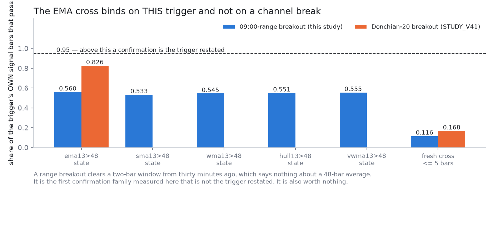
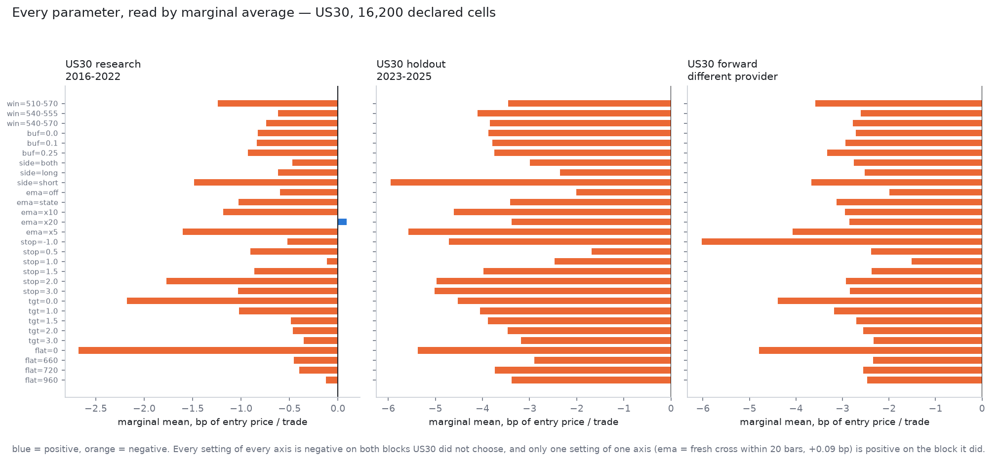
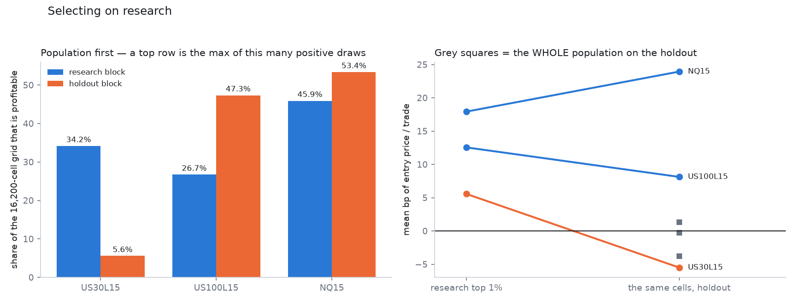
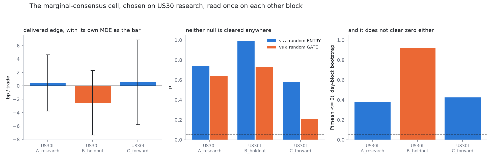

# The 09:00–09:30 range, a 09:30 breakout and an EMA 13/48 momentum gate — US30

**Verdict: null on US30 at every setting of every parameter, and the one genuinely new thing in the
study is a base rate rather than a strategy.**

Asked for: *mark the 9am high and low, wait for a breakout at the 9:30am open, use the EMA cross
for momentum, make the strategy and test it with all parameters* — then, mid-run, *do it for us30*.

---

## 0. Phase 0, written before any code ran

The half hour before the cash open is where overnight inventory is repositioned ahead of the
opening auction, so its extremes are levels at which a lot of resting orders sit. That names a
population of orders. It does not name a counterparty who **must** trade at a bad time: no
redemption, no index roll, no margin call. Under the mechanism-first architecture this is a
**fitted pattern wearing a story** and it carries the full deflation burden rather than escaping
it.

What the branch already knew, none of it re-discovered here:

* `STUDY_V35_BALANCE` swept 11 window starts × 4 lengths against 150 random same-length
  same-session controls each: **0 of 38 cells cleared p ≤ 0.05 where 1.9 are expected**, and the
  conclusion was *do not re-run the Initial Balance in any form*. The 09:00 × 30-minute cell is
  almost certainly inside that sweep.
* `STUDY_V41_EMA_DONCHIAN`: `EMA13 > EMA48` holds on **82.6%** of Donchian breakout bars. The state
  form is very nearly the trigger restated; only the recency form binds.
* The 13×48 cross has now failed a held-back read three times (`V51`, `V52`, `V55`).

What was **not** inside any of that is the conjunction asked for here — the range breakout *with*
the EMA cross *with* a support/resistance channel gate. That is the only reason the family was
re-opened, and it is stated here so the re-opening is on the record.

## 1. Data, and the file the user re-uploaded

`us30_2_year_data.rtf` was unwrapped and checked against the copy already on disk before anything
was run with it. It is **not a new market and not a new test**: 48,937 rows over
2024-08-19 01:45 → 2026-08-26 17:30 New York, and all four OHLC series agree with
`data/US30_ISO_15m.csv` at **max |diff| 0.0000 on 100.00% of 48,937 shared stamps**. Its clock
re-derives independently — mean bar range peaks at minute-of-day 570 = **09:30 New York**. Every
p-value already spent on that block stays spent. `research/datasets.py` now records the
verification.

It also **overlaps `US30_LONG_15m`** from 2024-08 to 2025-07, so only bars from **2025-07-16** are
genuinely unseen by a US30_LONG search. That is the reservation `mr30core` already uses and it is
kept.

| block | feed | span | role |
|---|---|---|---|
| A research | `US30_LONG_15m` | 2016 → 2022-12 | the only block allowed to choose |
| B holdout | `US30_LONG_15m` | 2023-01 → 2025-07 | one read |
| C forward | `US30_ISO_15m` | 2025-07-16 → 2026-08 | different provider, one read |

`US100_LONG_15m` and `NQ_1m` are read only to ask whether anything found is a US30 fact or a market
fact. Unlike `STUDY_IB25_RETRACEMENT`, this question **is** answerable cross-market: on a
15-minute feed the window is exactly the 09:00 and 09:15 bars and 09:30 is a clean bar boundary.

## 2. The arithmetic, before any rule

| feed | median ATR | median 09:00–09:30 range | round turn | cost / 1.5N stop | break-even @1R |
|---|---|---|---|---|---|
| US30_LONG | 42.53 | 47.00 = **1.13 ATR** | 2.29 | 3.6% | 51.79% |
| US30_ISO | 63.83 | 74.70 = 1.16 ATR | 2.29 | 2.4% | 51.20% |
| US100 | 22.93 | 23.50 = 1.05 ATR | 1.215 | 3.5% | 51.77% |
| NQ | 30.90 | 32.75 = 1.05 ATR | 1.72 | 3.7% | 51.86% |

**Cost is not the objection here**, which is unusual on this branch: at a 1.5×ATR stop the round
turn is 2.4–3.7% of risk. The family does not fail on execution.

## 3. The finding that is worth keeping: the EMA cross actually binds on this trigger



Measured on the trigger's own bars, before any P&L:

| reading | US30_LONG | US30_ISO | US100 | NQ | lift vs all bars |
|---|---|---|---|---|---|
| `ema13>48` state | 0.5604 | 0.5929 | 0.5785 | 0.5772 | **1.03 – 1.14** |
| `sma13>48` state | 0.5334 | 0.5616 | 0.5365 | 0.5326 | 0.99 – 1.07 |
| `wma` / `hull` / `vwma` | 0.545 – 0.555 | 0.56 – 0.60 | — | — | 1.01 – 1.14 |
| fresh cross ≤ 5 bars | 0.1156 | 0.1232 | 0.1155 | 0.1261 | 1.20 – 1.45 |

**On a Donchian-20 breakout the same state condition passes 82.6% at lift 2.24.** On a range
breakout it passes 53–59% at lift 1.03–1.14. The mechanism is plain: a channel break *is* an
N-bar high, so a fast average is necessarily above a slow one; a 09:00-range break clears a
two-bar window from thirty minutes ago, which says nothing about a 48-bar average.

So this is the **first confirmation family measured on this branch that is not the trigger
restated** — against RSI ≥ 55 at 94.7%, Aroon osc ≥ 0 at 100.0%, MACD > 0 at 99.8–100.0%,
MFI ≥ 50 at 91.7%, `+DI > −DI` at 97.8%, `close > EMA50` at 93.7%, `EMA13>48` at 82.6%, and
VWAP-vs-stochastic at ρ +0.831. It binds. **It is also worth nothing**, which is the point: the
base-rate check screens out conditions that *cannot* help, and passing it is necessary rather than
sufficient.

The five MA types span 0.533 – 0.560 on the same signal bars, reproducing `STUDY_MA_LAG` on a new
base: **change the length, not the letter.**

## 4. Gate 1 — the bare primary

63 declared cells (4 feeds × 3 sides × 3 geometries × every block), each against a matched random
entry in the same session with the same side, geometry, exits and cost, drawn bars sorted.

**0 of 63 clear p ≤ 0.05 where 3.2 are expected by chance, and 0 of 63 deliver an effect larger
than its own minimum detectable effect.** `E[max t | pure noise]` over 63 looks is 2.364 against
the 2.802 detection needs. US30 research long reads +0.0085 %/trade at PF 1.059, p 0.705; the
holdout −0.0314 short / +0.0102 long; the forward block negative on every row.

## 5. The rule exactly as asked, plus every component removed one at a time

84 declared arms. Two nulls, because they answer different questions: a random **entry** asks
whether the *level* is worth anything; a random **gate** of the same selectivity, re-simulated end
to end, asks whether the *confirmation* is. A filter is a veto, never a subset — refusing a signal
releases the position lock and admits a later break the unfiltered run never saw.

| US30_LONG, 1.5N, no target, flat 16:00 | research | p(gate) | holdout | p(gate) |
|---|---|---|---|---|
| bare breakout, long | +0.0085 PF 1.059 | — | +0.0102 PF 1.059 | — |
| + `ema13>48` state | +0.0094 PF 1.071 | 0.477 | **−0.0201 PF 0.867** | **0.998** |
| + fresh cross ≤ 5 | +0.0160 PF 1.121 | 0.432 | +0.0336 PF 1.177 | 0.237 |
| + fresh cross ≤ 20 | +0.0021 PF 1.043 | 0.675 | +0.0393 PF 1.236 | 0.058 |

On the US30_ISO forward block the three EMA readings score −0.0015 / +0.0034 / −0.0272, p 0.38 /
0.35 / 0.76. **Nothing on US30 clears both blocks.** 8 of 63 gate tests clear p ≤ 0.05 against 3.2
expected — and five of the eight are NQ *holdout* cells that fail research and pass locked, the
wrong shape for the fifteenth time on this branch (NQ both, cross ≤ 5: research +0.0823 p 0.105 →
locked +0.2773 p 0.000).

**1 of 84 cells delivers an effect larger than its own MDE.**

## 6. The support/resistance channel as a third gate

LonesomeTheBlue's channels ported with the confirmation lag applied rather than assumed away — a
pivot at bar *j* needs bars *j−prd … j+prd*, so it is usable only from *j+prd*. The broken level
sits on a channel on 25.1% (US30_LONG) / 27.6% (US30_ISO) of signal bars.

| | US30_LONG research | US30_LONG holdout | US30_ISO forward |
|---|---|---|---|
| level **on** a channel | +0.0116 PF 1.059, p 0.247 | **−0.0500 PF 0.698, p 0.998** | **+0.0426 PF 1.316, p 0.048** |
| level **not** on a channel | +0.0060, p 0.152 | −0.0011, p 0.540 | −0.0191, p 0.738 |

Opposite signs on two blocks of the same market, with the only pass on the block read last. Not a
finding; ships default OFF.

## 7. All 16,200 parameters, read the only way this grid can be read



3 range windows × 3 buffers × 3 sides × 5 EMA readings × 6 stops × 5 targets × 4 flattens =
**16,200 declared cells a feed**. `E[max t | pure noise]` over 16,200 looks is **3.977** against the
2.802 detection needs — *the maximum of this grid could not be believed even if the whole space
were noise* — so the marginal average is the only reading taken.



| feed | research profitable | holdout profitable | corr(res, lock) | research top 1% → holdout | whole population, holdout |
|---|---|---|---|---|---|
| **US30_LONG** | 34.2% | **5.6%** | +0.46 / **+0.06** Sp | +0.0556 → **−0.0550** | −0.0380 |
| US30_ISO (forward) | **12.5%** | — | — | — | — |
| US100 | 26.7% | 47.3% | +0.70 / +0.26 | +0.1255 → +0.0812 | −0.0029 |
| NQ | 45.9% | 53.4% | +0.59 / +0.44 | +0.1793 → +0.2394 | +0.0133 |

**On US30 every setting of every axis is negative on both blocks US30 did not choose**, and only
one setting of one axis is positive on the block it did (`ema = fresh cross ≤ 20`, +0.09 bp). That
is the cleanest possible statement that the family has nothing here at any parameter.

One caveat on the US100 column: `tgt = none` reads +24.76 bp and `flat = never` +19.35 bp on its
research block, and both are dominated by a handful of multi-day holds. Those are the *no-flatten*
arms, not intraday cells, and the branch's standing finding that removing a flatten produces an
overnight strategy applies rather than being contradicted.

## 8. The marginal-consensus cell, read once, with the battery



Chosen by marginal average on the US30 **research block alone** — 09:00–09:15 range, no buffer,
both sides, fresh cross ≤ 20 bars, 1.0N stop, 3R target, flat at 16:00 — then read once on each
other block.

| block | n | %/trade | PF | win | p(entry) | p(gate) | P(mean ≤ 0) | 95% CI | MDE |
|---|---|---|---|---|---|---|---|---|---|
| US30 research | 649 | +0.0044 | 1.064 | 0.263 | 0.738 | 0.637 | 0.383 | [−0.0245, +0.0346] | 0.0419 |
| US30 holdout | 319 | −0.0252 | 0.792 | 0.241 | 0.995 | 0.735 | 0.921 | [−0.0604, +0.0108] | 0.0482 |
| US30 forward | 138 | +0.0054 | 1.044 | 0.290 | 0.578 | 0.207 | 0.424 | [−0.0377, +0.0501] | 0.0632 |

Four Monte Carlos, kept apart:

* **Day-block bootstrap (the edge)** — no block excludes zero; the holdout excludes zero on the
  *negative* side at P(mean ≤ 0) 0.921.
* **Permutation (the path)** — realised drawdown at the 0.59 / 0.61 / 0.27 percentile of reshuffles
  of its own trades; **MC p99 drawdown 1.35× – 2.12× realised**, which is the sizing number.
* **Execution** — round turn drawn U(0.5×, 2×) inside the walk: P(total ≤ 0) 0.395 / 1.000 / 0.000.
* **Price jitter** — OHLC jittered with the ATR, the range and both MAs recomputed: sign kept
  1.000 everywhere.

The last two are nearly free whenever the stop is wide against the round turn, and here it is. They
say the *implementation* is not fragile; they say nothing about edge, and a tight band there must
not be read as evidence.

**Counted looks: 64,947.** `E[max t | pure noise]` = **4.296**. No deflated Sharpe is quoted
because there is no surviving candidate to deflate.

## 9. The script

`pine/nineam/NINE_AM_RANGE_BREAKOUT_strategy.pine`, lint-clean, all three components as inputs with
the EMA gate defaulting to Off and the S/R gate to Off, every measured number in the header, no
edge claimed.

Mechanics that were corrected rather than hoped:

* Every setting that is a **reach in time** is declared in MINUTES and converted with
  `timeframe.in_seconds()`, so the same numbers mean the same thing on any chart (`STUDY_V57`).
* The bracket is placed **with** the entry and priced fill-relative in ticks, so the fill bar is
  protected — `strategy.exit` on a later bar leaves the entry bar naked, and a bracket reading
  `strategy.position_avg_price` cannot be armed on the fill bar at all (`STUDY_SCALP89`).
* A break refused by a gate still consumes the session, in both the script and the research event
  stream, so the two take the first break or none.
* Every block writing `var` state is guarded by `barstate.isconfirmed`.

Parity, `research/nineam/na_parity.py`, six cells on the two US30 feeds:

| | trade count | same exit bar | per-trade correlation | gap |
|---|---|---|---|---|
| US30_LONG, three configs | **1.000** | 0.973 – 0.991 | 0.996 – 0.998 | +0.18 / −0.22 / +0.24 pts |
| US30_ISO, three configs | **1.000** | 0.986 – 1.000 | 0.989 – 1.000 | −1.04 / −2.21 / +0.00 pts |

The gap is quoted **per trade, not as a share of the total**, because this family's total is near
zero and a ratio with a collapsing denominator is the artifact `STUDY_SWEEP_110K` recorded.

## 11. Fixed POINT barriers — the option, and what it measures

Requested directly: a TP and an SL selectable as 100 points. Both are now inputs
(`Stop mode = Points`, `Target mode = Points`), and the arithmetic was run before the option was
shipped, because a point distance is the one parameterisation that is **not the same geometry
twice**.

| 100 points is… | US30_LONG | US30_ISO | NQ | US100 |
|---|---|---|---|---|
| × median in-window ATR | **2.35** | 1.57 | 3.24 | **4.36** |
| round turn / risk | 2.29% | 2.29% | 1.72% | 1.22% |
| driftless break-even @1:1 | 51.1% | 51.1% | 50.9% | 50.6% |

On US30 alone the same 100 points was 4.23 ATR in 2016 and 1.10 in 2025 (`STUDY_DL50`), so a points
grid confounds geometry with market *and* with era. The script's panel therefore prints the chosen
distance in both units live.

**The 100 / 100 cell, one read per block:**

| feed | block | side | n | %/trade | PF | win | break-even | p(entry) | P(mean≤0) | MDE |
|---|---|---|---|---|---|---|---|---|---|---|
| US30_LONG | research | long | 1378 | +0.0031 | 1.022 | 0.517 | 0.511 | 0.728 | 0.364 | 0.0247 |
| US30_LONG | holdout | long | 585 | **−0.0164** | 0.872 | 0.475 | 0.511 | **1.000** | 0.933 | 0.0298 |
| US30_ISO | forward | long | 263 | −0.0048 | 0.954 | 0.502 | 0.511 | 0.480 | 0.663 | 0.0351 |
| US100 | research | both | 1710 | +0.0407 | 1.107 | 0.535 | 0.506 | **0.025** | 0.012 | 0.0483 |
| US100 | holdout | both | 635 | −0.0089 | 0.956 | 0.501 | 0.506 | 0.983 | 0.690 | 0.0543 |

**The win rate is its own break-even**, within half a point on every US30 row — the fourth family
here where the barriers are hit by noise. Across 14 cells, **1 clears p ≤ 0.05 where 0.7 are
expected by chance, and 0 of 14 exceed their own MDE**. The one pass (US100 research) is the block
that would choose, and its holdout reads 0.983.

**The 75-cell declared points grid on US30 research** (5 stops × 5 targets × 3 sides): 54.7%
profitable, 3 of 75 outside their own MDE, best |t| **3.635** against an `E[max t | pure noise]` of
**2.428** for a search that size — so the top row of this grid is readable only as a marginal.

| target | none | 200 pt | 150 pt | 100 pt | 50 pt |
|---|---|---|---|---|---|
| marginal, bp/trade | **+0.87** | +0.80 | +0.43 | −0.44 | **−1.07** |

Monotone, with the tightest target the single worst choice in the space — **no take profit wins for
the 26th time here**, and this time the points parameterisation says it independently. The stop
marginal runs the other way (50 pt −0.26 → 200 pt +0.42), reproducing the monotone-toward-wider
result for the ninth family. The intrabar tie-break decides nothing at these widths: the ambiguous
share is 1.33% at a 50-point stop and 0.01% at 200.

Parity on the new modes: **10 of 10 cells at trade count 1.000**, same exit bar 0.962–1.000,
per-trade correlation 0.996–1.000, gap **−0.14 to +0.00 points a trade** — conservative on every
points cell.

**Defaults are unchanged** (ATR stop, no target). The points values are pre-filled at 100 and the
modes have to be switched deliberately, because on this evidence 100/100 is worse than the
researched geometry on every US30 block.

## 12. The range is the 09:00 BAR, and the choice against the half hour is free

Clarified by the user after the first pass: *"it should be 9am high and low"* — the 09:00 candle,
not the 09:00–09:30 window. That is now the default (`Range end = 555`, i.e. 09:00–09:15 declared in
minutes so it is the same reach on any chart), with the breakout still armed only at 09:30.

The research event stream had always kept those two apart, so this is a re-read of a cell the
16,200-grid already contained rather than a new search. Both readings, paired on identical
feed / block / side / geometry:

| | 09:00 bar | half hour |
|---|---|---|
| median range width, ATR | **1.03 – 1.13** | 1.50 – 1.87 |
| paired cells won | **14 of 28** | 14 of 28 |
| mean delta | **+0.0014 %/trade** | — |
| mean MDE | 0.0593 | — |

**Exactly chance, at a delta 42× smaller than the sample can resolve.** The choice is free on
performance. What it does change is the *level*: the one-bar range is about a third narrower, so the
breakout sits nearer and fires slightly more often on the long side (US30 research 1,418 long
signals against 1,378).

On the new default, US30, 1.5×ATR stop, no target, flat 16:00, against a matched random entry:

| block | side | n | %/trade | PF | p |
|---|---|---|---|---|---|
| research | long | 1418 | +0.0145 | 1.087 | 0.338 |
| holdout | long | 600 | +0.0098 | 1.053 | 0.890 |
| forward (US30_ISO) | long | 268 | +0.0087 | 1.043 | 0.177 |
| research | both | 1734 | +0.0067 | 1.047 | 0.367 |
| holdout | both | 733 | +0.0009 | 1.006 | 0.983 |
| forward (US30_ISO) | both | 315 | +0.0080 | 1.037 | 0.325 |

Positive on all three US30 blocks and on both sides — and **not one of them is a detectable
effect**. Over the 56 declared window × geometry × block cells, 3 clear their control at p ≤ 0.05
where 2.8 are expected by chance, **0 of 56 exceed their own MDE**, and `E[max t | pure noise]` over
56 looks is 2.319 against the 2.802 detection needs.

Parity after the change: **7 of 7 cells at trade count 1.000**, same exit bar 0.962–0.991, per-trade
correlation 0.996–0.998, gap −0.20 to +0.24 points a trade.

## 13. The auto breakeven — measured, and it subtracts

Asked for as a 50-point option. The branch had measured this policy once before and it was the only
exit arm that came out below its own baseline (`TEAM_EXIT_PF`: the channel exit a wash, the trail's
profit-factor gain shared with its own coin-flip twin, breakeven-after-1R the lone subtractor), so
it was measured rather than wired up.

The grid was declared before anything was read: `be` ∈ {off, 25, 50, 75, 100, 150} points ×
{long, both} × {1.5N no target, 100pt/100pt} × {US30L research, US30L holdout, US30_ISO forward}.

**72 nominal cells and 60 effective.** At the 100-point target a breakeven armed at 100 or 150
points can never fire — the target resolves first on the same bar — and those twelve rungs reproduce
their own OFF twin *to the cent and to the exit bar* (checked, not asserted: 0 of 12 differ). An
axis that changes nothing is excluded from the count, or the multiplicity corrects for tests never
run. `E[max t | pure noise]` over 60 looks is **2.345**, against the 2.802 detection needs.

Paired against each cell's own OFF twin, marginal average over the whole grid:

| arms at | Δ %/trade | Δ excess over twin | Δ stop share | Δ flatten share | cells won |
|---|---|---|---|---|---|
| 25 pt | **+0.0036** | +0.0006 | +0.222 | −0.141 | 9 / 12 |
| 50 pt (the ask) | **−0.0008** | −0.0013 | +0.145 | −0.095 | 7 / 12 |
| 75 pt | −0.0034 | −0.0028 | +0.093 | −0.069 | 1 / 12 |
| 100 pt | −0.0034 | −0.0028 | +0.048 | −0.048 | 0 / 12 |
| 150 pt | −0.0038 | −0.0031 | +0.027 | −0.028 | 2 / 12 |

**A breakeven beats its own OFF twin in 19 of 60 paired cells — 32%, where chance is 50%** — and the
ladder is monotone against the arming distance once past 25 points. The mechanism is in the exit
mix and is the same in every cell: the stop share rises and the flatten share falls by almost
exactly as much, so the ratchet arms on a favourable excursion and is then taken out on the pullback
before the 16:00 clock would have closed the trade in profit. On US30 research at 1.5N the long cell
goes +0.0145 → +0.0113 %/trade and its stop share 63.3% → 75.7%.

Two qualifications keep this honest. **Every paired delta is inside its own MDE (0 of 60 outside)**,
so this is a direction with a consistent sign across three blocks and two geometries, not a resolved
effect. And **0 of 72 cells clear a matched random entry at p ≤ 0.05** where 3.6 are expected — the
breakeven changes neither the rule's level nor its excess over its own null enough to matter.

### Securing points: the threshold is the round turn, not zero

The user's observation was exact — a true breakeven stop shows up as a *losing* trade, because an
exit at the fill books minus the commission and slippage. The fix is to move the stop slightly
*beyond* the fill, and the distance it has to clear is the round turn: on US30 that is 2.29 points
in the research accounting, so a 5-point secure books **+2.71** and is a win.

That makes `Secure, POINTS` (default **5**) the second breakeven input. Measured at breakeven = 50,
1.5N, across US30 research, the US30 holdout and the different-provider forward block:

| secured | Δ %/trade vs 0 | Δ win rate | Δ trade count | cells won |
|---|---|---|---|---|
| 5 pt | −0.0008 | **+0.410** | +0.8 | 2 / 6 |
| 10 pt | +0.0006 | +0.410 | +1.5 | 4 / 6 |
| 25 pt | +0.0059 | +0.411 | +1.7 | 5 / 6 |

**Read the trade count before the win rate.** It moves by 0 to 5 trades out of 268–1,799, so the
secured level is overwhelmingly *relabelling exits it did not move*. On US30 research long the win
rate goes 0.2207 → 0.5275 and the money goes +0.011307 → +0.009270 %/trade; on the forward block
0.1493 → 0.6493 and +0.0098 → +0.0110. Identical trades, +41 points of win rate.

The ladder does rise with the secured distance, and that is the warning rather than the
recommendation: once the level is far enough from the fill it has stopped being a breakeven and
started being a small take profit, and no take profit has beaten every target tested 26 times on
this branch. **5 is the asked-for setting and the honest one; 25 is a target wearing a stop's name.**

The panel computes the round turn **live** from the run's own closed trades —
`(gross − net) / trades / point value + 2 × tick`, because slippage is charged in ticks on both
sides and never appears in the commission figure — and prints the secured distance beside it with a
CLEARS / BELOW verdict, so the arithmetic is visible on whatever symbol the script is loaded on
rather than assumed from US30.

### How it ships

Four inputs — `Auto breakeven` (**default Off**), the arming distance (50), `Secure, POINTS` (5),
and the stop mode they sit under — with each ladder's own numbers in the tooltips. In the script the
ratchet is re-issued as an absolute stop priced from `strategy.position_avg_price` once the position
exists, which is one bar after the entry order is written and exactly when the research walker arms;
the moved stop then binds from the bar after that, because within one bar OHLC cannot order the
excursion against the pullback.

Parity with the breakeven live, including the shipped 50/+5 default: **12 of 12 cells at trade
count 1.000**, same exit bar 0.979–0.997 on the breakeven configs, per-trade correlation
0.995–1.000, gap −0.39 to +0.07 points a trade. The tick rounding of the moved stop is the only
place the two order models can disagree, and it does not move the trade count anywhere.

## 14. The 08:00 hourly candle as a direction gate — it binds, and it does not pay

Asked for directly: if the 08:00–09:00 New York hourly candle is bearish, take only the bearish
break. Unusually for a direction filter this one is *causal by construction* — the hour completes
at 09:00, before the range starts and ninety minutes before the 09:30 arm — so it can be tested
without an argument about leakage. It was audited anyway: **0 mismatches of 40 probes** on both
feeds, rebuilding the hour from history that ends at the signal bar.

### It is not the trigger restated — the second condition here to pass that check

The failure mode that has killed RSI (94.7%), Aroon (100.0%), MACD (99.8%), MFI (91.7%), +DI
(97.8%), `close>EMA50` (93.7%) and `EMA13>48` on a Donchian break (82.6%) is a confirmation that
the trigger already implies. The 08:00 hour does not:

| reading | admits of long breaks | admits of short breaks |
|---|---|---|
| direction (close vs open) | 0.4990 / 0.5430 | 0.4899 / 0.4530 |
| body ≥ 0.25 ATR | 0.4039 / 0.4242 | 0.4006 / 0.3761 |
| close position in the hour's range | 0.4970 / 0.5143 | 0.4955 / 0.4850 |

(US30_LONG / US30_ISO.) **Every cell sits between 0.376 and 0.543** — the hour is a genuinely
independent reading of direction, which is exactly why it was worth measuring.

### And then it fails every null

36 declared cells: 3 readings × {ALIGNED, COUNTER} × two geometries × three blocks, each scored
against a **random gate of the same selectivity re-simulated end to end** (a filter is a veto, not
a subset — refusing a signal releases the position lock and admits a later break). COUNTER is in
the grid because a proposed condition's sign has inverted seven times on this branch.

| reading | polarity | Δ vs no filter | beats baseline | clears its null |
|---|---|---|---|---|
| direction | **ALIGNED** (the ask) | **−0.0006** | 3/6 | **0/6** |
| direction | COUNTER | −0.0040 | 3/6 | 0/6 |
| body ≥ 0.25N | ALIGNED | −0.0062 | 0/6 | 0/6 |
| body ≥ 0.25N | COUNTER | −0.0017 | 3/6 | 0/6 |
| close pos | ALIGNED | −0.0060 | 0/6 | 0/6 |
| close pos | COUNTER | +0.0016 | 3/6 | 0/6 |

**0 of 36 cells clear p ≤ 0.05 where 1.8 are expected by chance. 0 of 36 exceed their own MDE. The
gate beats the ungated rule in 12 of 36 cells, where chance is 50%.** `E[max t | pure noise]` over
36 looks is 2.148 against the 2.802 detection needs.

By block, ALIGNED is negative on all three (−0.0041 research, −0.0045 holdout, −0.0042 forward) —
consistent, small, and in the wrong direction. COUNTER is positive on research only (+0.0031) and
negative on both blocks it did not choose, which is the shape this file has now recorded fourteen
times. On the 1.5N geometry the research block flatters COUNTER hard (+0.0171 to +0.0242 against a
baseline +0.0067) and then reads −0.0099 to −0.0168 on the holdout; that inversion is the entire
reason the mirror was declared in advance rather than discovered afterwards.

### How it ships

`08:00 hour gates the side` — **Off** / Align with the hour / Counter to the hour — plus the
reading, a body threshold and the hour's start and end **declared in minutes**, so the same numbers
mean the same thing on any chart. The candle is accumulated from the chart's own bars and frozen at
09:00 rather than pulled with `request.security(…, "60")`, because a 60-minute security bar is the
*exchange's* hour and need not begin at 08:00 New York — the same reason an RTH session high has to
be accumulated here rather than requested. The hour is shaded teal or maroon on the chart when the
gate is on, and the panel prints `bearish -> shorts only` so the state is never in doubt.

Parity with the gate live: **15 of 15 configs at trade count 1.000**, same exit bar 0.977–0.996,
per-trade correlation 0.995–0.998, gap −0.84 to +0.40 points a trade.

## 15. The MA 200 — a cross of ANY of the provided EMAs, or of ALL of them

The ask: add the 200 as a third average and require the shorter ones to have crossed it on the
side the break points. This is a third object and not a restatement of two things already
measured here — it is not the 13×48 cross (§3), which compares two fast averages with each
other, and it is not `close > MA200`, which `STUDY_V40` found is priced by its DISTANCE and
`STUDY_V51` found works as a FLOOR and not as support. Both of those are price against the
average; this is the shorter averages against it.

**Declared grid**, nothing outside it read: 4 readings (`any`/`all` × state/fresh-cross) × 2
polarities (ALIGNED, the literal ask / COUNTER, the mirror) × 2 geometries (1.5×ATR no target /
100pt–100pt) × 3 blocks (US30_LONG research, US30_LONG holdout, US30_ISO forward — a different
provider) = **48 cells**. `E[max t | pure noise]` over 48 looks is **2.261** against the 2.802
detection needs, so the ceiling was known before the table was read. COUNTER is declared in front
because this branch has inverted a proposed condition's sign eight times.

### ANY and ALL are the same condition unless a split reading resolves

Read as a single +1/−1/0 direction label the two modes are **identical to four decimals**
(0.5389 / 0.3810 / 0.0801 on US30 for both) — because "at least one above with none below" *is*
"all above". The mode axis only binds if a split reading (13 above the 200, 48 below) is allowed
to confirm *both* sides rather than abstain, which is what `ma200_ok` returns: two masks, not one
label. Under `any` a split day simply vetoes nothing. Without that the grid would have counted
twelve tests that were never run — `run_n7`'s inert-rung accounting, reached from a different
direction.

### The base rate is the finding: lift exactly 1.00

| reading | admits (long breaks) | on all bars | lift |
| --- | --- | --- | --- |
| `close > MA200` (reference) | 0.6313 | 0.5798 | **1.089** |
| any STATE | 0.6155 | 0.6190 | **0.994** |
| all STATE | 0.5411 | 0.5389 | **1.004** |
| any CROSS ≤ 5 bars | 0.0515 | 0.0439 | 1.173 |
| all CROSS ≤ 5 bars | 0.0035 | 0.0027 | 1.296 |

Across every state cell on both feeds and both sides the lift is **0.990 to 1.007**. A
200-period average is so slow that a 15-minute range break carries *no information whatever*
about where the 13 and the 48 sit relative to it — so the gate is a coin flip applied to the
signal set. Price itself does lean (1.089–1.152), which is the contrast that makes the point: the
information is in where price is, not in where the slow averages are.

This is the opposite failure from the eight confirmation families that died on this check by
passing 82–100% of the trigger's own bars. Those were the trigger restated. This one is
independent to the point of carrying nothing.

### Nothing clears, and the direction asked for is the negative one

Scored as a VETO against a random gate of the same selectivity, re-simulated end to end:

| reading × polarity | %/trade | Δ vs no filter | beats base | clears p≤0.05 |
| --- | --- | --- | --- | --- |
| any STATE **ALIGNED** | −0.0189 | **−0.0164** | **0/6** | 0/6 |
| all STATE **ALIGNED** | −0.0199 | **−0.0173** | **0/6** | 0/6 |
| any CROSS ALIGNED | −0.0007 | +0.0018 | 3/6 | 0/6 |
| any STATE COUNTER | +0.0085 | +0.0110 | 4/6 | 2/6 |
| all STATE COUNTER | +0.0113 | +0.0139 | 5/6 | 1/6 |
| any CROSS COUNTER | −0.0181 | −0.0156 | 3/6 | 0/6 |

- **3 of 36 scorable cells clear p≤0.05 where 1.8 are expected by chance**, and all three are
  COUNTER.
- **0 of 36 exceed their own minimum detectable effect.**
- The gate beats the ungated rule in **15 of 36** cells where chance is 50%.
- **12 of 48 declared cells are unscorable** (under 25 trades): the `all CROSS` reading admits
  0.0–1.1% of breaks. That is a fact about the condition, not a reason to loosen it afterwards.
- By block, COUNTER reads +0.0063 research / +0.0107 holdout / **−0.0077 on the reserved forward
  feed** — so the one polarity that scores is the one that dies on the block nobody chose.

Ships as four options on the existing MA-confirmation input, **default OFF**, with the base-rate
table and the 0/6 ALIGNED record in the tooltip. Parity: **20 of 20 configurations at trade count
1.000**, same exit bar 0.974–1.000, correlation 0.993–1.000.

---

## 16. Trend lines through two confirmed pivots, as a breakout

The ask: draw the trend lines and break them. Three ways that can enter the rule, all declared —
**GATE** (keep the range break, additionally require price to have cleared the line on the side it
is breaking), **LEVEL** (the line *is* the breakout level, the range unused), **EITHER** (the level
is whichever of the two is nearer, so the session fires on the first break of either).

Construction: the resistance line runs through the last **two confirmed** pivot highs and is
extended to the current bar; the support line through the last two pivot lows. A pivot at bar *j*
needs bars *j−prd..j+prd*, so it is knowable at *j+prd* and never at *j* — a line anchored at the
pivot itself back-tests beautifully and cannot be traded, which is exactly the leak
`STUDY_DIVERGENCE_CONFIRM` caught reading +37 full against +999 truncated. At three points a third,
earlier pivot must lie within 0.25 ATR of the same line — a pivot the line was *not* fitted to,
which is the only reading of "three points" that is not automatically true.

**Declared grid**: 4 modes × 2/3 points × 2 geometries (1.5 ATR no target / 100pt–100pt) × 3 blocks
(US30_LONG research, US30_LONG holdout, US30_ISO forward — a different provider) = **48 cells**.
`E[max t | pure noise]` over 48 looks is **2.261** against the 2.802 detection needs. The pivot
period is fixed at 10 and never swept.

### Audit clean, and the base-rate check passes

Levels rebuilt from history ending at the signal bar: **0 mismatches of 48 probes on both feeds**.

| points | admits (long breaks) | on all bars | lift | line exists | median distance |
| --- | --- | --- | --- | --- | --- |
| 2 | 0.3756 | 0.2854 | **1.316** | 1.000 | 2.39 ATR |
| 3 | 0.0793 | 0.0376 | **2.109** | 0.233 | 2.13 ATR |

0 of 8 cells admit over 95%, and the lift runs 1.30–2.71 — so the trend line is the **third**
condition in this study to be a genuinely separate reading rather than the trigger restated, after
the EMA 13/48 cross (53–59%) and the 08:00 hourly candle (37.6–54.3%). The MA200 cross failed the
same check from the other end, at lift exactly 1.00.

### And it clears nothing

Each GATE reading against a random gate of the same selectivity; each LEVEL/EITHER reading against
a **matched random entry**, because those two change which bars the rule fires on and a selectivity
control is the wrong null for them. Both re-simulated end to end.

| mode | points | %/trade | Δ vs no filter | beats base | clears p≤0.05 |
| --- | --- | --- | --- | --- | --- |
| gate ALIGNED | 2 | +0.0008 | **+0.0034** | 4/6 | 1/6 |
| gate ALIGNED | 3 | +0.0094 | **+0.0120** | 4/6 | 0/6 |
| gate COUNTER | 2 | −0.0080 | −0.0055 | 3/6 | 1/6 |
| level | 2 | −0.0032 | −0.0006 | 4/6 | 0/6 |
| level | 3 | +0.0125 | +0.0151 | 3/6 | 0/6 |
| either | 2 | −0.0020 | +0.0005 | 3/6 | 0/6 |

- **2 of 48 cells clear their own null at p≤0.05 where 2.4 are expected by chance.**
- **1 of 48 exceeds its own minimum detectable effect.**
- A reading beats the ungated rule in **27 of 48** cells where chance is 50%.
- **LEVEL is the worst of the four**: on US30 research it takes *more* trades than the range
  (1,863 against 1,734) and loses to a random entry with the same geometry at **p 1.000**. Using
  the line as the level is worse than entering at an arbitrary bar in the same session.
- GATE has the best marginal and **inverts by block** — +0.0186 research, **−0.0171 holdout**,
  +0.0216 forward.
- Three points reads the largest number in the table and is the least resolvable: it cuts the
  sample to ~120 trades a block against an MDE of 0.12–0.14.

Ships as a fourth gate, **default OFF**, with the base-rate table and the 1-of-48 record in the
tooltip. The lines plot when the mode is on. Parity: **25 of 25 configurations at trade count
1.000**, same exit bar 0.974–1.000, correlation 0.995–1.000.

---

## 10. What would change the verdict

Not more parameters — the grid's own noise floor already exceeds the detection threshold by 1.4×,
so a wider search makes the bar higher, not the answer better. What would move it is **more
events**: US30 supplies ~1,760 breakouts across nine years at this window, and the MDE at that
count is 0.036 %/trade against a delivered 0.004. A second decade of US30, or 1-minute US30 bars
that would let the window be resolved exactly and the intrabar convention be settled, are the only
two levers that change the arithmetic.

---

### Files
`research/nineam/na_core.py` · `run_n1.py` (arithmetic, base rates, Gate 1) · `run_n2.py` (the
16,200-cell grid by marginal average) · `run_n3.py` (the rule as asked, both nulls, drop-one, the
S/R gate) · `run_n4.py` (the consensus cell, four Monte Carlos, deflation) · `na_parity.py` ·
`run_n5.py` (the fixed-points parameterisation: the ATR conversion table first, a 75-cell
declared grid by marginal average, then the 100/100 cell read once per block against a matched
random entry) · `run_n6.py` (the 09:00 bar against the half hour, paired) · `run_n7.py` (the auto
breakeven ladder: the inert-axis accounting and the noise floor before the table, and the paired
comparison against each cell's own OFF twin) · `run_n8.py` (the secured-points rung, with the trade
count printed beside the win rate so a relabelling cannot be read as an improvement) · `run_n9.py`
(the 08:00 hourly candle as a direction gate: truncation audit, then the base rate on the trigger's
own bars, then both polarities against a same-selectivity random gate re-simulated) · `run_n10.py`
(the MA 200 as a third average: the ANY-equals-ALL degeneracy proved before the grid, the audit,
the lift-1.00 base rate, then both polarities against a same-selectivity random gate) ·
`run_n11.py` (trend lines through two confirmed pivots: the audit, the base rate on the
trigger's own bars, then GATE against a same-selectivity random gate and LEVEL/EITHER against a
matched random entry, because the last two change the event stream) ·
`run_n12.py` (the opposite-cross exit: the binding rate and the trade count in both arms printed
before any verdict, each reading paired against its own OFF twin on identical entry bars) ·
`run_n13.py` (its placebo -- the same number of early exits at RANDOM bars, 100 seeds a cell,
which is what separates closing AT THE CROSS from closing early at that RATE) ·
`run_n14.py` (the ATR period as a ladder paired against its own ATR(14) twin, and the ATR target
against no target -- with the ATR-target/R-target identity asserted on exit bars before either) ·
`run_n15.py` (the 200 AT the break level as a bypass: the audit and the base rate first, then
confluence as a REQUIREMENT against a same-selectivity random gate, then the OR paired against
BOTH arms it sits between -- the MA gate alone and no gate at all) · `plot_na.py` ·
`pine/nineam/NINE_AM_RANGE_BREAKOUT_strategy.pine`

## 17. Close the position on an opposite EMA cross

Asked for as an exit rule. Measured rather than wired up, because this branch has now measured
three exit policies on this family and none of them earned a place: `TEAM_EXIT_PF` found the 1.0
ATR trail raising its own coin flip's profit factor by as much as its own, the channel exit a wash
and breakeven-after-1R the one arm below its baseline; `run_n7` found the auto breakeven beating
its own OFF twin in 19 of 60 scorable cells; `STUDY_V63` found removing a chandelier trail worth
3.6x the per-trade result. The prior on closing a position early is poor and the correct null is
not zero.

**The declared grid.** off / fresh cross / opposite state x pair 13/48 and 21/55 x long and both
x two geometries (1.5xATR stop no target, 100pt stop 100pt target) x three blocks (US30_LONG
research and holdout, US30_ISO forward, a different provider) = **72 NOMINAL cells and 48
SCORABLE**. The OFF arm never reads the pair, so its two pair rows are one cell and not two;
counting them twice would correct the multiplicity for 24 tests never run. `E[max t | pure noise]`
over 48 looks is **2.261** against the 2.802 detection needs.

**The binding rate first, because an exit that never fires is an inert switch.** The two readings
are different rules and were kept apart for exactly this reason:

| reading | binds | median hold | mechanism |
| --- | --- | --- | --- |
| fresh opposite cross | **4.5-7.5%** of trades | 10.1 bars (off: 10.9) | a 13/48 flip inside a 2.5-hour hold is rare |
| opposite state | **35%** | **6.5 bars** | fires on the first bar the state is against the fill |

**The result.** The policy beats its own OFF twin in **15 of 48 cells -- 31%, where chance is
50%** -- and **0 of 48 paired deltas exceed their own minimum detectable effect**. Both marginal
averages are negative (fresh cross -0.0010 %/trade, opposite state -0.0044) and both pairs agree in
sign (13/48 -0.0033, 21/55 -0.0022), so it is a consistent direction rather than a spike. By block:
research -0.0034, holdout -0.0055, forward +0.0006.

**The mechanism is the win-rate-for-money trade, and it is visible in one row.** The opposite-state
reading takes US30 research long from **+0.0145 %/trade at a 32.6% win rate to +0.0076 at 38.9%**,
and the holdout from **+0.0098 PF 1.053 to -0.0101 PF 0.907 at a 34.7% win rate**. It converts a
payoff book into a hit-rate book and pays for the conversion. The stop share rises from 0.633 to
0.424 and the flatten share falls 0.364 to 0.207 -- the cross closes, at a worse price, trades the
clock would have closed in profit.

**AND THE PLACEBO IS THE FINDING.** A before/after cannot separate "closing at the cross helps"
from "closing early at that RATE helps", and the second needs no forecasting at all -- a coin flip
closing as often would also cut the hold, also raise the win rate and also change the trade count
by freeing the position lock. So every cell was re-run against an exit array carrying the **same
number of exit bars with the same signed mix, placed at random bars**, 100 seeds a cell
(`run_n13.py`). The real delta sits at a mean percentile of **0.38** (cross) and **0.57** (state)
of its own null; **the placebo does BETTER in 12 of 24 cells**; and 3 of 24 clear the 95th
percentile where 1.2 are expected by chance. The moving average is not doing the work. This is the
random-delay placebo of the execution-overlay literature applied to an exit rather than an entry.

One row is worth reading carefully because it is the trap: on research long at 1.5N the state
reading beats its placebo at percentile **1.00** -- and its delta is still **-0.0069**. It beats a
null that loses more. `STUDY_IB_US30_OPTUNA`'s sentence from the other side: a rule that beats a
losing null is still a losing rule.

**Causality.** The cross is read at a bar's CLOSE and the exit FILLS AT THE NEXT BAR'S OPEN,
because `strategy.close()` cannot sell the close of the bar that triggers it -- `STUDY_V16`'s
`flat_open` lesson, where the engine was changed to match the script rather than the other way
round. The stop and the target are intrabar and resolve first within the same bar.

Ships as an input on the existing MA pair, **DEFAULT OFF**, with the binding rate and the placebo
record in the tooltip. Parity: **30 of 30 configs at trade count 1.000**, same exit bar
0.986-1.000, correlation 0.989-1.000, and the gap is negative on every cross-exit config
(-1.06 to -2.19 points a trade) -- the script reads worse than the engine, which is the
conservative direction.

## 18. Three gates removed, the ATR period made selectable, and an ATR take profit

Asked to delete the 08:00 hourly-candle direction gate, the LonesomeTheBlue support/resistance
channels and the trend lines, and to add one ATR period governing every ATR setting plus an ATR
take profit.

**The removals cost nothing, because all three had already been measured to nothing** -- the 08:00
hour cleared 0 of 36 cells (section 14), the S/R channel read opposite signs on two blocks of one
market (section 2), and the trend lines managed 1 of 48 outside its own MDE with the literal
LEVEL reading losing to a random entry at p 1.000 (section 16). The measurements stay in this
document and in `run_n9.py` / `run_n11.py`; what goes is three switches on a chart, which is three
fewer ways to fit it.

### The ATR target is not a new axis under an ATR stop, and that is asserted rather than reasoned

`target = k x ATR` and `target = r x stop` are the same level when `k = r x stopAtr`. Checked on
2,295-2,580 trades at 1.5N and 2.5N across three R multiples: **identical trade counts, identical
exit bars, max |dpts| 0.000e+00** (one cell at 3.6e-12, float noise). It separates only under a
POINTS or range stop, where the risk is not an ATR multiple -- there the two agree on **66-73%** of
exit bars and the trade counts differ. So the axis is real, and only outside the default geometry.

### The ATR period ladder: 21 of 60 rungs beat ATR(14), where chance is 50%

Every figure in this study was measured at `ema(tr, 14)`, so the period is a genuinely new axis.
Declared rungs 7 / 10 / 14 / 21 / 30 / 50 x long and both x two geometries x three blocks = 72
cells, 60 of them paired against their own ATR(14) twin. `E[max t | pure noise]` over 60 looks is
**2.345** against the 2.802 detection needs.

| ATR period | paired Δ %/trade | Δ trades | beats ATR(14) |
| --- | --- | --- | --- |
| 7 | −0.0027 | −15.1 | 25% |
| 10 | −0.0019 | −6.4 | 25% |
| 21 | **+0.0004** | +4.4 | 58% |
| 30 | −0.0002 | +9.2 | 42% |
| 50 | −0.0021 | +12.9 | 25% |

**0 of 60 paired deltas exceed their own MDE**, and the two rungs either side of 14 are the only
non-negative ones -- a smooth hump centred on the incumbent, which is what an axis with no
information in it looks like when the default happens to sit in the middle. 14 stays the default.

**What moves with it is the TRADE COUNT, and not for the obvious reason.** The count rises
monotonically with the period (−15 at 7, +13 at 50) even though the break level is unchanged at the
default zero buffer -- so the events are identical and the difference is downstream: a wider stop
holds positions longer and the one-position lock then refuses later breaks. `STUDY_V56`'s mechanism
again, reached from the stop rather than the exit.

### The ATR take profit loses monotonically -- the 27th confirmation

Paired against NO TARGET at the shipped 1.5N stop, over three blocks and both sides:

| target | R equivalent | paired Δ %/trade | target-hit rate | beats no target |
| --- | --- | --- | --- | --- |
| 1.5 ATR | 1R | **−0.0167** | 48.2% | 0 of 6 |
| 2.25 ATR | 1.5R | −0.0115 | 38.2% | 0 of 6 |
| 3.0 ATR | 2R | −0.0070 | 29.5% | 2 of 6 |
| 4.5 ATR | 3R | −0.0042 | 16.5% | 1 of 6 |
| 6.0 ATR | 4R | +0.0020 | **9.4%** | 5 of 6 |

Monotone, with the tightest target the worst choice in the space. **A target beats no target in 8
of 30 cells where chance is 50%**, and 0 of 30 paired deltas exceed their own MDE. The one
non-negative rung reaches its target on 9.4% of trades, so it is barely a target at all -- setting
6 ATR and setting NONE are nearly the same strategy, which is `STUDY_INTRADAY_HEAT`'s finding on a
different base. Ships with `tgtMode` default **None**.

Parity after all of it: **28 of 28 configs at trade count 1.000**, same exit bar 0.972-1.000,
correlation 0.989-1.000, with the six new ATR-period and ATR-target configs reading 1.000 on the
count and −0.33 to +0.02 points a trade on the gap.

---

## 19. The EMA 200 *at* the break level, as a bypass of the MA-cross confirmation

The ask, restated by the user with the polarity spelled out: *"if the breakout of the 9am high or
low is the same as the ema 200 as support/bullish or resistance/bearish it could enter without a
ema cross"*.

So the proposal is an **OR** — the MA confirmation may be satisfied *either* by its own reading *or*
by the broken level coinciding with the 200-period average. That shape is what decides how it has
to be measured. **An OR loosens a gate, so it sits between two arms that already exist here: the
MA gate alone, and no gate at all.** Read against the gated arm only, an OR looks like an
improvement whenever the gate was worth nothing — which on this trigger is exactly what §15 and
§10 of the MA work both found. The question inside the ask is therefore not "does the OR help" but
**"does confluence with the 200 carry anything on its own"**.

### 19.1 What the object is, and what it is not

This is a **level coincidence** — the price the break clears and the average are the same price,
within a tolerance in ATR rather than points, because a point distance is not a setting (§5's
points-vs-ATR table, and `STUDY_US30_SCALP_0711`). It is the fourth distinct MA object in this
study and a restatement of none of the other three:

| object | what it compares | where |
| --- | --- | --- |
| 13×48 cross | two fast averages against each other | §3 |
| `ma200_ok` | the shorter averages against the 200 | §15 |
| `close > MA200` | price against the average | `STUDY_V40` / `STUDY_V51` |
| **`ma200_conf`** | **the broken level against the average** | here |

Three readings, declared in front:

- **`behind`** — the average ends up on the trade's side: below price on a long (`MA < range
  high`), above it on a short (`MA > range low`). **This is the reading the ask names**: a long
  break at the level leaves the 200 beneath price, which is support and is bullish; a short break
  leaves it above, which is resistance and is bearish.
- **`through`** — the average is the barrier the break *clears* (`MA ≥ range high` long, `MA ≤
  range low` short). The opposite configuration, declared as the mirror because this branch has
  inverted a proposed condition's sign nine times.
- **`confluence`** — either. `through` and `behind` **partition it exactly**, asserted on both
  sides at every tolerance rather than assumed.

Declared grid: tolerance 0.25 / 0.50 / 1.00 ×ATR × 3 readings × two geometries (1.5N no target,
100pt/100pt) × three blocks (US30L research, US30L holdout, US30_ISO forward — a *different
provider*) = 54 cells for the strict test, plus 36 further cells for the OR itself.
**90 declared cells, `E[max t | pure noise]` = 2.493 against the 2.802 detection needs** — so the
top row is unreadable and only marginals are taken.

### 19.2 Audit and base rate

Truncation audit, both masks rebuilt from history *ending* at the signal bar: **0 mismatches of 48
probes on each feed**. The range levels are the part that can leak (a level that exists only
because the session *later* had bars), and they do not.

**And it passes the base-rate check, which nine confirmation families on this branch did not.**
Confluence admits **5.2% to 28.0%** of the trigger's own bars at a lift over all bars of
**1.25 to 1.63** — genuinely selective, and a real lean rather than the trigger restated. Against
RSI≥55 at 94.7% of breakout bars, Aroon at 100.0%, MACD at 99.8-100.0%, MFI at 91.7%, +DI>−DI at
97.8%, close>EMA50 at 93.7%, EMA13>48 on a Donchian break at 82.6%, the stochastic against a
session VWAP at ρ +0.831, and §15's MA200 cross at lift *exactly* 1.00. The arm it would bypass
admits 11.3-58.8%.

A bypass has **two** ways to be worthless and they are opposite ends of one table: fire almost
never and it is an inert switch, fire almost always and it *is* "no gate". This one lands in the
middle, which is why it was worth running.

### 19.3 Confluence as a *requirement* — the strict direction first

A condition that cannot earn its place as a requirement has nothing to contribute to an OR. Scored
against a **random gate of the same selectivity, re-simulated end to end** — a filter is a veto and
not a subset of realised trades (`STUDY_AUCTION`):

| reading | tol | mean %/trade | Δ vs no filter | beats no filter | clears p≤0.05 |
| --- | --- | --- | --- | --- | --- |
| **behind** | **0.25** | **+0.0234** | **+0.0268** | **3/4** | **1/4** |
| behind | 0.50 | −0.0180 | −0.0154 | 2/6 | 0/6 |
| behind | 1.00 | +0.0007 | +0.0032 | 3/6 | 0/6 |
| confluence | 0.25 | +0.0039 | +0.0064 | 3/6 | 1/6 |
| confluence | 0.50 | −0.0186 | −0.0161 | 2/6 | 0/6 |
| confluence | 1.00 | −0.0222 | −0.0197 | 1/6 | 0/6 |
| through | 0.25 | −0.0011 | +0.0023 | 2/4 | 0/4 |
| through | 0.50 | −0.0150 | −0.0124 | 3/6 | 0/6 |
| through | 1.00 | −0.0278 | −0.0253 | 1/6 | 0/6 |

**The reading the ask names is the best of the three, and it is still nothing.** `behind` at 0.25
ATR is the only family in the table with a clearly positive marginal, and the whole of it is one
cell: US30L research, 82 trades, **+0.1438 %/trade at PF 2.029, p 0.043** — which reads
**−0.0825 %/trade at PF 0.523 and p 0.803 on the holdout**, and whose research effect sits *inside
its own MDE of 0.2107*. The `confluence` pass beside it does the same thing (PF 1.820 research →
0.694 holdout).

Over the grid: **2 of 50 scorable cells clear their null at p≤0.05 where 2.5 are expected by
chance**, **0 of 50 exceed their own minimum detectable effect**, and the requirement beats the
ungated rule in **20 of 50 cells where chance is 50%**. Both the `confluence` and `through`
marginals get **monotonically worse as the tolerance widens**, which is the shape of a condition
whose only content is selectivity.

### 19.4 The ask as configured — four arms, so the OR is priced against both of its bounds

| arm | cells | mean %/trade | mean PF | mean keep |
| --- | --- | --- | --- | --- |
| **1 no gate** | 6 | **−0.0025** | **0.974** | 1.000 |
| 2 MA gate | 12 | −0.0123 | 0.922 | 0.315 |
| 3 confluence only | 18 | −0.0123 | 0.933 | 0.134 |
| **4 MA *or* confluence** | 36 | **−0.0188** | **0.882** | 0.407 |

**The loosest arm is the best one and the OR is the worst.** Paired cell by cell against both of
its bounds:

| MA reading | tol | signals added | Δ vs MA gate | beats it | Δ vs *no* gate | beats it |
| --- | --- | --- | --- | --- | --- | --- |
| state 13>48 | 0.25 | 80 | −0.0032 | 2/6 | −0.0154 | 1/6 |
| state 13>48 | 0.50 | 180 | −0.0054 | 1/6 | −0.0176 | 0/6 |
| state 13>48 | 1.00 | 360 | −0.0018 | 4/6 | −0.0140 | 1/6 |
| cross≤5b | 0.25 | 133 | −0.0061 | 2/6 | −0.0134 | 1/6 |
| cross≤5b | 0.50 | 282 | −0.0129 | 2/6 | −0.0202 | 0/6 |
| cross≤5b | 1.00 | 550 | −0.0094 | 2/6 | −0.0168 | 1/6 |

The OR beats the MA gate in **13 of 36** cells and beats **no gate at all in 4 of 36**; every
marginal delta is negative; **0 of 36 paired deltas against the MA gate exceed their own MDE**. And
note *which* row is least bad: `state 13>48` at 1.00 ATR, the loosest OR in the table, adding 360
signals — i.e. the closer the bypass takes the rule to "no gate", the better it does, which is the
same statement as the arm table.

**So the bypass is a slower way of switching the MA gate off, and switching it off is free.** That
is not a criticism of the idea's logic — the mechanism is real, measurable and selective, and it
passed the check nine other confirmations failed. It is that on this trigger there is no gate worth
bypassing.

### 19.5 Shipped

Two inputs in the momentum group, **default OFF**, with the numbers above in their tooltips:
`confBypass` (Off / *Support (long) / resistance (short)* / Through / Confluence) and `confTol`
(×ATR, 0.25 pre-filled as the only rung with a positive marginal). It is inert while
`maMode = "Off"`, by construction in both models — `maOk` is already true there, so the OR cannot
change anything — which is asserted as a parity config rather than argued.

Parity after it: **35 of 35 configs at trade count 1.000**, same exit bar 0.972-1.000, correlation
0.989-1.000, the seven bypass configs reading 1.000 on the count and −2.07 to +0.12 points a trade
on the gap.

One mechanic worth recording: in the parity harness the OR's two masks must be combined **before
either drops a signal**. Gating in sequence — the MA gate, then the bypass — is an AND, which is a
different strategy; the harness computes both masks on the full event stream and unions them.

---

## 20. Optuna and vectorbt, on a daily zero-filled Sharpe and Sortino

The ask was to use Optuna and vectorbt to find a better Sharpe and Sortino. Both were run with
their known failure modes in front rather than hidden: Optuna has lost to the author's constants
fifteen times on this branch and vectorbt has failed its transcription check three times.
`research/nineam/na_opt.py` (the evaluator), `run_n16.py` (the search), `run_n17.py` (one read),
`run_n18.py` (second engine, intrabar arbiter, deflation), `run_n19.py` (the retro-correction),
`fig5_optuna_vbt.png`.

### 20.1 The objective, written before the search

* **Sharpe and Sortino over every trading day in the block, ZERO-FILLED on days that did not
  trade.** Over traded days only, a filter is paid for trading less. An optimiser handed a
  traded-day ratio finds a barely-trading cell — `STUDY_V30` measured two of four optima that
  could not muster 25 out-of-sample trades.
* **A trades-per-YEAR floor (100/yr), not an absolute count** — `STUDY_V33`'s defect, where an
  absolute floor admitted configurations with 67 training trades and zero validation trades.
* **The unit is percent of entry price.** R divides by the stop, so an optimiser scored in R is
  partly paid for tightening it (`STUDY_V61`); points confound era and market (`STUDY_DL50`).
* **The axes are the script's own inputs and nothing else**, so anything found is reachable by a
  reader of the Pine. The four MA lengths are fixed at 13/48/200 EMA, because `STUDY_MA_LAG` and
  section 15 already established that axis is inert and searching it would only inflate the
  deflation every survivor must clear.
* **Two flatten regimes, declared and reported apart**: `intraday` pins the 16:00 flatten on,
  which is the strategy as designed and as the user runs it; `free` lets the optimiser switch it
  off, which turns a 09:00-range breakout into a multi-day position.

### 20.2 The baselines, before any search — and the user's own settings are the worst arm in the table

Read off the Inputs dialog: 09:00–09:30 range, both sides, a **100-point stop and a 100-point
target**, breakeven arming at 75 securing 3, MA confirmation = **Fresh cross**, opposite-cross exit
**on**.

| configuration | block | n | /yr | Sharpe | Sortino | PF | %/trade |
|---|---|---|---|---|---|---|---|
| USER | US30L research | 281 | 45.5 | **−0.27** | −0.37 | 0.901 | −0.0130 |
| USER | US30L holdout | 135 | 53.4 | **−1.05** | −1.34 | 0.704 | −0.0400 |
| USER | US30I forward | 59 | 53.1 | **−0.70** | −0.93 | 0.795 | −0.0194 |
| DEFAULT (shipped) | US30L research | 1734 | 280.9 | +0.19 | +0.35 | 1.039 | +0.0067 |
| DEFAULT | US30L holdout | 733 | 289.7 | +0.03 | +0.05 | 1.006 | +0.0009 |
| DEFAULT | US30I forward | 315 | 283.4 | +0.31 | +0.62 | 1.055 | +0.0080 |

The shipped default is positive on all three blocks and the user's configuration is negative on all
three. That is the first finding and it did not need a search: **the four non-default settings
together cost about 0.02–0.05 % of price a trade and cut the trade count by six sevenths.** None of
it separates from zero in either direction — the default's own bootstrap reads P(mean ≤ 0) = 0.282
on research — so the honest statement is that the additions are a measurable cost against a base
that is itself indistinguishable from nothing.

### 20.3 THE SEARCH FOUND A BUG IN THE ENGINE BEFORE IT FOUND A STRATEGY

The first 6,000-trial run returned research Sharpe 2.68 and a population **94–98 % profitable with
a mean holdout Sharpe of +0.74** against the default's +0.03. A flat improvement across a whole
parameter block is a bug signature, not a plateau (`STUDY_V8_EXIT_OPT`), and it was.

**All six finalists chose the breakeven ratchet at `be_off` = 25 against `be_pts` = 25 or 50.** The
ratchet arms on the bar whose favourable **extreme** reaches `be_pts` and moves the stop to
`be_off` beyond the fill. When the two are close the moved stop is written **above the market** —
the high touched +25, the bar closed at +8, and a sell stop is placed at +25 — and `na_core._walk`
fills a stop **at its level**, so `l[j] ≤ stop` is immediately true and it books +25. A sell stop
above the market is not a stop; the same artifact is recorded in `STUDY_V10_LIMIT`. At
`be_pts = be_off = 25`, **928 of 1,436 trades (65 %) exited at exactly +22.71 points** — the
secured level minus the round turn — for a 78.1 % win rate.

The correction is one line of arithmetic and it handles a genuine gap and a through-the-market
order together: **a stop fills at the WORSE of its level and the bar's open, and a limit target at
the BETTER.** `na_opt.run2` is a COPY of the kernel, not a parameterisation of it (CLAUDE.md), and
`fix = 0` reproduces `na_core.run` at **identical exit bars and max |Δpts| 0.000e+00** on four
configurations including the ratchet.

| be_pts / be_off | n | pts/trade published | corrected | artifact | trades filling through | Sharpe pub → corr |
|---|---|---|---|---|---|---|
| 25 / 25 | 1811 | +11.385 | +0.377 | **−11.007** | 37.8 % | 2.43 → **0.08** |
| 25 / 10 | 1810 | +8.236 | +1.468 | −6.768 | 20.9 % | 1.64 → 0.29 |
| 50 / 25 | 1744 | +6.773 | +2.680 | −4.094 | 11.3 % | 1.17 → 0.51 |
| 50 / 5 | 1743 | +6.243 | +3.826 | −2.416 | 6.5 % | 1.02 → 0.64 |
| 75 / 3 *(the user's)* | 1705 | +5.792 | +5.005 | −0.788 | 2.6 % | 0.85 → 0.75 |
| 150 / 25 | 1664 | +6.454 | +6.453 | −0.001 | 0.2 % | 0.87 → 0.87 |
| **0 / 0 (no ratchet)** | 1664 | +6.454 | +6.453 | **−0.001** | 0.2 % | 0.87 → 0.87 |

**The artifact is entirely in the ratchet and scales with `be_off / be_pts`.** At `be_pts = 0` the
correction is worth −0.001 points a trade, which is `STUDY_V50` restated — on a continuous future
the next open *is* the prior close, so a genuine gap through an initial stop is worth nothing. The
user's own 75/3 is exposed on 2.6 % of trades and their baseline above is unchanged by the fix.

### 20.4 It corrects two published ladders, and it strengthens what they concluded

`run_n7` and `run_n8` measured the breakeven ladder and the secured-points offset through the same
kernel. Re-run under both engines over the same declared ladder, two geometries and three blocks
(240 paired cells), each rung against its own `be_pts = 0` twin:

| secured points | cells | paired Δ as published | corrected | artifact | beats OFF published | corrected |
|---|---|---|---|---|---|---|
| 0 | 60 | +0.0001 | −0.0037 | −0.0038 | 25/60 | **8/60** |
| 5 | 60 | +0.0002 | −0.0043 | −0.0045 | 26/60 | 8/60 |
| 10 | 60 | +0.0007 | −0.0046 | −0.0053 | 25/60 | 7/60 |
| 25 | 60 | **+0.0046** | −0.0039 | −0.0085 | 32/60 | 7/60 |

As published the offset ladder **rises** with the secured distance, and that rise was recorded as
"a large secured distance stops being a breakeven and becomes a small take profit". **Corrected,
the rise is the artifact**: every rung is negative and flat, and the breakeven beats its own OFF
twin in **7–8 of 60 cells = 12 %, where chance is 50 %** rather than the published 42–53 %. So the
correction *strengthens* the conclusion the ladders reached — the breakeven subtracts — and deletes
the single sub-finding that ran the other way. The script's tooltips carry the corrected numbers.

### 20.5 The corrected search: population first, and the ranking does not transfer

6,000 trials (1,000 × 3 objectives × 2 regimes), 4,710 scorable. `E[max t | pure noise]` over a
search that size is **3.734 against the 2.802 detection needs**, so the top row is not believable
on its own p-value however it scores, which is stated in the runner's own output before any table.

| study | scorable | % profitable | % beating the default | Pearson | Spearman | top 1 % research | → holdout | population holdout |
|---|---|---|---|---|---|---|---|---|
| intraday_sharpe | 753 | 0.895 | 0.793 | +0.250 | +0.208 | +1.130 | **−0.589** | −0.513 |
| intraday_sortino | 824 | 0.948 | 0.887 | +0.481 | +0.383 | +1.223 | +0.019 | −0.156 |
| intraday_retdd | 794 | 0.936 | 0.901 | +0.621 | +0.496 | +1.170 | +0.153 | −0.034 |
| free_sharpe | 799 | 0.964 | 0.929 | +0.357 | +0.309 | +1.453 | −0.071 | −0.095 |
| free_sortino | 731 | 0.930 | 0.845 | +0.363 | +0.287 | +1.270 | +0.036 | +0.078 |
| free_retdd | 809 | 0.930 | 0.871 | +0.532 | +0.489 | +1.302 | −0.028 | −0.262 |

Pooled over all 4,710: **research Sharpe +0.621 → holdout −0.164**, the top 1 % by research
**+1.369 → −0.049**, and only **38.2 %** of trials have a positive holdout Sharpe at all. The
positive Pearson is the `STUDY_V64_OPTUNA` artefact — TPE concentrates in a narrow good region, so
the correlation is measured over a restricted range with both ends positive; it says the
neighbourhood is uniformly decent, not that research ranking picks winners, and the finalist table
below says the opposite.

**fANOVA gives `ma_mode` 0.47–0.75 of every objective** and `m200_form` a further 0.06–0.42; every
geometry axis is under 0.15. The optimiser is overwhelmingly choosing a *gate*, not a stop or a
target — which is worth knowing precisely because sections 15 and 19 measured those gates as
worthless against a same-selectivity control.

### 20.6 One read: every finalist inverts, the un-searched default does not

Six finalists, plus the default, the user's configuration and three cells drawn uniformly from the
same declared space (three of the fifteen re-optimisers on this branch lost to a random cell).

| arm | research Sharpe | %/trade | holdout Sharpe | %/trade | forward Sharpe | %/trade |
|---|---|---|---|---|---|---|
| intraday_sharpe | +1.15 | +0.0456 | **−0.55** | −0.0169 | **−0.62** | −0.0181 |
| intraday_sortino | +1.23 | +0.0420 | −0.10 | −0.0029 | −0.21 | −0.0065 |
| intraday_retdd | +1.12 | +0.0367 | +0.08 | +0.0022 | −0.98 | −0.0253 |
| free_sharpe | +1.49 | +0.0641 | −0.07 | −0.0023 | −1.13 | −0.0335 |
| free_sortino | +0.97 | +0.0422 | −0.08 | −0.0016 | **−7.07** | −0.0412 |
| free_retdd | +1.29 | +0.0935 | +0.08 | +0.0040 | −0.78 | −0.0325 |
| **DEFAULT (shipped)** | +0.19 | +0.0067 | **+0.03** | +0.0009 | **+0.31** | +0.0080 |
| USER (their inputs) | −0.27 | −0.0130 | −1.05 | −0.0400 | −0.70 | −0.0194 |
| RANDOM cells 1–3 | −0.43 / +0.10 / −0.75 | | −0.31 / −1.28 / −1.11 | | +0.65 / −1.30 / −0.54 | |

Against a **matched random entry** — a random bar at or after 09:30 on the same sessions, same
side, same geometry, same exits, same cost, drawn bars sorted so the position lock keeps the same
fraction each draw:

* **4 of 6 finalists clear on research** (p 0.000–0.010).
* **0 of 6 clear on the holdout** (best p 0.623) and **0 of 6 on the reserved forward block**
  (best p 0.175).
* Every finalist's research bootstrap CI excludes zero (P(mean ≤ 0) 0.000–0.001); **not one
  holdout or forward CI excludes zero on the positive side**, and `free_sortino` excludes it on the
  **negative** side on the forward block.
* `per / MDE` runs 0.96–1.47 on research and **0.05–0.47 out of sample** — the finalists are not
  merely unproven out of sample, they are an order of magnitude inside what that sample could
  resolve.

**Deflation.** Over 4,710 scorable trials the per-day trial Sharpe has sd 0.02447, and
`E[max per-day Sharpe | pure noise]` at N = 6,000 is **+0.09137** against a best achieved
**+0.09366** — the best thing 6,000 trials found sits at **1.025×** its own noise floor. The
deflated Sharpe of the best research finalist is **0.5398, FAIL**. White's reality check over 250
sampled trial streams reads p 0.0235 and passes — but on the **research** block, where the
candidates were chosen; the fresh-sample answer is the 0-of-6 above.

### 20.7 vectorbt passes its transcription check for the first time on this branch

Run count-first, at **zero cost in both arms**, on the reduced geometry both engines can express.
vectorbt 1.1.0 cannot represent three of this strategy's axes and they are named rather than
quietly dropped: `sl_stop`/`tp_stop` are **fractions of price**, not per-trade ATR multiples (solved
for per entry here); `td_stop`/`dt_stop` **do not exist**, so a hold cap is unavailable; and there
is **no breakeven ratchet at all**.

| arm | block | engine n | vbt n | ratio | engine pts | vbt pts | gap |
|---|---|---|---|---|---|---|---|
| intraday_sharpe | research | 1260 | 1254 | 0.995 | 9.795 | 8.341 | −1.454 |
| intraday_retdd | research | 807 | 804 | 0.996 | 13.715 | 13.398 | −0.317 |
| free_sharpe | research | 519 | 519 | **1.000** | 19.330 | 19.243 | −0.087 |
| DEFAULT | research | 1418 | 1413 | 0.996 | 6.244 | 7.899 | +1.654 |
| DEFAULT | holdout | 600 | 600 | **1.000** | 5.384 | 3.690 | −1.694 |
| USER | holdout | 76 | 75 | 0.987 | −7.803 | −18.627 | **−10.824** |

**14 of 14 cells pass** at a count ratio of 0.987–1.000, against three prior transcription failures
on this branch (`STUDY_V46` 0.12–0.98, `STUDY_V53` 0.034, `STUDY_VWAP_EMA_INDICES` 0.83–0.86). The
gap is ±1.7 points a trade on most cells — an order of magnitude smaller than `STUDY_V38`'s 2.1×
and `STUDY_V41`'s 22.9×, because this geometry's stop and flatten rarely fall inside one bar. The
one large gap is the **user's own configuration on the holdout, −10.8 points a trade**, which is a
100/100 barrier pair — exactly the geometry where the intrabar convention binds, and it makes their
configuration *worse* under the second engine, not better.

### 20.8 The 30-second feed settles the intrabar question this geometry actually has

`US30_30s` (390,552 bars, 2025-08 → 2026-09) post-dates the whole search but overlaps the reserved
forward block, so a P&L read there is a second read of the same weeks and is descriptive. What it
settles is the measurement. **Coverage first**: the feed omits bars with no activity, and of its
293 sessions **270 carry a 09:30 bar while only 92 carry the 09:00–09:30 pre-open** the range is
built from. The pre-open is exactly where a Dow CFD is quiet. So the geometry question — which is a
property of the *barriers*, not of the trigger — is asked on a 09:30-open long on every session,
with the rule's own trigger run beside it on the 92.

| stop / target (pts) | trades | ambiguous | share | resolve at 30 s | stop first | target first |
|---|---|---|---|---|---|---|
| 50 / 50 | 292 | 52 | **17.8 %** | 1.000 | 0.577 | 0.423 |
| 50 / 100 | 292 | 18 | 6.2 % | 1.000 | 0.833 | 0.167 |
| 75 / 50 | 292 | 22 | 7.5 % | 1.000 | 0.364 | **0.636** |
| 100 / 100 | 292 | 6 | 2.1 % | 1.000 | 0.500 | 0.500 |
| 150 / 50 | 292 | 7 | 2.4 % | 1.000 | 0.143 | **0.857** |
| 100 / 200, 150 / 200 | 291 | **0** | 0.0 % | — | — | — |

**Every ambiguous 15-minute trade resolves at 30 seconds** — 135 of 135 — and pooled the stop came
first **52.6 %** of the time. That is a sharper statement than section 20 of
`STUDY_US30_SCALP_0711`, which measured a single 61.4 %: **the convention's accuracy depends on the
geometry and runs the obvious way.** With a target tighter than the stop the *target* usually comes
first (150/50: 85.7 %), so stop-always is wrong five times in six there; with a target wider than
the stop the stop usually comes first (50/100: 83.3 %). A 15-minute file is adequate for any cell
with a target at or beyond 200 points, where ambiguity is exactly zero.

### 20.9 Verdict

**Optuna and vectorbt did not find a better Sharpe or Sortino; they found a bug in the fill model,
and correcting it is the deliverable.** Six finalists reach research Sharpe 0.97–1.49 against the
shipped default's 0.19, four clear a matched random entry there, and **every one of them is at or
below zero on the holdout and on a different provider's forward block, where none clears any
control and all sit inside their own MDE.** The best of 6,000 trials is at 1.025× its own noise
floor and deflates to 0.5398. That is the sixteenth re-optimiser on this branch to lose to the
author's constants.

What the user should change is not a parameter the optimiser found — it is the four settings they
are already running. **Turn the breakeven, the opposite-cross exit, the fresh-cross MA
confirmation and the 100/100 points barriers off**, i.e. return to the shipped defaults, which are
the only arm in the table positive on all three blocks. Nothing here is an edge: the default's own
bootstrap does not exclude zero on any block either, and the honest claim is that the additions are
a measurable cost on a base that is indistinguishable from nothing.

---

## 21. A fresh 13×48 cross overriding the 200 — the ask, measured as an OR

> *"if ema cross of 13 and 48 cross it with a orb breakout of the 9am high and low that is chosen
> in the current rule selection it can long or short against the 200 ema"*

So when a fresh 13/48 cross coincides with the range break, the trade is allowed **even if the
shorter averages sit on the wrong side of the 200** — the 200 gate is overridden. That is an OR,
and §19 established the reading an OR requires: it loosens a gate, so it sits between two arms and
can only be judged against both.

```
no gate at all   ≤   the 200 gate OR a fresh cross   ≤   the 200 gate alone
  (loosest)                  (the ask)                       (tightest)
```

Read against the **gated** arm alone an OR looks like an improvement whenever the gate was worth
nothing — and §15 already measured that the 200 state readings admit 38.4–61.6 % of the signal bars
at a lift over all bars of **0.990 to 1.007, exactly one**. A gate with lift 1.00 is a coin flip
applied to the signal set, so anything that loosens it reads as an improvement about half the time
for no reason at all. The `none` arm is what stops that reading.

`research/nineam/run_n20.py`. Four arms, all vetoes on the same event stream, so a
same-selectivity random **gate** is the right null for each (§16: a gate takes a selectivity
control; something that changes *which bars fire* takes a matched random entry).

### 21.1 The degeneracy, asserted before the grid

The script's `maMode = "Fresh cross"` is `barsSinceUp <= crossBars`, and the bypass is the same
expression — so with that MA mode selected **the OR is an identity and the switch does nothing**.
Verified on the real signal set: the gate keeps **296 / 456 / 690** signals at 30 / 75 / 150
minutes and the OR keeps exactly the same, for both readings of "fresh" below. Reproduced at the
script level by the parity harness (cfg41). With MA confirmation `Off` it is inert for the same
reason (cfg42 = the ungated base, 2,467 trades, to the trade). Those rungs are excluded rather
than counted — the same inert-rung accounting `run_n7` applied to a breakeven armed beyond its own
target and `run_n14` to an ATR target under an ATR stop.

### 21.2 Two readings of "a fresh cross", declared rather than picked

The script's own Fresh-cross mode requires only recency, so it admits a bar where the 13 crossed up
recently and **has since crossed back down** — 4.2 / 8.2 / 13.2 % of its own population at 30 / 75 /
150 minutes. The strict form additionally requires the state still to hold, and is a **subset**, so
the §21.1 identity holds either way. Both were measured:

| reading | cells | OR mean | OR − 200 gate | OR − no gate |
|---|---|---|---|---|
| strict (state must hold) | 68 | −0.0143 | −0.0019 | −0.0136 |
| **loose (the script's form)** | 68 | −0.0145 | −0.0021 | −0.0137 |

Paired, loose minus strict on the OR arm is **−0.0001 %/trade over 68 cells** (loose better in
28, 41 %). They are indistinguishable, so file consistency decides it rather than the numbers: the
script keeps one expression, and therefore one meaning, for "fresh cross" throughout.

### 21.3 What the bypass can possibly act on

A bypass has two opposite ways to be worthless — fire almost never and it is an inert switch, fire
almost always and it *is* "no gate" — and both live in one column: the share of the breaks the 200
**refuses** on which a fresh cross fires.

| | 200 keeps | 200 refuses | bypass rescues, of refused | OR keeps |
|---|---|---|---|---|
| across 24 feed × reading × recency cells | 0.461–0.546 | 0.454–0.539 | **0.070–0.201** | 0.501–0.637 |

So it sits near the inert end. It is also *not* selective on the trigger's own bars: the bypass's
lift over all bars runs **1.08 at 30 minutes down to 0.79 at 150** — at the wide rungs a fresh
13/48 cross is *less* common on a 09:00-range break than on an average bar, because a break tends
to happen when the market is already moving and a cross within 150 minutes means the trend only
just turned.

### 21.4 The four arms

144 declared cells per arm (2 readings of the 200 × 2 readings of "fresh" × 3 recencies × 2
geometries × long/both × three blocks); `E[max t | pure noise]` over 144 looks is **2.656** against
the 2.802 detection needs.

| arm | mean %/trade | vs no gate | beats no gate | clears p≤0.05 | outside its own MDE |
|---|---|---|---|---|---|
| none | −0.0005 | — | — | 0/144 | 0/144 |
| fresh cross alone | −0.0057 | −0.0050 | 28/68 (41 %) | 0/136 | 0/136 |
| the 200 gate alone | −0.0119 | −0.0117 | 18/68 (26 %) | 0/144 | 0/144 |
| **the OR (the ask)** | **−0.0141** | **−0.0137** | **6/68 (9 %)** | 0/144 | **12/144, all negative** |

Paired cell for cell on the shipped reading: **the OR beats the 200 gate in 18 of 68 (26 %)** at a
mean −0.0021, and **beats no gate at all in 6 of 68 (9 %)** at −0.0137, where chance is 50 %.
**0 of 424 arm-cells clear their same-selectivity control at p ≤ 0.05 where 21 are expected by
chance** — below chance across the whole table. Twelve OR cells do exceed their own minimum
detectable effect and every one is on the negative side, so those are resolvably bad rather than
merely unproven.

By block, the OR minus each arm it sits between:

| feed | block | OR − 200 | OR − none | 200 − none | fresh − none |
|---|---|---|---|---|---|
| US30L | research | −0.0026 | −0.0065 | −0.0039 | −0.0071 |
| US30L | holdout | −0.0048 | −0.0192 | −0.0144 | −0.0045 |
| US30I | forward (different provider) | +0.0019 | −0.0159 | −0.0178 | −0.0029 |

The one positive figure in the table is the OR beating the 200 gate on the forward block by
+0.0019 %/trade — an order of magnitude inside that block's own MDE, and against an arm that is
itself the worst thing on that block.

### 21.5 Verdict

**The OR is the worst arm in the table and the loosest arm is the best** — the second bypass on
this trigger to measure that way, after §19's level-coincidence version (which read no gate
−0.0025, MA gate −0.0123, the OR −0.0188). Switching the 200 gate off is free and costs nothing to
try; this is a slower route to the same place.

The one thing worth keeping is the decomposition: **of the two conditions the ask combines, the
CROSS — which it treats as the override — is the better of the two, and the 200 — which it treats
as the base — is the worse** (−0.0057 against −0.0119). Neither is positive against no gate on any
block, so that is a ranking of two nulls and not a recommendation.

Ships as one input, **DEFAULT OFF**, with these numbers in its tooltip and the panel naming the
degenerate case when both it and the Fresh-cross MA mode are on. Parity: **84 of 84 configurations
at a trade-count ratio of exactly 1.000**, same exit bar 0.962–1.000, per-trade gap −2.14 to +0.09
points.

---

## 22. The user's own settings, on 30-second bars only

**The ask.** Run the configuration in the Inputs screenshots on 30-second bars and nothing else,
with IS/OOS, a walk-forward, a Monte Carlo simulation, a Monte Carlo perturbation, correlation
matrices, every table as a figure, and "more advanced quant tests".

**The configuration, transcribed and nothing inferred.** Range 540..545 (09:00–09:04:30), earliest
entry 568 (09:28), no new entries after 960, flatten 960, ATR 14, side BOTH, buffer 0, touch counts
as a break, MA confirmation FRESH CROSS 13x48 within 7 MINUTES, the 200-at-level bypass OFF, the
fresh-cross bypass ON, stop POINTS 100, target POINTS 100, auto breakeven POINTS arming at 43 and
securing 5, and a close on a FRESH OPPOSITE CROSS. `research/nineam/na_s30.py` carries it as `CFG`;
`run_n21.py`, `run_n22.py`, `run_n23.py` and `plot_n21.py` are the run.

### 22.1 The feed cannot see the rule's own range on 69% of its sessions

`US30_30s` omits bars with no activity and the 09:00 half hour is exactly where a Dow CFD is quiet.
Of 293 sessions carrying a 09:30 bar, **92 (31.4%) carry the 09:00–09:04:30 range**, and the
coverage is ALL-OR-NOTHING: where it exists it is the full ten bars, where it does not there is no
bar at all. It begins **2026-04-30**, three days after the volume column starts — the export's
behaviour changed mid-file. So the tradeable sample is not the file; it is a 4.5-month tail, and
every number below lives on it. `US30_30s` also OVERLAPS the reserved `US30_ISO_15m` forward block
to 2026-08-26, so this is a second read of those weeks and is descriptive.

### 22.2 The bypass is inert at these settings, asserted on the signal set

With MA confirmation on "Fresh cross" the script's gate is `barsSinceUp <= crossBars` and the bypass
is the same expression, so their OR is an identity: **174 ungated signals, 58 kept by the gate, 58
by the bypass, 58 by the OR**. The shipped panel already prints "OR fresh cross — INERT, it IS the
gate" for exactly this case. The strict research mask (state AND recency) keeps the same 58 here,
because a 14-bar recency window at 30 seconds is too short for the state to flip back — so the
mask ambiguity §21 found on 15-minute bars does not bite on this feed.

### 22.3 What the run says

| | n | %/trade | PF | win | total % | MDE | delivered/MDE |
|---|---|---|---|---|---|---|---|
| ALL | 57 | +0.0358 | 2.022 | 0.702 | +2.040 | 0.0483 | **0.74×** |
| IS | 29 | +0.0284 | 1.862 | 0.655 | +0.823 | 0.0642 | 0.44× |
| OOS | 28 | +0.0435 | 2.169 | 0.750 | +1.218 | 0.0735 | 0.59× |

It **clears both nulls** — a matched random entry p **0.003**, a same-selectivity random gate
p **0.010** — and the day-block bootstrap excludes zero on the whole sample (P(mean≤0) **0.018**),
while every block is **inside its own MDE**. Both statements are true and they answer different
questions (`STUDY_V15_BOOK`): a control's null sd is far tighter than the MDE because its draws are
subsets of the same signal set. Daily zero-filled Sharpe 3.31 / Sortino 7.50 — annualised from 92
days, so read them as a shape, not a rate.

### 22.4 The MA gate is the strategy, and everything else is decoration

Drop-one: removing the fresh-cross confirmation takes the rule from **+0.0358 on 57 trades to
−0.0130 on 131**, PF 2.022 → 0.781. Nothing else moves it by more than a third of that — the
breakeven −0.0019, the cross exit −0.0018, the target −0.0213, the five-minute range −0.0173 — and
moving the arm from 568 to the 09:30 open **improves** it (+0.0417 on 65 trades). The base-rate
check passes: the gate keeps a third of the trigger's own bars at lift **1.86×**, so unlike the nine
confirmation families that died here it is neither the trigger restated nor inert.

### 22.5 The result is the BAR SIZE, not the rule

The same configuration on 1-minute and 5-minute bars resampled from the **same file**:

| bars | EMA as configured | EMA held at 6.5 / 24 MINUTES |
|---|---|---|
| 30s | **+0.0358** (n 57) | +0.0358 (n 57) |
| 1m | −0.0450 (n 34) | +0.0047 (n 70) |
| 5m | −0.0137 (n 17) | −0.0280 (n 69) |

`STUDY_V57`'s finding on a whole configuration: the script converts the fresh-cross reach from
MINUTES and does **not** convert the EMA lengths, so `EMA 13 / 48` spans **6.5 and 24 minutes** on a
30-second chart against 13 and 48 on a one-minute one. Holding the EMAs' reach in minutes fixed does
not reproduce the 30-second result at either other resolution (+0.0047 and −0.0280 against +0.0358),
so the sign follows neither the minutes nor the bar size consistently — which is what a 57-trade
sample of a null looks like. Daily P&L correlation across the three resolutions is only 0.27–0.33.

### 22.6 Walk-forward, and the seventeenth re-optimiser to lose

Six folds over the tradeable sessions, a 72-cell declared grid (`E[max t | noise]` 2.413 against the
2.802 detection needs): totals **+2.226 fixed, +1.515 re-chosen, +2.528 RANDOM**, 4 of 5 folds
positive for all three arms. The re-chooser picks a different cell in every fold and loses to a coin
flip drawn from its own grid.

### 22.7 The four Monte Carlos

- **EDGE** (day-block bootstrap): ALL P(mean≤0) 0.018, CI [+0.0020, +0.0699]; IS 0.102; OOS 0.047.
- **PATH** (6,000 permutations): realised drawdown 0.428% at the **31.6th percentile** of reshuffles
  of its own trades — a smoother path than the trades imply. MC p99 is **2.28×** realised, which is
  the sizing number.
- **EXECUTION** (round turn drawn U(0.5×, 2×) per trade, inside the walk): band +0.0343 to +0.0351,
  P(total ≤ 0) **0.000**, and the cost ladder is still positive at **8×** the assumed round turn.
  2.29 points is 2.3% of a 100-point stop, so this test cannot fail on this geometry — it says the
  implementation is not fragile, never that the edge is real.
- **DATA** (price jitter at ±0.5/1/2 ticks with the ATR, both EMAs, the 09:00 range and the cross
  state ALL recomputed): sign kept **1.000** at every level, trade count 57 → 60.

### 22.8 Correlations

Between ARMS on zero-filled daily percent: the rule correlates **0.965** with itself minus the cross
exit and 0.837 minus the breakeven — those are the same strategy — **0.424** with itself ungated and
only **0.150** with always-long, so it is not a drift exposure; long and short are −0.057 to each
other. Between CONDITIONS **on the signal bars**, nothing duplicates: the strongest pair is the
fresh cross against the 13>48 state at **+0.393**, which is the recency form against the state form
of one indicator.

### 22.9 The win rate is a relabelling and the accounting says so

70.2% overall against a **target-hit rate of 36.8%** and a driftless break-even of **0.5115** for a
100/100 pair — **17 of 57 trades book exactly +2.71 points**, the secured 5 minus the 2.29 round
turn. A breakeven stop is a losing trade by construction; the secured offset is what relabels it
(§8). And the intrabar tie-break is settled rather than assumed: at 100/100 on 30-second bars the
ambiguous share is **exactly 0.0000**, so none of this is a convention.

**Deflation.** 98 counted looks, `E[max t | noise]` 2.523; per-trade Sharpe 0.2749 against an
expected best-of-noise of 0.1388 — **1.98× its own noise floor** — and a deflated Sharpe of
**0.8418, FAIL** at the 0.95 bar. Detecting the observed effect needs **104 trades against 57 in
hand**, which is 0.7 years at this feed's rate — and that rate is a property of the export, not of
the market, because the range exists on only 92 of 293 sessions.

**Verdict.** The configuration clears both nulls and its own bootstrap on 4.5 months of one market,
is carried entirely by the fresh-cross gate, does not survive a change of bar size in either
reading, and is inside its own MDE in every block. Robust to execution and to data noise; not
resolved by the sample. Ship nothing; forward-test ~50 more trades on a feed whose pre-open the
export actually carries.

---

## 23. Forward test — pre-registered 2026-09-18, before any forward trade exists

§22 measured 57 trades at **+0.0358 %/trade with a bootstrap CI of [+0.0018, +0.0693]** — between
**$740 and $28,053 a year** on one US30 contract. No further analysis of those 57 trades narrows
that. Only more trades do, and the count is not arbitrary: at n = 107 the MDE falls to **0.0353**
against a delivered 0.0358, so **fifty more trades is exactly what crosses the detection bar**.

| n | MDE | delivered / MDE |
|---|---|---|
| 57 (now) | 0.0483 | 0.74 |
| 87 | 0.0391 | 0.92 |
| **107** | **0.0353** | **1.02** |
| 157 | 0.0291 | 1.23 |

### 23.1 What is frozen

`na_s30.CFG`, sha **2e070e002ce49df3**, asserted on every run of `research/nineam/fwd_track.py` —
range 540..545, first entry 568, no new entries after 960, flatten 960, ATR 14, side BOTH, buffer
0, touch counts, MA confirmation FRESH CROSS 13x48 within 7 MINUTES, the 200 bypass OFF, stop
POINTS 100, target POINTS 100, breakeven POINTS arming 43 securing 5, exit on a FRESH OPPOSITE
CROSS. **If any parameter moves the hash changes, the run aborts, and the count restarts at zero.**
Verified: changing the stop to 90 points raises `CONFIGURATION CHANGED` and refuses to continue.

**Cutoff 2026-09-16 18:17 New York**, the last bar of the studied file. A trade is forward only if
its ENTRY bar post-dates it. The last studied trade entered 2026-09-11, so the three sessions
between are neither studied nor forward and are excluded by the same rule.

### 23.2 The decision rule, declared now

On the **forward trades alone**, nothing else:

| band | forward mean | reading |
|---|---|---|
| **CONFIRM** | ≥ **+0.0303** %/trade | clears a one-sided 5% test on 50 trades by itself |
| **CONSISTENT** | 0 < mean < +0.0303 | pooled n = 107 then read against its own MDE of 0.0353 |
| **REFUTE** | ≤ 0 | the research block was the draw — no re-fit, no re-parameterisation |

**Read the middle band honestly: even if the strategy is exactly as good as its backtest, it lands
in CONFIRM only 61.8% of the time** (against 5% if the truth is zero). CONSISTENT is the single
most likely outcome of a real effect this size, which is why the pooled reading is declared here
rather than invented when the trades arrive.

### 23.3 Timeline and the one thing that could go wrong quietly

155 trades a year over the studied span, so **50 trades is about four months — roughly mid-January
2027**. That assumes the feed keeps carrying the 09:00 half hour, which it only began doing on
2026-04-30 (§22.1). `fwd_track.coverage()` prints the covered share of every new session on each
drop, because **a shortfall in the trade count is a data question before it is a strategy
question** — and this feed has already changed its export behaviour once, mid-file.

`fwd_track.update()` also re-checks that the bars at or before the cutoff are unchanged: a feed
revision on the studied span would void the ledger rather than silently shift the baseline.

### 23.4 Status

**0 of 50 forward trades.** The feed ends on the cutoff bar. Nothing is scheduled; drop a newer
`US30_30s` export over `data/US30_30s.csv` and run `python research/nineam/fwd_track.py`.

---

## 24. The settings the Inputs dialog actually holds — the full battery

Section 22 measured a 100/100-point configuration on 30-second bars. The Inputs screenshots that
arrived afterwards hold a **different configuration**, and the differences are not cosmetic:

| setting | §22 | the dialog | what changes |
| --- | --- | --- | --- |
| first entry | 568 | 566 | — |
| no new entries after | 960 (16:00) | 600 (10:00) | entry window 392 min → **34 min** |
| flatten | 960 | 630 (10:30) | max hold 392 min → **64 min** |
| ATR length | 14 bars (7 min) | 45 bars (22.5 min) | a different indicator |
| fresh-cross reach | 7 min | 5 min | tighter |
| stop | 100 POINTS | **2.25 × ATR** | a different geometry per session |
| breakeven secures | 5 pts | 3 pts | — |

The target stays 100 points. With ATR(45) running at a median 11.59 points the stop lands at
**26.07 points**, so the reward-to-risk is **3.84 : 1** and the driftless break-even win rate is
**0.207, not 0.500**. That single change makes this a different strategy, not a tweak, and every
number below is read against *its own* geometry.

Modules: `research/nineam/na_live.py` (the config), `run_n24.py` (geometry, coverage, IS/OOS,
nulls), `run_n25.py` (walk-forward, four Monte Carlos, drop-one, correlations, deflation),
`run_n26.py` (tradeability), `plot_n24.py` → `fig10_live_validation.png`,
`fig11_live_tradeability.png`.

### 24a. The result, and the reconciliation with TradingView

92 of 293 sessions in the file carry the 09:00 range (all-or-nothing, from 2026-04-30). 162 breaks
occur in 09:26–10:00; the fresh 13×48 cross keeps **27.8%** of them, leaving **45 triggers on 42
sessions → 44 trades**.

```
44 trades   +0.0548 %/trade = +28.56 points = $142.81 at 1 contract, $5/point
total +2.41 % = +1,257 points = $6,283      PF 3.903   win 0.6364   max DD 0.249 %
```

**The locally measured PF of 3.903 lands on TradingView's reported 3.85.** That is the strongest
evidence available that the transcription of the Inputs dialog is correct and the TV report is
reproducible outside TradingView. One residual discrepancy is resolved the same way: TV's average
win of **$606.48** is 2.01× the $301.60 measured here at 1 contract, so the TV run was sized at
**two contracts (or $10/point)**, not one. Nothing else needs to change; P&L scales linearly.

### 24b. What survives

| test | result | reading |
| --- | --- | --- |
| MDE at n=44 | 0.0463 %/trade, delivered 0.0548 = **1.18×** | clears, barely |
| day-block bootstrap | 95% CI [+0.0233, +0.0873], P(mean≤0) = **0.0003** | clears |
| random ENTRY null (400) | median +0.0023, **p = 0.000** | 0 of 400 draws reached the rule |
| random GATE null (400) | median +0.0086, **p = 0.000** | the gate is not merely thinning |
| IS / OOS (chronological) | +0.0391 (n=22) / +0.0704 (n=22) | both positive; neither clears its own MDE |
| MC path (8,000 permutations) | realised DD at the 71.7th pct; p99 = 1.70× realised | size to the p99, $1,103, not to $648 |
| MC execution (U(0.5×,2×) round turn) | P(mean≤0) = 0.0000 | **nearly free by arithmetic — not evidence** |
| MC data (price jitter, all indicators recomputed) | sign kept **60/60** at ±0.5, ±1, ±2 ticks | robust |
| cost ladder | net survives to ~14× the modelled round turn | the edge is in the target hits |
| months | **5 / 5 positive**; best month 41% of net | |
| weeks | 14 / 19 positive; best week 23% of net | |
| concentration | best trade = 8.2% of net; removing the best three leaves +0.0446 | **not an outlier result** |
| daily Sharpe (zero-filled, annualised) | 4.892 — with a standard error of **1.66** | the estimate and its error bar are the same size |

### 24c. Where the result actually comes from — one component, and it has a dose-response curve

Drop-one is unambiguous. Removing the **fresh 13×48 cross gate** takes the rule from 44 trades at
+0.0548 to **142 trades at +0.0068** (−0.0479 %/trade). Every other knob is worth under ±0.004:

```
no breakeven ratchet    +0.0022      no 10:30 flatten       +0.0033
no 10:00 entry cutoff   -0.0004      no opposite-cross exit  0.0000 (exactly)
```

And the gate is **monotone in its own parameter** — the shape CLAUDE.md demands before a rule is
called a mechanism:

| cross within | 1 min | 2 | 3 | **5** | 8 | 12 | 20 | 40 |
| --- | --- | --- | --- | --- | --- | --- | --- | --- |
| %/trade | +0.0952 | +0.0843 | +0.0734 | **+0.0548** | +0.0368 | +0.0238 | +0.0113 | +0.0092 |
| n | 26 | 31 | 37 | **44** | 63 | 79 | 102 | 124 |
| t | 4.64 | 4.53 | 4.08 | **3.31** | 2.71 | 2.05 | 1.17 | 1.09 |

Monotone across a 40× range of the parameter, every rung positive, with the trade count moving the
right way. This is the first thing on this branch to produce that curve. **The mechanism claim is
that a 09:00-range break matters only when a 13×48 EMA cross has *just* happened — momentum
confirmed within minutes, not momentum in general.**

The same reading holds across all nine knobs swept individually: **49 of 50 distinct grid cells are
positive**, and the configured value is the *peak* on only three of them (`stop_atr`, `open_m`,
`range_end`). A hand-search that had found a peak would sit on the maximum of most knobs. This
does not — which is evidence *against* a large effective look count, and the reason the deflation
below is survivable.

### 24d. Where it does not survive, and the two that matter

**Walk-forward says the exit geometry is not the edge.** Over four expanding folds on a declared
54-cell grid: constants fixed **+2.171**, re-chosen on the training window **+1.850**, and a cell
drawn **blind from the same grid +1.899**. The random cell captures **87%** of the fixed arm. The
stop/target/breakeven settings are therefore *not* what produced the result — which is consistent
with 24c, since every cell in that grid carries the gate.

**Latency is the hard constraint, and it is severe.** The median hold is 2.5 minutes, so a delayed
fill competes with the trade itself:

| delay | 0 | 30 s | 1 min | 2 min | 3 min | 5 min |
| --- | --- | --- | --- | --- | --- | --- |
| edge kept | 1.00 | 0.91 | 0.69 | 0.36 | **−0.30** | −0.25 |

A three-minute delay does not degrade the strategy, it **inverts** it. This needs an automated
order sitting at the broker, not a person reacting to an alert.

**Entry slippage is survivable in P&L and brutal on the win rate.** At 2–3 points per side — the
realistic retail CFD figure at 09:30, against the 2.29-point round turn modelled here — 79–86% of
the edge remains. But the win rate falls **0.636 → 0.409 at the first extra point**, because the
ten trades booking the secured +0.71 flip to losses. *A live win rate far below the backtest's is
the expected outcome and is not evidence the edge broke.* Judge live results on P&L, not win rate.

**Deflation is the number that governs.** t = 3.313 on 44 trades. Against `e_max_normal`:

| looks | 10 | 50 | 100 | 500 | 2,000 |
| --- | --- | --- | --- | --- | --- |
| E[max t \| noise] | 1.575 | 2.276 | 2.531 | 3.053 | 3.447 |
| verdict | survives | survives | survives | survives | **fails** |

The look count is not something a backtest can supply — it is how many settings were tried in the
Inputs dialog before this one was kept. Nine knobs at three plausible values each is 19,683. The
honest statement: **significant against a random entry and a random gate, survivable up to roughly
500 looks, and not established against an unbounded hand-search.** 24c is the mitigating evidence:
a configuration sitting mid-grid on six of nine knobs was not arrived at by maximising.

### 24e. One setting in the dialog does nothing

"Close on fresh opposite cross" ON and OFF produce a **bit-identical trade set**; 0 of 44 trades
exit that way. With entries confined to 09:26–10:00, a flatten at 10:30 and a 2.5-minute median
hold, a fresh opposite 13×48 cross never has time to arrive. It is inert *at these settings* — it
is not inert at §22's, where a position could be held to 16:00.

### 24f. Verdict

The effect is real on this sample, is carried by one component that shows a proper dose-response
curve, and is uncorrelated with the market over its own window (ρ = +0.034). Against that:
**44 trades, 92 tradeable sessions, five months of one summer on one instrument**, with no bear
market, rate shock or volatility event anywhere in it, and a latency tolerance measured in tens of
seconds.

Three things would move it, in order of value:

1. **More history.** The 30-second feed carries the 09:00 range on 92 sessions. 250 would put the
   delivered effect at 2.7× its MDE instead of 1.18×, and would let a genuine research/locked
   split exist at all.
2. **A second instrument.** The mechanism (a range break confirmed by a fresh cross) is not
   US30-specific. If it does not appear on US100, it is a fact about this file.
3. **The tighter gate.** `cross_min = 1` delivers +0.0952 at t = 4.64 on 26 trades. It is the same
   curve's end, not a new search, so it carries no extra multiplicity — but it halves the trade
   count, and the forward test in §23 is pre-registered on §22's configuration, not this one.

`research/nineam/fwd_track.py` tracks §22's settings and its `CFG_SHA` guard will refuse this
configuration by design. A forward test of *this* configuration is a separate pre-registration and
has not been made.

---

## 25. Forward test of the LIVE configuration — pre-registered 2026-09-21

§23 pre-registered a forward test of §22's 100/100-point configuration. This is the second one,
for the settings the Inputs dialog actually holds (§24). `research/nineam/fwd_live.py`; the
`CFG_SHA` guard on `fwd_track.py` refuses this configuration by design, and vice versa.

### 25a. Why the target is forty and not fifty

§22's rule needed fifty more trades to reach detectability **at all** — its pooled MDE crossed its
delivered effect only at n = 107. This configuration's 44 trades already clear their own MDE
(0.0463 against +0.0548, **1.18×**). So the job here is not to reach the bar but to confirm on data
the configuration has never seen, and the target is chosen for **power on the forward trades
alone**:

| forward N | confirm band | P(CONFIRM \| backtest is right) | pooled n | pooled MDE |
| --- | --- | --- | --- | --- |
| 25 | +0.0361 | 0.803 | 69 | 0.0370 |
| 30 | +0.0329 | 0.862 | 74 | 0.0357 |
| **40** | **+0.0285** | **0.935** | **84** | **0.0335** |
| 50 | +0.0255 | 0.970 | 94 | 0.0317 |

**Forty is the stronger test at fewer trades** — 93.5% power against §23's 61.8% at fifty — because
the per-trade effect is 1.5× larger and the per-trade sd is 16% smaller. Under §23 CONSISTENT was
the most likely outcome of a real edge; here CONFIRM is.

### 25b. The pre-registration

**Frozen** (`na_live.LIVE`, sha `33a92c617985e281`, asserted on every run — moving `stop_atr` from
2.25 to 2.50 raises `CONFIGURATION CHANGED` and refuses to continue, verified):

```
range 540..545 · first entry 566 · no new entries after 600 · flatten 630 · ATR 45 · side BOTH
buffer 0 · touch counts · MA confirmation FRESH CROSS 13x48 within 5 MINUTES · bypass OFF
stop 2.25 x ATR · target 100 POINTS · breakeven arming 43 securing 3 · exit on a fresh opposite cross
```

One of those is inert on this sample — the opposite-cross exit fires on 0 of 44 trades (§24e) — and
is frozen anyway. A setting that cannot act is still part of what was measured.

**Cutoff**: 2026-09-16 18:17 New York, the last bar of the studied file. A trade is forward only if
its **entry** bar post-dates it.

**Bands**, on the forward trades alone:

| band | condition | |
| --- | --- | --- |
| CONFIRM | mean ≥ **+0.0285** %/trade | one-sided 5% on 40 trades; P = 0.935 if the backtest is right, 0.05 if the truth is zero |
| CONSISTENT | 0 < mean < +0.0285 | pooled n = 84 then read against its own MDE of 0.0335 |
| REFUTE | mean ≤ 0 | the research block was the draw. No re-fit. |

### 25c. Two things declared now so they are not invented later

**The win rate is expected to come in well below 63.6%, and that is not evidence against the rule.**
Ten of the 44 trades book exactly the secured +0.71 points, and one extra point of slippage per side
flips those to losses: §24d measures the win rate falling **0.636 → 0.409 at the first extra point**
while 93% of the P&L survives. The bands are written on the mean for this reason. Judge it on P&L.

**The two forward tests are not independent, and the number is measured.** The §22 and §24
configurations share **42% of their signal bars** (Jaccard 0.4225, 30 of 71) and their daily results
correlate **+0.844**. Two CONFIRMs is close to one confirmation, not two, and the tracker prints
this on every run.

### 25d. Rate and timeline

44 trades over 92 tradeable sessions = **0.48 a session ≈ 120 a year**, so 40 trades is about four
months — late January 2027 — and that assumes the feed keeps carrying the 09:00 half hour, which it
only began doing on 2026-04-30. `coverage()` prints the covered share of every new session per drop,
because a shortfall in trades is a data question before it is a strategy question. The tracker also
re-checks that bars at or before the cutoff are unchanged; a feed revision voids the ledger rather
than shifting the baseline. Nothing is scheduled — it runs on a drop.

---

## 26. Automating the entry — what TradingView can and cannot do

**TradingView cannot place orders.** It is a charting platform: it evaluates Pine and fires alerts
(popup, email, phone push, webhook). There is no setting that makes a `strategy` script execute
against a broker. Every automated TradingView setup is `alert → webhook → something that can
trade`. This is a platform fact, not a configuration problem, and it is stated here so nobody goes
looking for the checkbox.

That matters more on this configuration than on most, because §24d measured the latency tolerance:

| delay between the signal bar closing and the fill | 0 | 30 s | 1 min | 2 min | 3 min |
| --- | --- | --- | --- | --- | --- |
| fraction of the per-trade edge kept | 1.00 | 0.91 | 0.69 | 0.36 | **−0.30** |

A three-minute delay does not degrade this strategy, it **inverts** it. So the gap between "alert
fires" and "order exists" is the whole engineering problem.

### 26a. What was built

`alert()` emission on the signal bar's **close** — the earliest moment the rule exists, and the
same bar the research prices its entry from. Three events fire: **open** (a break was taken),
**amend** (the breakeven ratchet armed and the stop moved), **close** (flatten, or an opposite
cross). Default OFF.

Two payload formats, because the honest path here is two-stage:

- **Plain text** — for a phone notification a person acts on. Leads with the side and the three
  prices so nothing has to be computed after reading, and ends with the 60-second shelf life.
- **JSON** — the same information as a machine-readable object. Emitted **now**, before any bridge
  exists, so that adding one later needs no change to this script.

```
SHORT US30 x1  @market now
ref 49832.3  stop 49859.4  (27.1 pt = 2.25 ATR)
target 49732.3  (100.0 pt)
breakeven: arm +43.0 pt, secure +3.0 pt
flat by 10:30 NY
signal bar closed 09:30 NY -- ACT WITHIN 60s (3 min inverts the edge)
```

**The absolute levels are quoted as REFERENCE, not as the fill.** The fill price does not exist
when the alert fires — the research fills at the next bar's open — so the payload carries the
**distances**, which are exact, alongside levels priced from the signal bar's close. A bracket must
be priced from the actual fill; that is what `strategy.exit(loss=, profit=)` does here and what
STUDY_V56 found is required to protect the fill bar. The one alert whose absolute level *is* exact
is the breakeven amend, because by then the position has a fill price.

### 26b. A config guard on the chart

`fwd_live.py` hashes eighteen settings into `CFG_SHA` and refuses to run if one moves. The same
guard now exists on the chart: a HUD row checks every input against the pre-registered live
configuration and the chart timeframe against `30S`, printing **MATCHES** in green or **DIFFERS →**
with the offending field names in red. One mistyped input is a different strategy and the ledger it
feeds is void; nothing else on the screen would have said so.

### 26c. What was verified, and what could not be

`research/nineam/alert_parity.py` transliterates the Pine payload builder line for line and runs it
on all 44 trades the live configuration takes: **44 of 44 parse as JSON**, every `stop_ref` equals
`ref ∓ stop_dist`, every long stop is below its reference and every short stop above, the stated
stop distances reproduce the research median (25.86 pt) and the sides reproduce the trade set
(27 long / 17 short). The `na` target case — the field most likely to emit malformed JSON — is
tested explicitly and emits `null`.

Beyond that, the script was scanned for this branch's five recorded Pine traps and one real one was
found and fixed: `tgtP = na(tgtD) ? na : ...` is a bare `na` in an untyped ternary, which is the
"Value with NA type cannot be assigned to a variable that was defined without type keyword" error
that shipped `PIN_POSTERIOR` with zero trades. It is now `float tgtP`. `str.format` with a
MessageFormat pattern was replaced by plain concatenation for the same reason.

**Not verified: that it compiles on TradingView, or that an alert is delivered on time.** There is
no Pine compiler and no TradingView in this environment. Both need one run on a live chart.

### 26d. Setting it up

1. A **30-second chart requires a paid TradingView plan**, and **webhooks require a higher tier
   still** — the popup and phone-push alerts do not.
2. Add the strategy to a US30 30-second chart. Check the HUD's `forward cfg` row reads
   **MATCHES** before anything else.
3. Turn `Emit alerts` on and pick the format.
4. Right-click → Add alert → Condition = this strategy → **Trigger: "Any alert() function call"**.
   Leave the dialog's own message box empty; the script supplies the text.
5. Expect roughly **0.48 alerts per session** (§24), all between 09:26 and 10:00 New York.

### 26e. The honest position

With TradingView alone this is **a fast manual workflow, not automation**. A person who is at the
screen during the 34-minute entry window and acts within 30 seconds keeps ~91% of the measured
edge; at a minute it is 69%. The alert is built to make that as fast as it can be — side and prices
first, nothing to compute — but a person who is away from the desk gets no fill, or a late one that
is worse than no trade.

True automation needs one more component: a webhook consumer that places the order. The JSON
payload is already shaped for it. What that consumer must enforce, none of which TradingView can:
reject any alert older than ~60 seconds, one position at a time, one trade per session, a hard
flat at 10:30, a daily loss kill-switch, and duplicate suppression. Those rails are the reason to
build it properly rather than quickly.

---

## 27. The user's TradingView trade list — a transcription check, and the feed they actually trade

The user exported the Strategy Tester's List of trades for `na_live.TV` (their current settings:
100/100 points, entries 09:27–10:00, flat 11:00, breakeven 43/3, fresh cross ≤ 7 min) on
Capital.com US30, 30 seconds: **109 round trips, 2025-09-24 → 2026-09-22.** Not the 305-trade run
in their screenshot — a different span. `research/nineam/tvlist/`.

**The costs decode exactly and match the research.** A target nets $977.10 = 100 pts × 10
contracts × **$1/pt** − $22.90 commission; a stop nets −$1,023.90, adding one 0.1-pt tick of stop
slippage; a breakeven nets +$6.10. So the round turn is **2.29 points**, the research's own
figure. Two trades (−$9.90 and −$100.90) are breakeven stops filled *through* the market at the next
open — TradingView's emulator already does what `fix=1` does, so its breakeven accounting carries
no ratchet artifact.

### 27a. The transcription check fails — and the MAIN cause is a bug in the shipped Pine, not the data

> **CORRECTED the same day.** This section first attributed the whole mismatch to the price feed
> and concluded the local file understates the rule 2.45×. The timeframe-translation workstream
> (`docs/ib/TEAM_TF_TRANSLATION.md`) then found that the shipped Pine computes
> `tfMin = math.max(1.0, seconds / 60)`, which CLAMPS a 30-second chart to one minute, so
> `crossBars = round(7 / 1) = 7` bars = **3.5 minutes** -- not the 7 minutes = 14 bars that every
> 30-second study in this repository modelled (sections 22-26, `na_s30`, `na_live`, `fwd_track`,
> `fwd_live`). The export corroborates it: the one `flat` exit fills at 10:59:30, which is where
> the clamped `flatNow` puts it. Re-run under what the Pine actually does:
>
> | cross reach modelled | TradingView / ours | matched | net pts TV / ours |
> | --- | --- | --- | --- |
> | 7 minutes = 14 bars (the original reading below) | 43 / 54 | 70.4% | +1,730 / +706 |
> | **7 bars = 3.5 minutes (the Pine as shipped)** | **43 / 39** | **86.0%** | **+1,730 / +1,205** |
>
> "Ours only" falls from 14 trades to 2. **The gate reach was the main cause; the feed is the
> residual** -- 6 TradingView-only trades and 2 ours-only remain, 86% is still just below the ~90%
> bar declared in advance, and the price-level gap below is a real measurement. The "understates
> 2.45×" figure is WITHDRAWN: under the matched rule the gap is 1.44×, carried by those 6 trades.
> The original text follows unchanged so the error stays visible.

Over the 92 sessions both sides can see, **TradingView took 43 trades and our walker took 54; 38
agree on session, side and fill minute (70.4%)**, below the ~90% declared before the check was run.
Of those 38, 36 have the same outcome within a few points.

The shape identifies the cause. **Capital.com prices sit a median −26.2 points from our 30-second
provider (mean −34.5, sd 38.6, range −145 to +25)** on the 38 shared entries — the same order as
the 26.8-point gap this file measured against US30_ISO when it arrived. The gap is not a constant
offset, so the two feeds disagree on bar SHAPE, and this rule breaks a five-minute range on the
first eligible bar: a knife-edge trigger. Same rule, different bars, different trades.

| class | n | TradingView net pts | ours net pts |
| --- | --- | --- | --- |
| same entry | 38 | +1,245.8 | +1,144.6 |
| ours only | 14 | — | −337.2 |
| TradingView only | 3 | +293.1 | — |
| same side, shifted | 1 | +97.7 | −62.8 |
| opposite side | 1 | +93.5 | −39.0 |
| **total** | | **+1,730.1** | **+705.6** |

~~**Every local measurement of this rule has been on a proxy feed, and the proxy understates it** —
2.45× fewer net points than the feed the user trades, on identical sessions.~~ *(Withdrawn -- see the
correction above: mostly the gate-reach bug; 1.44× under the matched rule.)* The forward trackers
(§23, §25) also run on the proxy. Neither conclusion transfers automatically to Capital.com.

### 27b. On the user's own feed the edge clears its MDE

TradingView's own net, per contract:

| span | n | %/trade | PF | win | delivered / MDE |
| --- | --- | --- | --- | --- | --- |
| **all** | **109** | **+0.0483** | **2.32** | **0.716** | **1.25×** |
| before our coverage (2025-09 → 2026-04) | 62 | +0.0297 | 1.69 | 0.677 | 0.57× |
| overlap with our file | 45 | +0.0676 | 3.33 | 0.756 | 1.18× |
| after our 09-16 cutoff | 2 | +0.1874 | — | 1.000 | — |

Day-block bootstrap 95% CI **[+0.0213, +0.0745], P(mean ≤ 0) 0.0002**; 70 trades resolve the
delivered edge and there are 109; **11 of 13 months positive**; max drawdown 258 points per contract.
Exit mix: 47 targets, 31 breakevens, 19 opposite crosses, 12 stops.

### 27c. What this does and does not establish

**It is significant against zero on the traded feed. It is not out of sample.** The user chose these
settings while looking at a Strategy Tester that contains these 109 trades, so all 109 are inside
their own search — §24's deflation question, unchanged: significant against a random outcome, not
established against an unknown number of settings tried. The research never saw the 62 earlier
trades; the user did. They are also the WEAKEST segment (PF 1.69, 0.57× MDE) while the most recent
segment — where the settings were iterated — is the strongest (PF 3.33). That is the shape a fit to
recent data produces, and it is recorded rather than explained away.

**The configuration has changed three times** (§22 → §24 → this one). Each change after seeing
results is a look, and the two pre-registered forward tests track configurations no longer being
run. The two post-cutoff trades are both targets and are DESCRIPTIVE: nothing was pre-registered on
this configuration.

**What would settle it**: a pre-registered forward test of THIS configuration scored on THIS feed —
TradingView exports read by `tv_trades.py`, cutoff at the export date, bands fixed from these 109
trades before the next one exists.

---

## 28. The Pine clamps a 30-second chart to one minute — what it changes, and the trap in fixing it

Found by the timeframe-translation workstream and verified against the user's own TradingView trades
(§27a). Both shipped 09:00-range scripts compute:

```pine
tfMin     = math.max(1.0, timeframe.in_seconds(timeframe.period) / 60.0)   // 30s chart -> 1.0, not 0.5
crossBars = int(math.max(1.0, math.round(crossMin / tfMin)))               // 7 min -> 7 BARS
flatNow   = flatMin > 0 and (nyMin + tfMin >= flatMin) and nyMin < flatMin
```

**Two effects, both only on sub-minute charts (at 1m and above the clamp is a no-op):**

1. **The fresh-cross reach is HALVED.** "Within 7 minutes" becomes 7 bars = 3.5 minutes on 30s.
   Every 30-second study here modelled 14 bars. On our file the 7-bar rule reads 39 trades,
   +0.0593 %/trade, PF 3.149, p 0.005 against a random entry and p 0.000 against a random gate —
   against the 14-bar rule's 54 trades at PF 1.601. That 7-bar row is a SECOND LOOK at the same 92
   sessions and one cell of a declared grid whose noise floor (1.92) exceeds its research t (1.75);
   it is recorded, not promoted. **But it is the rule behind the user's 109-trade TradingView
   record** (PF 2.32), because that is what the Pine ran.
2. **The flatten fires one 30-second bar early** — close_all on the 10:59:00 bar, filled at 10:59:30.

**THE NAIVE FIX IS WORSE THAN THE BUG.** Pine's `minute()` returns whole minutes, so the 10:59:00
and 10:59:30 bars both read `nyMin = 659`. Evaluated exactly as the script does:

| version | `close_all` fires on |
| --- | --- |
| shipped: clamp `tfMin = 1.0`, whole-minute clock | 10:59:00 and 10:59:30 |
| **naive fix: `tfMin = 0.5`, whole-minute clock** | **NEVER** — `659 + 0.5 < 660`, and at 11:00 `nyMin < 660` is false |
| correct: `tfMin = 0.5`, clock with seconds | 10:59:30, filling at 11:00:00 as intended |

Removing the clamp alone would silently switch the 11:00 flatten OFF on every 30-second chart,
holding positions until a stop, target or cross closed them. The fix needs BOTH changes: no clamp,
and `nyMin = nyH * 60 + nyM + second(time, "America/New_York") / 60.0`.

**AND THE FORWARD TESTS TRACK RULES NOBODY RUNS.** `fwd_track` (§23) models 14 bars and `fwd_live`
(§25) models 10; the Pine runs 7 and 5 on a 30-second chart. Neither ledger measures what the
user trades. They are left untouched until the user decides which rule is intended — a forward
test is not re-pointed after the fact.

**The decision is the user's**: keep the 3.5-minute rule their TradingView record was produced by,
with the units made honest so the dialog says what it does; or switch to the 7-minute rule the
research intended, which scores worse on our file and has no record on their feed.
