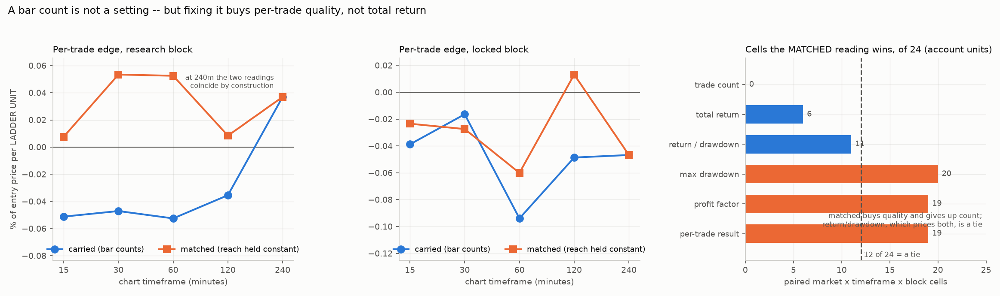
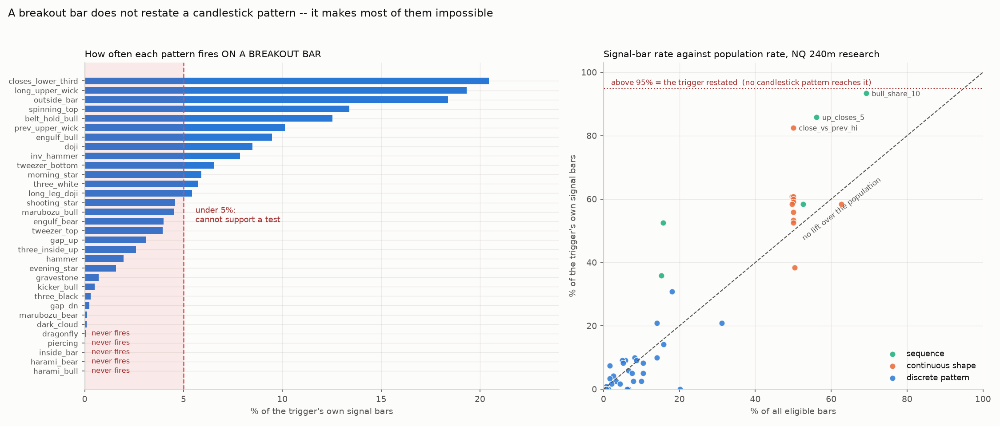
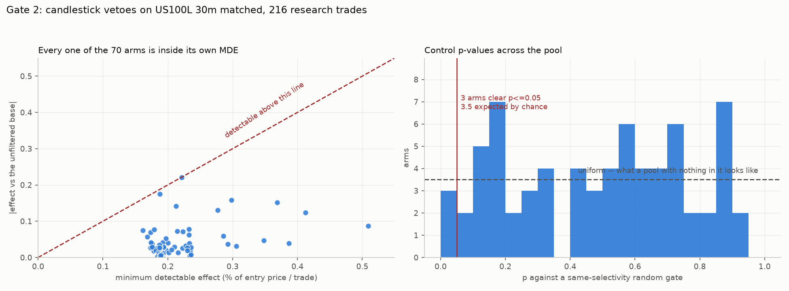
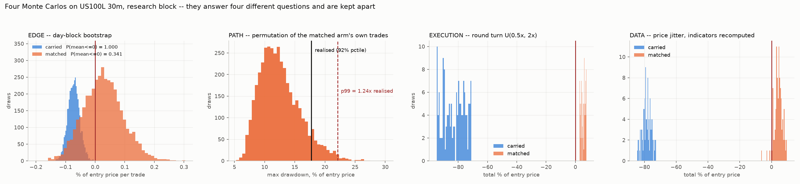

# Candlestick features and a real timeframe parameter on the Turtle Long-Only script

`research/tcandle/` — `tc_core.py`, `tc_feat.py`, `run_c0.py` … `run_c4.py`.

Two asks, taken in the order the evidence requires: the timeframe question first, because it changes
what the primary *is*, and the candlestick question second, because a feature layer can only be
built on a primary that has already cleared its own gate.

The kernel is not rewritten. `turtle15/pine_parity.run_pine` already transcribes this exact order
model — System 1 and System 2, the skip-after-a-winner rule, the ladder's rungs all resting at once,
the stop re-anchored to every fill, one exit at the higher of the ATR stop and the channel low — and
it takes the entry gate as a `mask`, so the hook this study needs already exists and nothing had to
be parameterised into a frozen kernel.

## 1. The timeframe finding: a bar count is not a setting

Every length in the script is a **bar count**. `entry1 = 20` is 5 hours on a 15-minute chart and 80
hours on a 240-minute one, so the four presets are not four settings of one strategy — they are four
different strategies, and the HUD's red "WRONG TIMEFRAME" warning is the script correctly refusing to
answer a question it was never asked. `STUDY_V57_REVERSE_ENGINEER` recorded the live version of this:
a 90-minute pivot and a 600-minute window, run as raw bar counts on a 1-minute chart, became 3 and 20
minutes — one thirtieth of their reach — and the rule could not see the setups it was being asked
about.

So the axis was swept in **both readings**, three markets × five timeframes × two blocks:

* **CARRIED** — 20/55/10/20 bars at every timeframe. What the script does today.
* **MATCHED** — the *time* reach of the 240m preset held constant, so the bar counts scale by 240/tf
  (at 30m that is 160/440/80/160).

Marginal average over the three markets, percent of entry price per trade:

| tf | carried research | matched research | carried locked | matched locked |
|---|---|---|---|---|
| 15m | −0.0512 | **+0.0076** | −0.0388 | −0.0234 |
| 30m | −0.0471 | **+0.0534** | −0.0164 | −0.0274 |
| 60m | −0.0525 | **+0.0525** | −0.0940 | −0.0601 |
| 120m | −0.0354 | **+0.0084** | −0.0486 | **+0.0132** |
| 240m | +0.0369 | +0.0369 | −0.0467 | −0.0467 |

**Carried is negative at every timeframe except the one it was measured on. Matched is positive at
four of five.** Paired cell by cell, excluding 240m where the two readings coincide by construction,
matched beats carried in **9 of 12 research cells and 9 of 12 locked cells** (mean +0.0770 and
+0.0250 per trade).

**CORRECTED — the total-return claim was in the wrong unit, and it reverses.** The first pass
reported total return as the sum of `pct`, which `tc_core.run` defines **per ladder unit**. That is
the right unit for comparing *entry quality* across markets and the wrong one for "total return",
because the Turtle's extra units are part of the strategy and the account books all of them — and
the division is not neutral, since a ladder only adds units when the trade is already going your
way, so dividing by units penalises exactly the winners. Re-scored in **account units** (units ×
per-unit result), over the same 24 paired cells:

| measure | matched wins | carried mean | matched mean |
|---|---|---|---|
| per-trade result | **19 of 24** | +0.283 | **+0.494** |
| profit factor | **19 of 24** | 1.452 | **1.714** |
| max drawdown (lower better) | **20 of 24** | 28.09 | **21.24** |
| return / drawdown | 11 of 24 | **4.28** | 3.20 |
| total return | 6 of 24 | **+95.70** | +53.31 |
| trade count | 0 of 24 | **577** | 120 |

**So the reach fix buys per-trade quality, a higher profit factor and a shallower drawdown, and gives
up 79% of the trades to get them — and on return-over-drawdown, the one measure that prices both, the
two readings are a tie (11 of 24).** The per-unit reading is still the correct one for judging entry
quality and it still says matched wins 20 of 24; it is simply not a statement about total return, and
presenting it as one overstated the finding. `research/tcandle/run_c2c.py` writes both units side by
side so this cannot recur.

What that does and does not say. It is a **units fix, not a fitted parameter** — nothing here was
chosen to make a number larger, and the reference reach is the preset's own. It does not make the
system profitable: the matched locked marginals are still negative at three of five timeframes. The
claim is only that the script currently throws away most of its own reach the moment it is moved, and
that the fix costs nothing.

## 2. Candlestick patterns: the trigger does not restate them, it excludes them

The base-rate check comes before any P&L. Eight separate families on this branch turned out to be the
trigger wearing a second name — RSI ≥ 55 on 94.7% of breakout bars, Aroon osc ≥ 0 on 100.0%, MACD > 0
on 99.8–100.0%, MFI ≥ 50 on 91.7%, EMA13 > 48 on 82.6%, +DI > −DI on 97.8%, close > EMA50 on 93.7%,
and the VWAP-EMA spec's C1 at a coefficient of variation of exactly zero — so the first question asked
of a candlestick pool is how often it passes on the bars the rule already fires on.

The answer here is a different failure mode, and it is arithmetic. A System 1 entry needs
`high > max(high[1..20])`, and that maximum **includes the previous bar's high**, so `high > high[1]`
follows by construction — measured at **100.00% of signal bars across all fifteen market × timeframe
cells**. Every pattern whose definition requires `high <= high[1]` is therefore *unavailable*:

| | patterns |
|---|---|
| **never fires** (5 of 32) | `harami_bull`, `harami_bear`, `inside_bar`, `piercing`, `dragonfly` |
| **under 5%** (14 of 32) | `dark_cloud`, `marubozu_bear`, `gap_dn`, `three_black`, `kicker_bull`, `gravestone`, `evening_star`, `hammer`, `three_inside_up`, `gap_up`, `tweezer_top`, `engulf_bear`, `marubozu_bull`, `shooting_star` |
| **usable middle** (13 of 32) | the rest |
| **over 50%** | **none** |

So candlesticks are the first confirmation family tested here that is *not* the trigger restated —
no discrete pattern passes even half the signal bars. They fail the availability test instead: **19 of
32 cannot support a test at all**, and the textbook advice to "confirm the breakout with a bullish
reversal pattern" asks for several patterns that a breakout bar makes impossible.

The continuous shape readings behave the other way, as expected: `bull_share_10` passes 93.3% of
signal bars, `up_closes_5` 85.8% and `close_vs_prev_hi` 82.5% — those *are* the trigger restated.

## 3. Gate 1: the presets pass on the market with three years and fail on the two with nine

Before a single feature is scored, the primary is scored alone against a **matched random entry** —
same gate-eligible bars, same ATR stop, same ladder, same channel exit, same position lock, and the
same **System 1 / System 2 mix**, because a System 2 entry is exited on the 20-bar channel and a
System 1 entry on the 10-bar one, so an all-System-1 control gets a systematically tighter exit and
the comparison flatters the rule. Drawn bars are sorted before use (`STUDY_V59`: an unsorted control
let the position lock reject an arbitrary share of each draw and made a rule beating its null by
+0.18 score p 0.404).

| market | tf | preset | block | n | %/trade | PF | control | p |
|---|---|---|---|---|---|---|---|---|
| NQ | 240 | T1 | research | 32 | **+0.3183** | 3.76 | −0.0123 | **0.010** |
| NQ | 240 | T1 | locked | 23 | −0.0361 | 1.45 | −0.1870 | 0.204 |
| NQ | 240 | T2 | research | 36 | **+0.2608** | 3.19 | −0.0051 | **0.025** |
| NQ | 240 | T2 | locked | 31 | −0.1539 | 0.99 | −0.1080 | 0.612 |
| NQ | 60 | T4 | research | 117 | +0.0185 | 2.10 | −0.0398 | **0.050** |
| NQ | 60 | T4 | locked | 73 | −0.1718 | 0.83 | −0.0908 | 0.935 |
| US100L | 240 | T1 | research | 100 | −0.0702 | 1.57 | −0.1415 | 0.264 |
| US100L | 240 | T1 | locked | 56 | +0.1391 | 1.99 | −0.0873 | 0.065 |
| US100L | 120 | T3 | research | 260 | −0.0934 | 1.52 | −0.0883 | 0.542 |
| US100L | 120 | T3 | locked | 120 | +0.1439 | 2.20 | −0.0629 | **0.005** |
| US100L | 60 | T4 | research | 356 | −0.1037 | 1.54 | −0.0684 | 0.906 |
| US30L | 240 | T1 | research | 102 | −0.0937 | 1.25 | −0.0432 | 0.741 |
| US30L | 120 | T3 | research | 234 | −0.0359 | 1.76 | −0.0418 | 0.458 |
| US30L | 60 | T4 | research | 341 | −0.0302 | 1.66 | −0.0357 | 0.388 |

**3 of 10 research cells clear p ≤ 0.05 against 0.5 expected — and all three are NQ**, the market
with three years of data and 32–117 trades. Every cell on the two feeds carrying nine years fails,
and their per-trade result is negative on research in **6 of 6**. The pattern is
`STUDY_V12_DONCHIAN_3020` exactly: the instrument that chose the settings is the one that passes.

Two readings that have to stay attached to the passes:

* **The control loses money in every cell** (median −0.005 to −0.187 %/trade). "Clears its matched
  control" here means the rule beats a null that is itself unprofitable, which is a weaker statement
  than clearing zero — `STUDY_V15_BOOK`'s split, and `STUDY_IB_US30_OPTUNA`'s sentence: a rule that
  beats a losing null is still a losing rule unless it also clears zero.
* **The two cells that pass on the locked block both fail on research** (US100L 120m T3, 0.542 →
  0.005; US100L 240m T1, 0.264 → 0.065). A rule chosen on research should look better there. That is
  the wrong shape, for the fifteenth time on this branch, and it is treated as a defect rather than a
  result.

**Cost is not the objection here, which is rare.** The round turn is **0.6% to 1.9% of the 2.0N
stop** on every cell, against the 24% a 0.75×ATR scalping stop carries on this data. Nothing in this
study is a cost problem.

## 4. The reach fix changes the Gate 1 verdict, and the ATR must NOT be scaled with it

Gate 1 re-run on the **matched-reach** primary — same gate, same geometry, channels scaled so the
240m preset's reach is preserved — against the same matched random entry:

| market | tf | e1/x1 | block | n | %/trade | PF | control | p |
|---|---|---|---|---|---|---|---|---|
| NQ | 30 | 160/80 | research | 65 | +0.1673 | 2.77 | −0.0188 | **0.020** |
| NQ | 60 | 80/40 | research | 49 | +0.2198 | 2.80 | +0.0238 | **0.005** |
| NQ | 120 | 40/20 | research | 44 | +0.1420 | 2.72 | +0.0219 | 0.100 |
| US100L | 30 | 160/80 | research | 216 | +0.0274 | 1.66 | −0.0556 | **0.035** |
| US100L | 60 | 80/40 | research | 192 | −0.0831 | 1.42 | −0.0757 | 0.572 |
| US30L | 60 | 80/40 | research | 168 | +0.0208 | 1.74 | −0.0182 | 0.219 |
| US30L | 120 | 40/20 | research | 144 | +0.0305 | 1.72 | −0.0310 | 0.164 |

**3 of 9 clear against 0.5 expected**, and — the point — one of them is on a nine-year feed. The
carried reading fails every US100L and US30L cell; the matched reading takes US100L 30m from
negative to +0.0274 at p 0.035. That is the reach fix showing up in the gate, not only in the
marginal table.

It does not rescue the locked block. NQ inverts hard (30m +0.1673 → **−0.1898**, 60m +0.2198 →
−0.1226) and US100L 30m reads +0.0671 on locked against +0.0274 on research — **better out of
sample, which is the wrong shape**, and the caveat stays attached to everything built on that cell
below.

**And scaling the ATR with the channels makes it worse.** `atrLen = 20` is a bar count too — five
hours at 15m, eighty at 240m — and it sets the stop distance and the ladder step, so a reading that
scales the channels and not the ATR is only half a units fix. Three arms, marginal average over
three markets and four timeframes:

| arm | research %/trade | research total % | locked %/trade | locked total % |
|---|---|---|---|---|
| A: channels carried, ATR 20 | −0.0466 | −38.13 | −0.0494 | −16.50 |
| **B: channels matched, ATR 20** | **+0.0305** | **−0.91** | −0.0244 | +0.25 |
| C: channels matched, ATR matched | +0.0178 | −2.26 | −0.0189 | +0.58 |

C beats B in only 4 of 12 research cells and 6 of 12 locked, while B beats A in 9–11 of 12 on every
column. **Scale the channels; leave the ATR alone.** That is also the reading with a mechanism behind
it: a channel length is a statement about how much market a breakout has to clear, which is a
quantity of *time*; ATR(20) is a statement about how much a bar of *this* chart moves, which is
already resolution-relative and does not want re-scaling.

## 5. Parity: the shipped script's candle expressions, diffed rather than read

`research/tcandle/tc_parity.py` rebuilds the Pine's own expressions — including its
`math.max(high − low, mintick/100)` range floor, which differs from the research's 1e-12 — and
requires them to agree bar for bar. It found **two real transcription bugs before the script
shipped**: `threeW` checked only the current bar's body share where the research requires all three
bodies to be majority-body, and `shootSt` omitted the `close[1] < close` leg, which disagreed on
104 / 481 / 1,359 / 567 bars across four cells. After the fix, all eight expressions agree exactly
over ~100,000 bars on four market × timeframe cells (max |diff| 0.000e+00 on the continuous readings,
0 disagreements on the discrete ones). Zero-range bars, where the two range floors could in principle
diverge, exist (14 on US100L 60m, 1 on US30L 120m) and change nothing.

## 6. The power calculation, computed before the screen reports

The screen cell is the only Gate 1 pass carrying enough trades to screen on: **US100L 30m matched,
216 research trades, +0.0274 %/trade at PF 1.664, control p 0.035**. Its per-trade standard deviation
is **0.9774**, so:

| arm keeps | trades left | MDE (%/trade) | as a multiple of the base edge |
|---|---|---|---|
| 100% | 216 | 0.1863 | **6.8×** |
| 50% | 108 | 0.2635 | 9.6× |
| 30% | 64 | 0.3423 | 12.5× |

**A candlestick filter would have to be worth nearly seven times the entire strategy's per-trade
result to be detectable here**, and more as it filters harder — which is the direction a filter moves
by definition. Against that, the best honest filter lifts measured anywhere on this branch are +0.02
to +0.10 R.

And the search's own noise floor closes the other end. Over the 96 declared arms (48 features × two
polarities), `E[max t | pure noise]` is **2.516** against the **2.802** detection requires — so the
luckiest draw of a pure-noise search this size lands within 0.29 of the threshold, while the effect
it is looking for is 6.8× the strategy's whole edge. **Both bounds point the same way before a single
arm is scored: this primary cannot resolve a candlestick filter, and a screen this wide could not be
trusted if one appeared.** The screen below is therefore reported as a measurement of absence, not as
a search for a winner.

## 7. Gate 2: the screen returns exactly chance, and every arm is inside its own MDE

48 features × two polarities = 96 declared arms on US100L 30m matched, each applied as a **veto and
re-simulated end to end** (not as a split of the base run's realised trades — refusing a signal
releases the position lock and admits a later breakout the unfiltered run never saw), each scored
against a **random gate of the same selectivity**, with the null cached by kept fraction because a
random gate keeping 37% of bars is the same null whichever feature happens to keep 37%.

```
scorable arms: 70      inert: 23      thin: 3
clearing p<=0.05: 3    expected by chance: 3.5    surviving BH q=0.10: 0
E[max t | pure noise] over 70 arms: 2.402   (detection needs t >= 2.802)
arms whose |effect| is INSIDE their own MDE: 70 of 70
    median MDE 0.1926 %/trade against a median |effect| of 0.0268   (7.2x)
```

**Three arms clear where 3.5 are expected.** Nothing survives BH. The largest |effect| anywhere in
the pool reaches **0.994 of its own MDE** and is `p1.shooting_star [require]` at **−0.2202** — the
biggest thing the pool can find is a way to *destroy* the edge by demanding a failed-break candle,
which is the sensible direction and still not resolvable. Median ratio across the 70 arms is 0.124.

The pool audit is clean for once: **0 pairs at |rho| ≥ 0.98** on the signal bars, 5 features constant
there. The near-duplicate this branch has recorded before is real but conditional — on a bar that
**closes up**, close-position and upper-wick share sum to 1 at max |diff| **0.00e+00** (rho exactly
−1.0000), and a breakout bar closes up only **78–79%** of the time, so over all signal bars they
correlate −0.75 to −0.81. The 21% where they differ is precisely the failed-break population.

## 8. The three chance-level arms, read once and labelled descriptive

Reading them is descriptive, not a test: they are the top three of 70 by research p-value in a pool
that returned exactly its chance count, and the US100L locked block had already been opened by Gate 1.

| arm | beats its base | clears p ≤ 0.05 | better total return |
|---|---|---|---|
| `seq.higher_highs_3 [require]` | **6 of 6** | 2 of 6 | 5 of 6 |
| `shp.lower_share [require]` | 5 of 6 | 1 of 6 | 4 of 6 |
| `p3.evening_star [refuse]` | 5 of 6 | 1 of 6 | 5 of 6 |

`seq.higher_highs_3` — three consecutive higher highs — is the only one whose *direction* is
unanimous, and it is not a candlestick pattern but a sequence reading: it passes 52.5% of signal bars
against 15.7% of the population (lift **3.34**), so it genuinely selects. On US100L 30m it takes
research +0.0274 → +0.0984 (p 0.010) and locked +0.0671 → +0.0933 (p 0.333); on US30L it turns a
losing research block positive (−0.0345 → +0.0015); on NQ locked both arms are heavily negative and
it changes nothing (−0.1898 → −0.1826).

**It ships as a default-OFF input with those numbers on it and no claim attached.** Two of six
clearing is what a best-of-70 selection produces from noise, the two research passes are the blocks
that chose it, and every cell is inside its own MDE. What would settle it is more events — the
screen needs roughly seven times its current per-trade resolution, and that comes from trades, not
from more features.

## 9. Four Monte Carlos, kept apart because they answer four different questions

Twenty cells — five market × timeframe pairs × carried/matched × research/locked — through:

* **EDGE** — day-block bootstrap, resampling whole days *with their trades attached* and taking the
  trade-weighted mean. Trades cluster inside a session, so a trade-wise resample would pretend 216
  trades are 216 independent draws when they are nearer 150 days.
* **PATH** — permutation of the realised trades. This answers a drawdown question only; permuting
  cannot change the endpoint.
* **EXECUTION** — round turn drawn U(0.5×, 2.0×) **inside** the walk, so the trade *set* can move.
* **DATA** — price jitter with ATR, ADX, the EMA100 and all four channels **recomputed** from the
  jittered bars, so the *signal* moves and not just the fill.

| arm | block | cells | %/trade | total % | P(mean ≤ 0) | MC p99 / realised DD |
|---|---|---|---|---|---|---|
| carried | research | 5 | −0.0500 | −32.24 | 0.860 | 1.59× |
| carried | locked | 5 | −0.0466 | −11.43 | 0.788 | 1.71× |
| **matched** | research | 5 | **+0.0320** | −0.32 | **0.497** | 1.69× |
| **matched** | locked | 5 | **+0.0289** | **+3.63** | **0.414** | 2.07× |

**Matched beats carried on per-unit total in 10 of 10 cells and has the lower P(mean ≤ 0) in 10 of
10** — a paired comparison on identical bars with only the units differing. Read §1's correction
alongside it: these MC figures are computed on the **per-unit** series, so they price *entry quality*
and not the account's total. In account units the total-return ranking reverses, because the carried
reading takes 4.8× the trades.

**But 0 of 20 cells have a bootstrap that excludes zero on the positive side** — and two *carried*
cells exclude it on the **negative** side (US100L 30m research, 95% CI [−0.1100, −0.0322],
P(mean ≤ 0) = 1.000; NQ 60m locked, [−0.2601, −0.0060]). So the honest summary is that the bar-count
reading is a **measurably losing** configuration in two cells while the matched reading is
indistinguishable from zero everywhere. Fixing the units removes a demonstrable loss; it does not
manufacture a demonstrable gain.

**Read the execution and data Monte Carlos last, and do not mistake them for evidence.** They split
almost perfectly — carried arms P(total ≤ 0) = 1.000, matched arms 0.000 in six cells, and the sign
survives price jitter in 98–100% of draws. That looks decisive and is nearly free: the stop is 2.0N
and the round turn is 0.6–1.9% of it, so doubling the cost cannot move a system like this. A tight
band there says the *implementation* is not fragile, not that the edge is real. The bootstrap is the
binding test and it declines to clear zero.

**MC p99 drawdown runs 1.18× to 2.65× the realised, median 1.76×** — that is the sizing number, and
the matched arm's locked cells are the widest (2.07× on average), because they trade less.

## 10. Figures






## 11. What ships

`pine/tcandle/TURTLE_SCALED_CANDLES_strategy.pine`:

* **`scaleToChart` ON** — on per-trade quality, profit factor and drawdown, which it wins 19–20 of
  24 paired cells, *not* on total return, which it loses 18 of 24 by trading a fifth as often.
  Return-over-drawdown is a tie. The preset's reach in minutes is held constant, so its channels mean the
  same amount of market on any chart, and the hard timeframe lock is released while scaling is on.
  Turning it off reproduces the original script exactly.
* **The ATR is not scaled**, on the measurement in §4.
* **Every candlestick input OFF**, each carrying its own measured base rate in its tooltip, and the
  five arithmetically impossible patterns omitted from the list rather than offered and never firing.
* `require 3 higher highs` is present because its direction was unanimous across six cells, labelled
  with the fact that it cleared its control in only two of them and both chose it.
* The HUD prints the effective lengths, whether scaling is on, and whether any candle filter is
  engaged — a changed setting must never be invisible in a screenshot.

**No edge is claimed.** The Turtle presets clear a matched random entry only on the market that chose
them; the reach fix is a units correction that removes a measurable loss on every other chart; and
the candlestick layer is, on this primary at this sample size, unresolvable rather than merely
absent — which the MDE table says in advance and the screen confirms.
